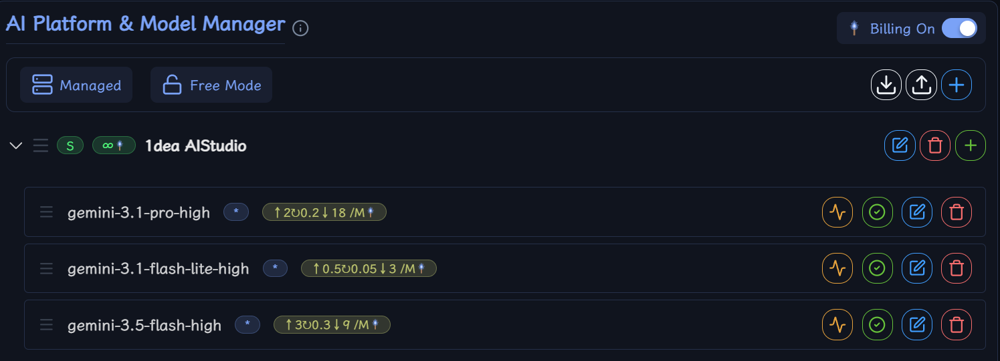
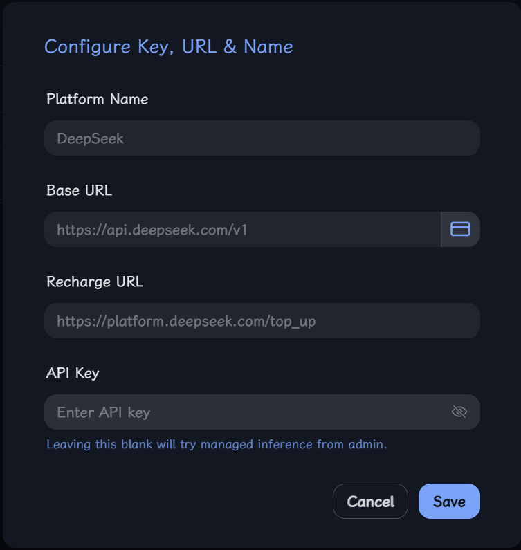

[简体中文](SUPPORT.md) | [English](SUPPORT.en.md)

# 💖 SparkArc 赞助与商业合作指南

> 📩 **合作联系邮箱**: [aideaaa@outlook.com](mailto:aideaaa@outlook.com)
> 
> 如果您是 **AI 模型中转服务商、大模型 API 聚合平台或 GPU 算力提供商**，SparkArc 将是您触达高频、高额 Token 消耗创作者的极佳渠道。

---

### 赞助 SparkArc能为贵方带来什么效益？

SparkArc可以为您带来大量的调用量。

*  **基于提供商的模型管理**：
我们会将您的站点**作为内置的默认系统平台**。
用户可以自由添加您平台下的**多个模型**，并绑定不同的用途。**点击充值图标，一键跳转到您的充值页面。**
此外，**用户可以非常方便地将服务部署到公网提供服务，将您的平台指定为下一级用户的系统平台。**

*   **高频的多 Agent 协同**：用户输入灵感后，后台的 Director 智能体将调度设定、大纲、执笔与逻辑审核等多个专家 Agent。单次创作流程即可触发数十次并发调用。
*   **深度长文本处理**：
    *   **高输出量**：编剧Agent撰写正文，会产生大量的纯输出。
    *   **文风与审核分析**：每次分析都需要大量的输入。
*   **高净值用户画像**：我们的用户以小说作者、剧本策划、游戏工作室和自部署团队为主。这类用户付费意愿强、使用黏性高，对高速稳定的 API 接口有刚性需求。

---

### 📢 为什么我需要赞助

我是个人独立开发者，目前完全利用业余时间开发并维护 SparkArc，并没有任何固定的收入来源。

开发和维护一个像 SparkArc 这样庞大的系统，日常开发成本极为昂贵：
1.  **Coding开销**：为了保持架构的优秀，使项目可以长期健康发展，需要使用优秀但昂贵的模型，每天在编写代码本身上就在烧大量的 Token 费用。
2.  **调试与测试开销**：为了保证 Director、Critic、Scriptwriter 等多个 Agent 之间的流式协作和逻辑对齐，我们在日常开发测试中必须反复进行长文本的多轮真实调用，这也带来了极高昂 Token 账单。
3.  **体验服务器开销**：我们托管了一个可供用户快速在线体验的实例，这也需要一定量的token。

坦白说，这笔高昂的模型调用费用对于没有固定收入的个人开发者而言，是一笔沉重的负担。为了能让这个开源项目持续高频迭代，**我们特别需要模型中转商或 API 聚合平台为我们赞助开发测试所需的 API 额度或测试 Key**。这能直接延续这个项目的生命。

---

### 合作与赞助方案

为了更好地回馈赞助商，我们设计了以下几种契合开源社区生态的合作模式：

#### 1. 推荐 API 中转合作
这是专门面向**大模型中转服务商**的流量转化方案（也是我们最希望能以 Token 额度/开发 Key 进行置换的赞助形式）：
*   **默认配置下发**：您的 API 通道（包括平台名称、`base_url` 接口地址、模型映射）将被直接写入项目预设 of `matchbox_cfg.yaml` 中。
*   **全体用户覆盖**：所有通过 Git 拉取代码、一键 Docker 部署或下载 Release 客户端的下游自部署用户，启动后系统都会自动同步此推荐平台。
*   **UI 黄金位推荐**：在客户端配置面板和项目 README 的“推荐服务”板块展示您的平台名称、专属注册链接和优惠活动。

#### 2. 算力与 Key 支持
如果您能为项目的**公共体验站**或**开发测试**提供大模型额度和 GPU 算力支持：
*   我们将在公共体验站中将您的通道设为后备/主要测试源，并注明“本体验站大模型额度由 XXX 赞助提供”。
*   在项目 README 中进行友情链接与致谢。

#### 3. 企业品牌赞助
适用于希望在开发者和创作群体中提升品牌知名度的企业：
*   在项目 `README.md` 顶部的赞助商区域展示您的品牌 Logo。
*   在项目文档及官方网站的显眼位置挂载友情链接。

#### 4. 个人打赏
如果您是个人用户，单纯想支持创作者：
*   我目前尚未正式开通个人收款渠道（后续会逐步完善并上线）。
*   对于个人，您的 **Star**、**Watch** 以及对项目的**贡献（如提交 Issue、PR 等）**就是对我最好的鼓励与赞助！

---

### 立即联系我们
如果您对上述合作感兴趣，欢迎与我们联系：

*   **官方邮箱**：[aideaaa@outlook.com](mailto:aideaaa@outlook.com) （请注明“SparkArc 赞助合作”）
*   **合作内容**：我们也非常欢迎您为 SparkArc 用户提供专属折扣、免费体验 Key 或算力支持。
