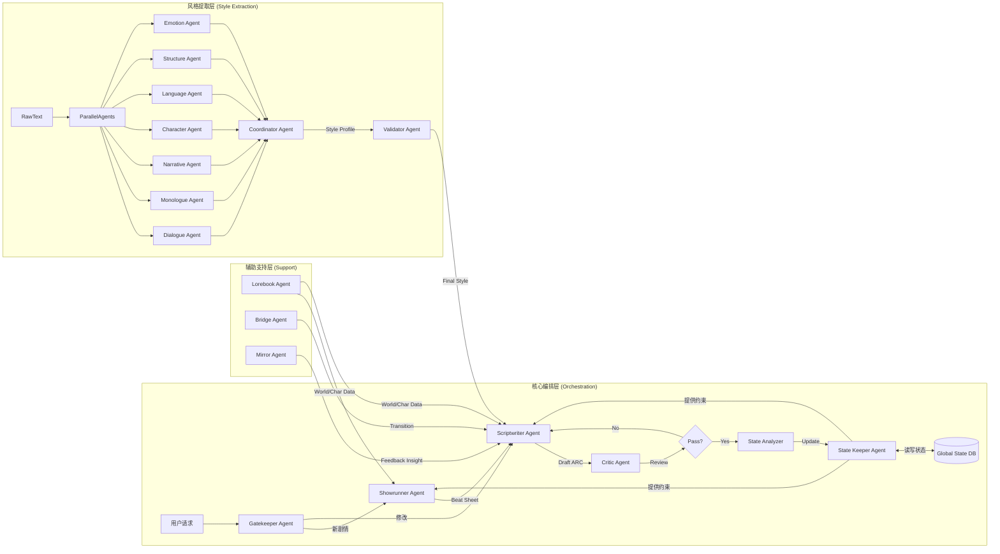

# SparkArc 多Agent高级编剧系统深度分析报告

本报告基于对项目源代码的深入分析，从用户创作全流程、后端全量Agent架构、技术核心优势、功能差异化及商业潜力五个维度进行客观详尽的剖析。

## 1. 用户创作流程全景 (User Creative Workflow)

SparkArc 的设计哲学是"从灵感到成品"的全链路覆盖，支持非线性、结构化的互动叙事创作。

### 1.1 完整创作路径图

```mermaid
flowchart LR
    Start([用户产生灵感]) --> Login[登录/鉴权]
    Login --> ProjectSel[项目选择/创建]
    
    subgraph "Phase 1: 世界构建与设定 (Lorebook)"
        ProjectSel --> WorldGen[世界观生成]
        WorldGen -->|Worldview Agent| WorldText[世界观文档]
        WorldText --> CharGen[角色批量生成]
        CharGen -->|Lorebook Agent| CharFiles[角色档案库]
        CharFiles --> AgentConfig[配置 Agent 模型与用途]
    end
    
    subgraph "Phase 2: 宏观编排 (Blueprint)"
        AgentConfig --> BlueprintView["剧情蓝图 (StoryBlueprint)"]
        BlueprintView -->|添加节点| AddScene[创建场景节点]
        AddScene -->|拖拽连线| Connect[构建非线性逻辑]
        Connect -->|双击连线| BridgeTrigger[触发 Bridge Agent]
        BridgeTrigger -->|自动生成| Transition[场景过渡内容]
    end
    
    subgraph "Phase 3: 微观创作 (DialogueTree)"
        BlueprintView -->|双击场景| EditorView[可视化编辑器]
        EditorView -->|手动创作| ManualEdit[树状图编辑对话/选项]
        EditorView -->|AI辅助| AiPanel[AI 编剧面板]
        
        AiPanel -->|单段续写| SingleGen[微调续写]
        AiPanel -->|多段续写| MultiGen[批量推进]
        
        SingleGen & MultiGen -->|后台校验| CriticCheck{Critic 审查}
        CriticCheck -->|通过| AutoSave[自动保存]
        CriticCheck -->|驳回| Retry[AI 自动重写]
    end
    
    subgraph "Phase 4: 发行与反馈 (Distribution)"
        AutoSave --> ShareMgr[分享管理]
        ShareMgr -->|生成链接| PlayLink[沉浸式播放器]
        PlayLink -->|终端用户体验| Player[互动播放]
        Player -->|用户反馈| Feedback[收集反馈]
        Feedback -->|Mirror Agent| Insight[提炼修改建议]
        Insight --> EditorView
    end
```

### 1.2 关键流程详解

1.  **从零开始的世界构建 (Phase 1)**:
    *   用户无需面对空白文档发愁。通过 **Worldview Agent**，只需输入一个"创意种子"（如"赛博朋克风格的古代长安"），系统即可自动生成包含地理、政治、魔法/科技系统的完整世界观文档。
    *   **Lorebook Agent** 进一步根据世界观批量生成角色档案，并自动建立角色间的关系网。这为后续的剧本创作奠定了坚实的数据基础。

2.  **宏观蓝图与微观树状图的协同 (Phase 2 & 3)**:
    *   **StoryBlueprint (蓝图)**：这是一个**宏观**的场景流转管理工具。用户在这里像画流程图一样安排剧情的走向，处理分支结局和场景跳转。它不涉及具体的对话内容，而是关注"结构"。
    *   **DialogueTree (树状图)**：这是一个**微观**的对话编辑工具。当用户在蓝图中双击一个场景节点时，就会进入该场景的内部。在这里，用户以树状结构编写具体的每一句对话、每一个选项分支。
    *   **差异点**：蓝图管理的是**Scene（场景）**之间的关系，树状图管理的是**Dialogue（对话）**之间的关系。这种分层设计完美解决了长篇互动剧本结构混乱的问题。

3.  **智能化的过渡生成 (Bridge Generation)**:
    *   在蓝图中，用户只需连接两个场景节点并双击连线，**Bridge Agent** 就会自动读取上一场景的结尾和下一场景的开头，生成平滑的过渡对话。这极大地减少了"填缝"性质的机械劳动。

4.  **闭环的反馈机制 (Phase 4)**:
    *   作品发布后，**Mirror Agent** 会收集并分析终端用户的反馈数据，将其转化为具体的修改建议反馈给创作者，形成"创作-发布-反馈-迭代"的良性闭环。

## 2. 后端全量 Agent 架构 (Backend Agent Architecture)

系统采用基于 **LangGraph** 的多 Agent 协作架构，每个 Agent 都有明确的职责边界和协作协议。

### 2.1 Agent 协作生态图

### 2.2 Agent 功能与质量保障机制

1.  **Gatekeeper Agent (意图识别)**:
    *   **功能**: 作为系统的"前台"，快速判断用户意图是"继续推进剧情"还是"修改现有内容"，将请求分发给正确的下游 Agent。
    *   **质量保障**: 避免了让昂贵的生成模型处理简单的路由任务，提高了响应速度和准确性。

2.  **State Keeper Agent (状态管理)**:
    *   **功能**: 维护全局游戏状态（物品、任务、好感度）。在生成前提供 POV 约束（如"主角现在不知道凶手是谁"），在生成后分析剧本中的状态变更（如"主角获得了钥匙"）。
    *   **质量保障**: 确保剧本逻辑的连贯性，防止出现"前后矛盾"或"剧情穿帮"。

3.  **Showrunner Agent (大纲规划)**:
    *   **功能**: 生成 **Beat Sheet (剧情节拍)**，规划场景的起承转合。
    *   **质量保障**: 解决了 LLM 直接写长文容易跑题的问题，确保故事结构稳固。

4.  **Scriptwriter Agent (剧本撰写)**:
    *   **功能**: 根据 Beat Sheet 和风格档案，生成符合 ARC 格式的对话和旁白。
    *   **质量保障**: 内置思维链 `<thought>`，在生成正文前先进行逻辑推演。

5.  **Critic Agent (评审)**:
    *   **功能**: 扮演"严厉的编辑"，检查 Scriptwriter 的产出是否符合设定、是否逻辑自洽。
    *   **质量保障**: 如果评分低，会打回重写。这是质量控制的最后一道防线。

6.  **Bridge Agent (过渡生成)**:
    *   **功能**: 专门负责生成两个场景之间的连接部分。
    *   **质量保障**: 确保场景切换不生硬，保持叙事流的平滑。

7.  **Mirror Agent (反馈镜像)**:
    *   **功能**: 分析用户反馈，更新用户的偏好模型。
    *   **质量保障**: 让系统越用越懂用户，实现个性化的持续优化。

8.  **Lorebook Agent (设定生成)**:
    *   **功能**: 负责世界观和角色的生成与维护。
    *   **质量保障**: 为故事提供丰富且一致的背景支撑。

## 3. 技术核心优势 (Technical Advantages)

### 3.1 ARC 格式：大模型时代的剧本标准

项目定义了 **ARC (SparkArc)** 格式，这是一种专为 LLM 优化的中间层语言。

*   **Markdown + XML 混合**: 结合了 Markdown 的易读性（用于文本）和 XML 的结构性（用于 `<choice>` 分支和 `<thought>` 思维链）。
*   **Token 效率**: 相比 JSON，ARC 格式更加紧凑，显著降低了 Token 消耗，提升了生成速度。
*   **鲁棒性**: 专门设计的解析器 (`arc_parser.py`) 能有效处理 LLM 输出中的微小格式错误，比严格的 JSON 解析更稳定。

### 3.2 风格提取系统：赋予 AI "灵魂"

基于 RAG 和多 Agent 并行的风格提取系统是本项目的技术高地。

*   **七维分析**: 不止是模仿遣词造句，而是从对话、独白、叙事、角色、语言、结构、情感七个维度全方位解构作者风格。
*   **回测验证**: Validator Agent 会用提取出的风格尝试仿写并与原文对比，通过"实战"来验证和修正风格档案，确保风格克隆的逼真度。

## 4. 功能独特性与竞品对比 (Functional Differentiation)

| 功能点 | 传统工具 (Final Draft) | 通用 AI (ChatGPT) | **SparkArc (本项目)** | **不可替代性分析** |
| :--- | :--- | :--- | :--- | :--- |
| **结构化管理** | 仅线性文本 | 无结构记忆 | **蓝图 + 树状图** | 唯一专为**非线性互动叙事**设计的双层可视化管理系统。 |
| **创作流** | 人工全写 | 对话式散点生成 | **Agent 流水线** | Showrunner -> Scriptwriter -> Critic 的流水线模拟了真实工业级创作流程，产出质量远超单点生成。 |
| **上下文一致性** | 靠人脑记忆 | 窗口有限，易遗忘 | **State Keeper** | 自动维护世界状态数据库，确保长篇连载逻辑严密，这是通用 LLM 无法做到的。 |
| **风格化** | 无 | 需复杂 Prompt | **风格克隆** | 一键提取并应用特定作者风格，极大降低了同人创作或特定 IP 续写的门槛。 |

## 5. 商业潜力与变现 (Commercial Potential)

### 5.1 商业价值锚点

*   **短剧/Reels 爆发**: 市场对高质量剧本的需求呈指数级增长，SparkArc 能将创作周期从周缩短至小时。
*   **互动娱乐蓝海**: 互动小说/游戏（如《隐形守护者》）受限于制作成本，SparkArc 的一键播放和蓝图系统极大降低了此类内容的制作门槛。

### 5.2 变现路径

1.  **SaaS 订阅 (Pro 版)**:
    *   面向专业编剧/工作室，提供无限 AI 调用、私有模型微调（风格提取）、多人协作功能。
2.  **内容分发平台 (UGC)**:
    *   利用播放器和分享功能构建社区。创作者发布互动剧，观众付费解锁或打赏，平台抽成。
    *   **碎片化娱乐**: 结合移动端播放器，主打"通勤路上的 5 分钟互动剧"，切入碎片化时间市场。
3.  **IP 衍生工具链 (B 端)**:
    *   为游戏公司或影视公司提供私有化部署，导入其 IP 资料库（Lorebook），辅助编剧快速生成符合 IP 规范的支线剧情或 NPC 对话。

---

**总结**: 
SparkArc 不仅仅是一个 AI 辅助工具，它重新定义了"人机协作创作"的标准。通过**蓝图与树状图的双层管理**解决了结构化难题，通过**全量 Agent 协作**保证了内容质量，通过**ARC 格式**打通了技术瓶颈。它具备成为互动娱乐时代"基础设施"的潜力。