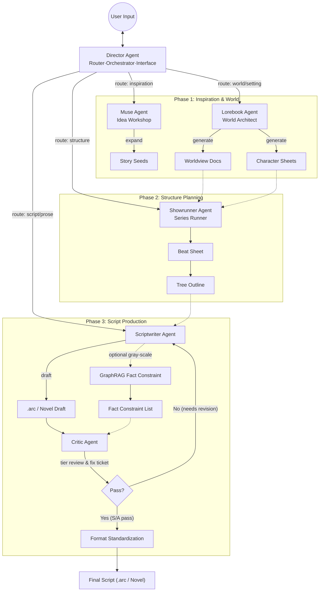
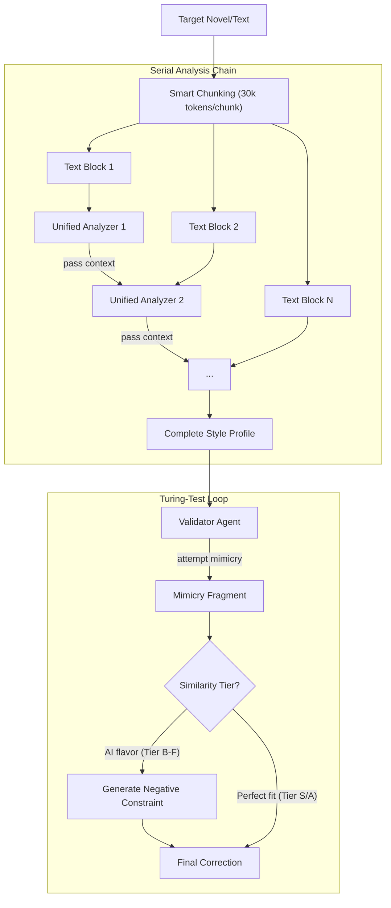
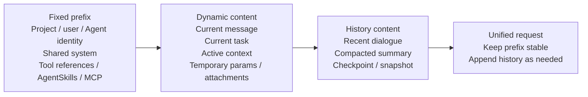
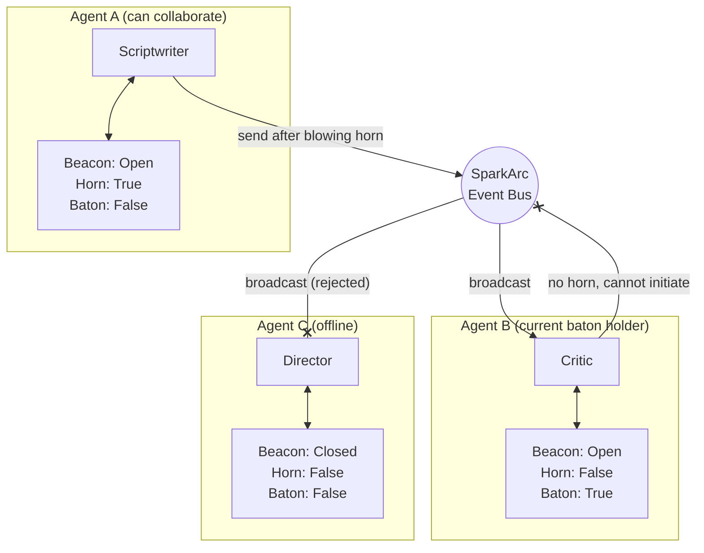

# SparkArc: Cross-Platform Agent Studio for Story Creation

[简体中文](README.md) | [English](README.en.md) | [日本語](README.ja.md) | [한국어](README.ko.md)

> 📢 **Support & Follow**: If SparkArc has been helpful to you, please consider giving us a **Star** (bookmark the project to prevent losing it) and a **Watch** (select Custom -> Releases to subscribe to new updates). As an independent open-source project, every Star and Watch significantly improves our visibility in the community, which is crucial for our continuous iteration and long-term development. Thank you for your support!
> 
> 💖 **Sponsorship & Partnership**: If you are an API proxy provider, aggregator, or GPU supplier, please check our [**Sponsorship & Partnership Guide**](.github/SUPPORT.en.md). We offer high-value promotion channels including **default configuration push** for our self-hosted users in exchange for development & testing API credits. **We highly need sponsorships to maintain our high-speed iterations.**

SparkArc is a production-grade creative studio powered by coordinated Agents.
It helps creators turn a tiny spark into a complete story world and publishable output across:

- Novel drafting
- Scriptwriting
- Interactive web performance
- Game-engine-ready story assets

SparkArc connects the full chain:

`Inspiration -> Worldbuilding -> Rhythm -> Outline -> Drafting -> QA -> Publish -> Share -> Performance`

---

## Why SparkArc

Most AI writing tools are either:

- A black-box text generator with weak structure control
- A complex prompt playground that shifts workflow burden back to the user

SparkArc takes a different product direction:

1. You communicate naturally with a Director Agent.
2. The Director dispatches specialized Agents and tools.
3. Structured editors stay in sync with generated outputs.
4. You can intervene at any layer without losing flow.

Result: you get IDE-level production power with chat-level simplicity.

---

## Product Pillars

### 1. Studio UX for Serious Creation

- Multi-agent orchestration behind a single conversation entry
- Structured editors for world, synopsis, outline, and script layers
- Traceable generation process instead of one-shot black-box output
- Surgical refinement by specialist Agent when a section needs rework
- **Blueprint system**: per-project `blueprint.json` defines creative preferences, style constraints, and workflow parameters

### 2. Human-Centered Control

SparkArc treats human creativity as the source of truth.

- `Manual mode`: AI assists with checks and suggestions
- `Hybrid mode` (recommended): AI expands details while you keep narrative control
- `Auto mode`: AI explores directions from a rough concept

### 3. Quality and Consistency Loop

- `Style Agent`: style cloning to reduce generic AI phrasing
- `Critic Agent`: evidence-based editorial review (S/A/B/C/D tiers)
- `GraphRAG` (optional): cross-document fact constraints for long-form consistency; production-ready but not mounted by default

### 4. Mobile-to-Desktop Continuity

- Mobile-friendly flow for commuting and fragmented sessions
- **Auto-Write**: unattended batch pipeline — AI writes chapter by chapter, survives browser disconnect, resumable with nested progress ring
- Desktop studio for deep editing and system-level management
- Inspiration inbox via MCP for cross-tool idea capture

### 5. Performance-Ready Outputs

- Share stories through web performance links
- **Version snapshots**: one-click snapshot, export as `.arc` or novel, restore from snapshot
- **Novel mode**: pure literary prose output (Markdown) alongside interactive script format
- Keep a clear upgrade path to game engine integration
- Treat scripts as executable content assets, not static documents

### 6. Scalable Agent Operations

SparkArc defines collaboration semantics with:

- `Beacon`: visibility/receivability
- `Horn`: proactive communication permission
- `Baton`: ownership of current task chain
- `Tool Permission Tiering`: role-based tool access control constrains each Agent to its dedicated capability domain, preventing hallucination-driven privilege escalation and ensuring pipeline safety

This model reduces multi-agent chaos and keeps large flows maintainable.

---

## Agent Pipeline (Production View)

| Stage | Role | Agent | What it does |
| :-- | :-- | :-- | :-- |
| 0. Orchestration | Director | **Director** | LangGraph-based multi-turn tool-call orchestration, task delegation, auto-write triggering, progress tracking, interaction entry |
| 1. Ideation | Logline / High Concept | **Muse** | Captures seed ideas and expands them into creative directions |
| 2. Worldbuilding | Story Bible / World Guide | **Lorebook** | Builds world rules, settings, and character foundations |
| 3. Structure | Beat Sheet / Treatment | **Showrunner** | Generates beats and chapter/scene skeletons |
| 4. Drafting | Screenplay / Script | **Scriptwriter** | Produces scene-level script; supports interactive script & novel dual output. |
| 5. QA | Script Doctor / Coverage | **Critic + Style** | Detects weak spots, AI flavor residue, and continuity issues. GraphRAG available as optional add-on |
| 6. Publishing | Implementation / Assets | **Web Player / Unity SDK** | Compiles scripts into high-performance runtime, driving in-game dialogue, performance scheduling, and quest triggers |

### Agent Tri-Mode Invocation Protocol

Every specialist Agent's prompts are strictly separated into three invocation modes, carried by three top-level fields in one YAML file. This keeps "manual panel", "user chat", and "director delegation" cleanly isolated:

| Mode | YAML Field | Output Behavior |
| :--- | :--- | :--- |
| **Specialized Work** | `system` + `user` | Strictly structured, directly consumable by parsers |
| **Chat Mode** | `chat_system` | Natural conversation, divergent, no format enforcement |
| **Pipeline Mode** | `pipeline_system` | Strictly structured + tool persistence + brief report to director |

> 📘 Full runtime logic, `pipeline_system` hard constraints, tool reference mechanism, and new-agent checklist: see [Architecture Deep Dive §2](docs/architecture.md#2-agent-三模态调用协议完整版) and [AGENTS.md §4.5](AGENTS.md)

## System Architecture

### 1. Agent Cluster

SparkArc builds a specialized agent cluster rather than relying on a single LLM. Each Agent has its own persona, prompt engineering, and model configuration.

> 💡 **Internationalization**: Agent registry (`registry.py`) natively supports `zh-CN` / `en-US` / `ja-JP` / `ko-KR`. Frontend uses i18n mapping; backend uses `resolve_agent_i18n_field()` to extract fields by request locale.

#### A. Orchestrator

* **Director Agent**:
  * **Role**: Global entry point and context manager. Based on **LangGraph SupervisorGraph** for multi-turn tool-call orchestration — delegates via `delegate_task`, triggers Auto-Write via `trigger_auto_write`, checks progress via `check_scriptwriter_status`.
  * **Core code**: `agent_director.py` + `director_graph.py`

#### B. Creative Core

* **Muse Agent**: Captures flash ideas and solidifies them into story seeds via multi-dimensional tags (style/tone/POV). Supports receiving inspiration from external AI assistants via MCP.
* **Lorebook Agent**: Builds world settings from simple seeds — geography, history, magic/tech systems, and batch-generates character sheets.
* **Showrunner Agent**: Macro narrative control. Generates beat sheets and tree-structured outlines following classic models like "Save the Cat" or "Hero's Journey".
* **Scriptwriter Agent**: The sole "writer". Supports **dual output**: `.arc` interactive script and pure literary novel (Markdown). Built-in **Conception Chain** mechanism.

#### C. Quality Assurance

* **Style Agent** (Style Clone Sub-cluster):
  * **Role**: Anti-AI — clones target author's voice to eliminate AI-typical high-frequency phrases.
  * **Sub-cluster**: **Coordinator** + **Validator** + **StyleChatAgent**.

* **Critic Agent**:
  * **Role**: Simulates a harsh reviewer. Outputs `S/A/B/C/D` tier ratings + evidence + `fix_ticket` modification orders, never directly rewrites text.
  * **Model strategy**: Uses LLM as Judge/Editor rather than training a dedicated classifier.

* **GraphRAG Tool** (optional, gray-scale):
  * **Status**: Production-ready but **not mounted by default**. Can be enabled per-project.
  * **Value**: Cross-chapter consistency, character relationship stability, setting recall.

#### Critic Review Mechanism

Critic answers not "is this AI-written?" but "**where does this text feel like a model completing a task?**". It outputs `S/A/B/C/D` tiers + evidence + `fix_ticket`, preserving creator authority.

> 📘 Full four core mechanisms and "why LLM over ML model" rationale: [Architecture Deep Dive §6](docs/architecture.md#6-critic-审核机制完整版)

#### Collaboration Data Flow



#### Style Clone Cluster

SparkArc's most technically deep module — **UnifiedStyleAnalyzer** serial analysis + **ValidatorAgent** Turing-test loop, capturing subtle human writing style and generating style profiles to constrain subsequent generation.

- **Serial analysis**: Long novels split into 30k-token chunks, 7-dimension full analysis per chunk, plot summaries passed between chunks
- **Self-adversarial**: ValidatorAgent writes "forgeries" based on the style profile, self-evaluates, generates negative constraints if AI flavor detected

#### Workflow: Serial Deep Analysis



> 📘 Full serial analysis details and negative constraint mechanism: [Architecture Deep Dive §7](docs/architecture.md#7-风格克隆集群完整版)

### 2. Context Structure and Unified Execution Pipeline

SparkArc's multi-Agent architecture is not a pile of parallel prompts. It is built around shared execution infrastructure. For repeated calls on the same platform, model, and Agent, SparkArc keeps the prefix stable: project / user / Agent identity, shared system prompts, tool references, and AgentSkills / MCP capability notes stay as fixed as possible; the current message, active context, attachments, and temporary parameters are placed later. This helps upstream prefix cache hit more often, reducing cost and improving response speed when the same model keeps working inside SparkArc.



* **Fixed content**: identity, role, shared system prompt, tool references, protocol skeleton.
* **Dynamic content**: current message, target, active context, attachments, temporary parameters.
* **History content**: recent dialogue, compacted summary, checkpoint / snapshot.
* **Observed benefit**: in a real DeepSeek V4 flash max Director chat test, the second round reported `10752` upstream cached prompt tokens, about `94.5%` cache hit rate.

> ⚠️ **Cache invalidation note**: changing the model or platform, editing specialist prompts / `pipeline_system` / `tool_rules`, changing tool bindings, language strategy, or some global parameters changes the stable prefix and makes upstream cache rebuild.
>
> The cached-token number shown under a chat window only uses that window Agent's `context_window_stats`. Director-delegated sub-tasks start another Agent with a different tool set and context prefix, so their cache hits are not mixed into the current window. Full task-level `llm_usage` still keeps the whole-chain aggregate for backend cost diagnostics.

* **Context assembly**: `communication.py` builds the stable system prefix; `prompt_layout.py` places the current editor state, attachment context, and user request near the tail; `context_budget.py` handles history budgets, compaction, and tool-loop re-budgeting.
* **Unified execution protocol**: Specialist Agents reuse `SparkBaseAgent` and `SparkAgentExecutor`, with `build_context -> execute -> write_result` as the business entry contract. Chat and Director delegation both go through `chat_stream(skip_tool_confirmation)`.
* **Unified tool ecosystem**: Tools are grouped in `server/agents/tools/registry.py` and exported through the public `agent_tools.py` facade. Script, outline, and lorebook patching share `_apply_patch`; token chunking and semantic chunking also use common foundations.
* **AgentSkills and MCP**: AgentSkills are read on demand through `search_skills` / `read_skill` / `read_skill_reference` as writing-quality references, without automatically polluting the system prefix. The MCP inspiration inbox exposes `capture_inspiration` through `/api/mcp` and stays isolated from chat Agent tool lists.
* **Frontend mapping**: Agent names, descriptions, badges, and colors use `server/agents/registry.py` as the source of truth. Tool-call UI metadata is injected by backend `build_tool_stream_event` and consumed centrally by frontend `chatStore`.

> 📘 Full context structure, cache-hit display, Agent responsibility table, AgentSkills/MCP boundaries, and tool registry details: [Architecture Deep Dive §2-§3](docs/architecture.md#2-agent-统一调用管线).

### 3. Beacon Bus Communication

SparkArc implements a **Beacon Bus** — a permission-controlled message routing architecture using "Beacon / Horn / Baton" to model real-world collaboration visibility, proactive communication, and task ownership.

> ⚠️ **Current status**: Full infrastructure is implemented and accessible via UI, but inter-Agent horizontal communication is a **reserved capability** — evaluation has found that **mainstream models are not yet fully capable of handling multi-turn, multi-role, long-context interactions**. When mainstream models achieve sufficient complex reasoning and attention capabilities, this mechanism will be officially enabled, **unlocking a second leap in creative efficiency and quality through horizontal interaction**.

#### Core Mechanism: Beacon / Horn / Baton

Each Agent owns an independent runtime triple: **Beacon** (visible/reachable), **Horn** (can proactively speak), **Baton** (current task chain ownership).

#### Interaction Topology



> 📘 Full triple definitions and application scenarios: [Architecture Deep Dive §8](docs/architecture.md#8-信标总线核心机制完整版)

#### Director Scheduling vs Beacon Collaboration (Vertical & Horizontal Collaboration)

SparkArc has **two independent communication mechanisms**:

- **Director Scheduling** (vertical): LangGraph-based multi-turn tool-call orchestration, unrestricted by beacons.
- **Beacon Collaboration** (horizontal): Inter-Agent communication constrained by Beacon/Horn/Baton.

> 📘 Full comparison table and design rationale: [Architecture Deep Dive §1](docs/architecture.md#1-导演调度-vs-信标协作双系统对比)

---

## Data Protocol

SparkArc defines a hybrid format — **.arc** — combining Markdown readability with XML logical structure, **maximally preserving literary quality in long structured text generation**.

### Format Example

```markdown
# Scene: The Last Goodbye
@guide Quest guide: Walk her through the final stretch
@intro Scene initialization description...

[-1]
This is the narration area. The setting sun stretches the streets long, sycamore shadows dappled.

[0]
Do you still remember this place?

[1]
Grandpa... candy...

<choice>
  <opt text="Point to the school gate in the distance">
    [0]
    Look, that's where we first met.
    @next scene_memory
  </opt>
  
  <opt text="Stay silent">
    [-1]
    Silence spreads through the air.
    @act system:AddMood(-5)
  </opt>
</choice>
```

### Parsing Strategy

Server-side `arc_parser.py` uses layered parsing: scene splitting → metadata extraction → `<conception>` chain-of-thought filtering → regex + custom tag hybrid parsing (dialogue lines / `<choice>` branches / `@act` directives / `@next` jumps).

> 📘 Full parsing strategy details: [Architecture Deep Dive §9](docs/architecture.md#9-arc-格式解析策略)

### Novel Mode

Besides interactive script format, SparkArc supports **pure literary novel** output mode. When a project switches to novel mode:

- Experts adopt a more literary style suited to novels
- The performance terminal automatically switches to a clean, focused novel reader
- The script editor automatically switches to novel view

Both modes share the same worldview, characters, outline, and beat sheet — only the final output format diverges.

---

## Infrastructure

SparkArc builds production-grade infrastructure with portability in mind — **you can easily migrate these to your own project**.

### 1. Matchbox Agent Gateway

The Matchbox gateway provides unified LLM access for Agents. It's an independent gateway with GUI, dual-channel quota billing, rate limiting, and full-chain capabilities.

**Compatible with OpenAI protocol**, with automatic reasoning-field unification into reasoning streams for optimal streaming experience.

Core capabilities:

- **Dual-channel design**: Managed channel (default) + Quick-connect channel (bypass)
- **Flexible hosting**: System-managed / BYOK / Hybrid
- **Multi-tier quotas**: `sys_paid` / `self_paid` independent flow control, periodic + cap limits
- **Precise token estimation**: `tiktoken` + dynamic CJK correction
- **Multi-purpose slots**: Fast / Reason / Main, routed by task complexity

> 📘 Full dual-channel design, onboarding, slot config: [Matchbox Gateway Complete Guide](docs/matchbox-gateway.md)

### 2. Database Auto-Migration

SparkArc includes **startup-time auto-migration** ensuring users can run after pulling new code without manual DB upgrades.

#### 🚑 Emergency Recovery

If DB errors occur, your data is safe. Copy the models and DB file out, give them to an AI code assistant with instructions to sync via SQL, then copy back.

#### Core Features

1. **Multi-DB branches**: `users.db` and `llm_config.db` with independent `version_locations`
2. **Auto-upgrade on startup**: Uses Alembic API
3. **Smart rename detection**: Auto-identifies field renames
4. **Dangerous operation interception**: `DROP COLUMN` / `DROP TABLE` requires confirmation
5. **Orphan version self-healing**: Auto-repairs broken migration chains

> 📘 Full developer workflow and integration guide: [Database Migration Complete Guide](docs/database-migration.md)

### 3. User Management & Permissions

Role-based access control (RBAC) with automated initial configuration:

- **First admin**: System auto-sets the first registered user as admin
- **Default permissions**: All other users default to regular (`is_admin = 0`)
- **Permission grants**: First admin can authorize others via "Admin Center" UI

### 4. Semantic Search Engine

SparkArc includes a project-level semantic search engine, providing the Director Agent with **regex + semantic** dual-mode retrieval and search-result-based text replacement.

#### Product Capabilities

- **Dual-mode search**: `search_project` for regex pattern matching, `semantic_search` for vector-similarity content understanding. Unified result format, both usable as input for `replace_from_search`
- **Per-project toggle**: enable/disable per project; auto-tests embedding model availability on enable, shows clear guidance on failure
- **Default-enable option**: configurable whether new projects default to semantic search on
- **Auto index update**: detects file hash changes on next search, incrementally rebuilds index

#### Technical Architecture

- **Vector pipeline**: built on LangChain + Chroma, retrieves user-configured Embedding model via Matchbox gateway, supports any OpenAI-compatible embedding API
- **Lazy build + hash increment**: auto-builds index on first search, reuses via MD5 file hash comparison on subsequent searches
- **Chunking strategy**: `SemanticChunker` splits project text at semantic boundaries, preserving narrative reference (`narrative_ref`) and line-number range metadata
- **CJK project name compat**: Chroma collection name converted via MD5 hash, resolving CJK naming convention issues
- **Batch vectorization**: calls embedding API in batches of 10, adapting to mainstream model batch limits

---

### 5. CI/CD Auto-Deployment

Full CI/CD pipeline: **auto-build, test, deploy** on push. Supports Gitea Actions and GitLab CI; Gitea workflows can migrate to GitHub Actions at low cost.

Pipeline stages: **Checkout → Build Image → Test (reserved) → Deploy → Cleanup**

> 📘 Full Runner setup, CI secrets, GitHub Actions migration: [CI/CD Deployment Complete Guide](docs/cicd-deployment.md)

---

## Cross-Platform Ecosystem

### Component Logic Decoupling

- **Business Logic (Composables)**: All core logic in independent Composable functions, UI-free. Key composables: `useSynopsisLogic` / `useScriptWriterLogic` / `useWorldLogic` / `useStyleLogic` / `useStructureLogic` / `useAIModelManager` / `useAgentRegistry` / `useChatActions` / `useAdminLogic`. **Project is evolving toward LUI — soon, every sentence you type can launch a complex creative pipeline.**
- **Streaming infrastructure**: `streamingRuntime.ts` (`createStreamingTask`) + `loadingStats.ts` + `eventBus.ts` + `GlobalLoading.vue` — complete streaming consumption loop. Chat and business task streams run independently.
- **Responsive views**: Desktop (multi-column workbench) + Mobile (streamlined single-hand operation). Most core views have dedicated mobile layouts; ScriptWriter desktop-only for now.

### Tauri 2 Cross-Platform Build

Frontend integrated with Tauri 2. Full build tutorial: [DOC/tauri/README.md](DOC/tauri/README.md)

Quick reference (from project root, `cd client`):

1. Install: `npm install`
2. Desktop (Win/Linux/macOS): `npm run tauri:build`
3. Android: `npm run tauri:android`
4. iOS: `npm run tauri:ios`
5. Local debug: `npm run tauri:dev`

Notes: macOS/iOS requires macOS device; Android needs Android Studio + SDK/NDK.

### Unity Game Engine Integration (BETA)

Unity SDK (`SparkArc.Unity`) at `presenter/UnitySDK` — early beta.

Data pipeline: **Create** (export `.arc` or `stories.db`) → **Assets** (place in `StreamingAssets`) → **Runtime** (`StoryRepository` auto-loads, `DialogueManager` drives, `OnActionTriggered` event broadcasts `@act` directives).

---

## Quick Start

### Option A: Windows One-Click (Recommended for Beginners)

To avoid Docker resource overhead and configuration issues, we provide a one-click startup script for Windows users. **No manual Python installation, no Conda, no command-line operations needed** — just double-click.

**Requirements**: Windows 10 or later (64-bit, any version since the original 1507 release).

#### Usage

1. Clone (not just download — cloning is needed to receive updates) this repository via `git clone` into an empty folder
2. **Double-click `start.bat` in the project root**
3. First run automatically downloads portable Python (~40MB) and installs dependencies — no intervention needed
4. After installation completes, the backend starts automatically
5. On subsequent runs, the script detects the deployment marker and **skips installation, starting directly**

Access at: **http://localhost:6688**, or download a client from GitHub Releases (recommended).
On mobile, just visit **http://192.168.x.x (your LAN IP):6688**.
For remote access, look into intranet penetration tools (if you have a server, you probably wouldn't use this method anyway~~~).

> 💡 **Zero-pollution design**: All artifacts stay inside `server/.runtime/python/`; deleting that directory fully restores the system with no residue.
> 💡 **Idempotent safety**: The script has built-in version detection and a deployment marker — repeated runs won't re-download or re-install.
> 💡 **Pip cache exception**: pip's download cache defaults to `%LOCALAPPDATA%\pip\Cache\` (user-level, not system-level) and doesn't affect the system. Run `pip cache purge` to clean it.

#### How It Works

The script automatically completes the following flow:

1. **Prefers PowerShell 7** (`pwsh`); if unavailable, **falls back to Windows built-in PowerShell 5.x**
2. Downloads [python-build-standalone](https://github.com/astral-sh/python-build-standalone) portable Python 3.13 from a mirror
3. Extracts to `server/.runtime/python/` using .NET built-in `GzipStream` + inline C# tar decoder (**no tar.exe needed, zero external dependencies**)
4. Installs dependencies with `pip install --isolated --no-user` — **packages are confined to the portable environment**
5. Writes a `server/.runtime/python/.deploy_complete` deployment marker only after full success
6. Starts the backend using portable Python. VS Code F5 remains a developer workflow and uses the interpreter selected in VS Code.

### Option B: Docker (Recommended)

```bash
git clone https://github.com/1deaaa/spark-arc-studio
cd spark-arc-studio
docker compose up -d --build
```

Open: **http://localhost:7788**

> 💡 **Port distinction**: Docker uses `7788`, bare-metal uses `6688`, so both can run side-by-side for debugging (production deployments **must never run both simultaneously** to avoid potential data conflicts).
> 💡 **Data persistence**: User data and database are automatically saved in the host `server/` directory; container restarts won't lose data.
> 💡 **Master key location**: `LLM_KEY` is written to `server/llm/agen_matchbox/.env` by default; no separate `server/.env` is needed.

#### Optional: Registration Human Verification (Cloudflare Turnstile)

SparkArc can protect the registration endpoint with Cloudflare Turnstile. The frontend renders the Turnstile widget and sends the token; the backend validates it with Cloudflare before creating the user.

Create or edit `.env` at the project root:

```env
SPARKARC_REGISTRATION_VERIFICATION_ENABLED=1
SPARKARC_REGISTRATION_VERIFICATION_PROVIDER=turnstile
SPARKARC_TURNSTILE_SITE_KEY=your Turnstile Site Key
SPARKARC_TURNSTILE_SECRET_KEY=your Turnstile Secret Key
```

Then recreate the container:

```bash
docker compose up -d --build --force-recreate
```

Notes:

- `SPARKARC_TURNSTILE_SITE_KEY` is public and is returned to the frontend by `/api/auth/verification-config`.
- `SPARKARC_TURNSTILE_SECRET_KEY` is private and used only by the backend.
- **If either the site key or secret key is missing, registration verification stays disabled by default**, so first-time self-hosted registration will not be blocked.
- To switch to another provider later, keep the registration route stable and extend the provider implementation in `server/core/verification.py`.

#### 🔄 Correct update procedure after pulling new code (important)

Do **not** just run `docker compose restart` — it only restarts the old container and may not apply new code.

After every `git pull`, always run:

```bash
# 1) Pull code
git pull --ff-only

# 2) Rebuild and replace containers (required)
docker compose up -d --build --force-recreate

# 3) Optional: check recent logs
docker compose logs --tail=120 sparkarc
```

This ensures:
1. Latest Git code is rebuilt into the image.
2. Git-managed files are synced back to mounted directories on startup, preventing stale persistent files from masking new behavior.
3. User databases and personal data (`*.db`, `_userdata`, `.env`) remain persistent and are not overwritten.

### Option C: Local Development

1. **Initialize Python environment**

   ```bash
   # 1. Create and activate Conda env (requires miniconda or anaconda)
   conda create -n sparkarc python=3.13 -y
   conda activate sparkarc

   # 2. Install server dependencies (requirements in the server directory)
   pip install -r server/requirements.txt
   ```

2. **Configure model & keys (GUI)** — optional; can also be done in the frontend.

   ```bash
   cd server/llm/agen_matchbox
   python matchbox_cfg_gui.py
   ```

   - **Master key**: enter `LLM_KEY` for encrypted storage.
   - **API Key**: select a platform (e.g. DeepSeek/OpenRouter), enter key, save.
   - **Verify**: click "Test selected model" and confirm success.

3. **Build frontend**

   ```bash
   cd ../../../client
   npm install
   npm run build
   ```

4. **Start backend**

   ```bash
   cd ../server
   python app.py
   ```

5. **Access the app**: **http://localhost:6688**

### Accessing a Self-Hosted Instance: Browser vs. Client Apps

The SparkArc backend serves the web frontend directly. For self-hosting, the simplest path is to open your backend address in a browser:

- Docker: `http://localhost:7788`
- Local development: `http://localhost:6688`
- Remote server: `http://your-server-address:port`

The client apps published in GitHub Releases are convenient frontend shells. They do not automatically connect to your private backend. **If you download a desktop or mobile client, change the default server address before logging in.** The default address may point to the maintainer-hosted official instance, which is not what you want for private deployment.

Common examples:

- Desktop client connecting to a local backend: `http://localhost:6688` or `http://localhost:7788`
- Phone connecting to a computer on the same LAN: `http://computer-lan-ip:6688` or `http://computer-lan-ip:7788`
- Remote private deployment: use your server's public domain/IP and port

For mobile or remote access to your private instance, you can deploy on a cloud server, or use a tunnel / reverse proxy / intranet penetration tool to expose your local service to your own devices. In all cases, configure accounts, HTTPS, access control, firewall rules, model keys, and backups responsibly.

> 💡 If your private instance allows public registration, configure HTTPS, registration human verification, firewall / reverse-proxy rate limiting, backups, and protect `LLM_KEY` plus model-provider keys carefully.

---

## Localization and Language Policy

- UI locales: `zh-CN`, `en-US`, `ja-JP`, `ko-KR`
- Frontend language is switchable in Settings
- Agent system prompts apply a unified locale policy:

1. Prioritize current locale by default
2. Switch only when user proactively uses another language or explicitly requests a switch

For frontend contributions: avoid hardcoded user-visible strings and use Vue I18n.

---

## Repository Guides

- Main contribution guide: `.github/CONTRIBUTING.md`
- Agent constraints and architecture rules: `AGENTS.md`
- Agent language policy note: `agent.md`

---


## Product Roadmap (directional)

- Style-consistent character portrait pipeline
- Lightweight background art generation/editing workflow
- User-defined scriptwriter capability packs (specialist sub-agents)
- Data-driven custom UI components generated from schema contracts

SparkArc is built to make high-quality narrative production more accessible, repeatable, and creator-led.

---

## Deep Dive Documentation

| Document | Content |
| :--- | :--- |
| [Architecture Deep Dive](docs/architecture.md) | Director vs Beacon comparison, Agent tri-mode protocol, Critic mechanism, Style Clone cluster, Beacon Bus core, ARC parsing, tool registry, streaming infrastructure |
| [Matchbox Gateway Guide](docs/matchbox-gateway.md) | Dual-channel design, onboarding, slot config, reasoning stream compat |
| [Database Migration Guide](docs/database-migration.md) | Developer workflow, migration integration, history cleanup risks |
| [CI/CD Deployment Guide](docs/cicd-deployment.md) | Runner setup, CI secrets, GitHub Actions migration |
| [Semantic Search Engine](#4-semantic-search-engine) | Dual-mode search, per-project toggle, lazy build + hash increment, Chroma vector storage |
| [AGENTS.md](AGENTS.md) | Agent development rules, new-agent checklist, prompt protocol |
| [LEGAL/README.md](LEGAL/README.md) | Legal and operational statements unified entry |

---

## Legal & Operational Statements

For licensing posture, official instances, third-party deployment, content governance, privacy, and IP boundaries, see [`NOTICE`](NOTICE) and [`LEGAL/README.md`](LEGAL/README.md) as the unified entries.

---

## Brand & Trademark Notice

SparkArc is the official name and identity of this project.

This project's code is released under AGPL-3.0-only; however, **the "SparkArc" name, Logo, brand visuals, and associated identifiers are not included in the code license**.

Any deployment, modified version, or distribution based on this project must not imply official, authorized, agency, or partnership affiliation with the original project.

The Matchbox Agent Gateway (`server/llm/agen_matchbox`) is a separately reusable component licensed under Apache-2.0 according to the `LICENSE` file in that directory. Unless otherwise stated, the rest of the main project is licensed under AGPL-3.0-only.

---

## Closing Remarks

This project was designed, developed, and tested entirely by me (1deaaa) alone, so imperfections are inevitable. My schedule is fairly tight, so maintenance may not always be immediate — community contributions are very welcome.

The project originated as an internal tool for game narrative development at a studio.

**AI has already massively accelerated most game development workflows through MCP, skills, and similar mechanisms. The dream of a solo developer making a game is no longer out of reach.**

**Its original purpose was to fill a crucial — and still AI-weak — piece of the AI game development puzzle: the narrative system.**

Later, I decided to invest in deeper iteration and treat this project as a proving ground for cutting-edge Agent technology — let it gain users first, then iterate toward game engine integration based on real feedback.

Unless force majeure intervenes, I intend to keep SparkArc open source for the long term. New features developed by the maintainer are expected to land in the public repository first.

Personal users, creators, small teams, and studios are welcome to self-host SparkArc for private or internal workflows. Contributions through issues, pull requests, documentation, templates, agents, workflows, tutorials, and ecosystem projects are warmly welcome.

SparkArc is released under AGPL-3.0-only. You may run, copy, modify, deploy, and distribute it under the terms of AGPL-3.0. If you modify SparkArc and make it available to users over a network, you must provide those users with the complete corresponding source code for that version (contributions back to this project are welcome), and keep copyright, license, and attribution notices.

I myself am bound by the same license, and I invite all contributors, deployers, and community members to help maintain SparkArc's open ecosystem together.

The official SparkArc service is operated only by 1deaaa / AIdeaStudio. It may later be sustained through public-good access, sponsorship, paid credits, hosted services, or other official offerings.

I also encourage every contributor, deployer, and community member to stay aware of the rights AGPL protects. SparkArc is open so people can learn, self-host, build, and contribute — not so closed white-label copies can erase attribution and monetize the community one-way. Please help protect the basics: keep attribution and license notices, provide corresponding source code when required, identify modifications and source, and respect brand and official-instance boundaries. Compliant self-hosting, internal use, learning, research, and ecosystem contributions are welcome; AGPL evasion, misleading white-label operation, and shifting third-party operational risks onto the community are not.

Unless expressly stated in writing, the maintainer does not grant third parties any proprietary relicensing, white-label operation, brand agency, official partnership, trademark use, or AGPL exemption. Any third-party deployment, modification, distribution, or operation of SparkArc must comply with AGPL-3.0, and the operator is solely responsible for its users, content, model providers, payments, points, redeem codes, support, compliance, and legal obligations.

**Compliance issues arising from actual operators and their users are not my responsibility.** Public-service operators should handle anonymous sharing, content moderation, identity requirements, log retention, and model compliance with care.

