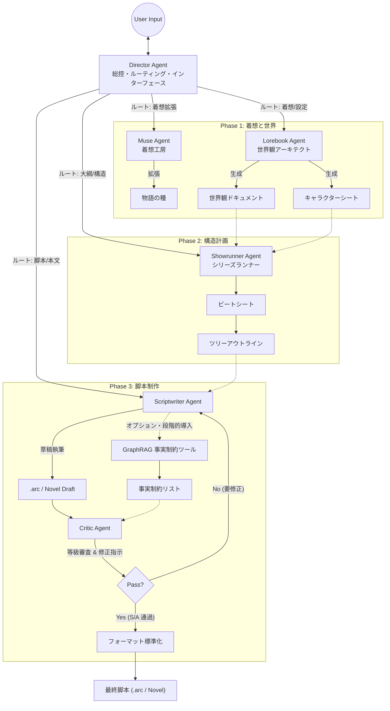
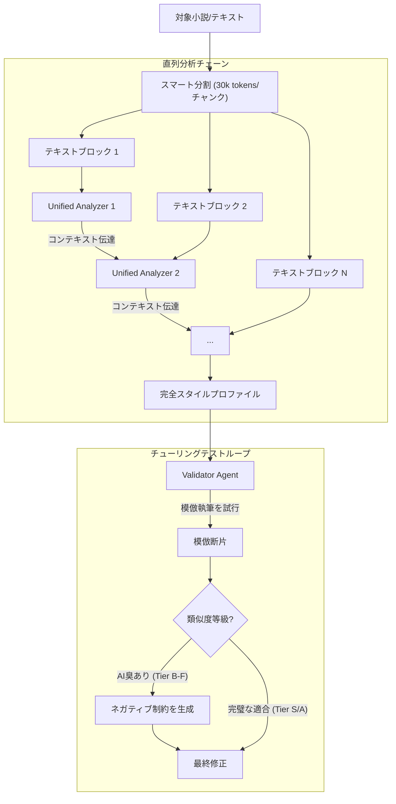
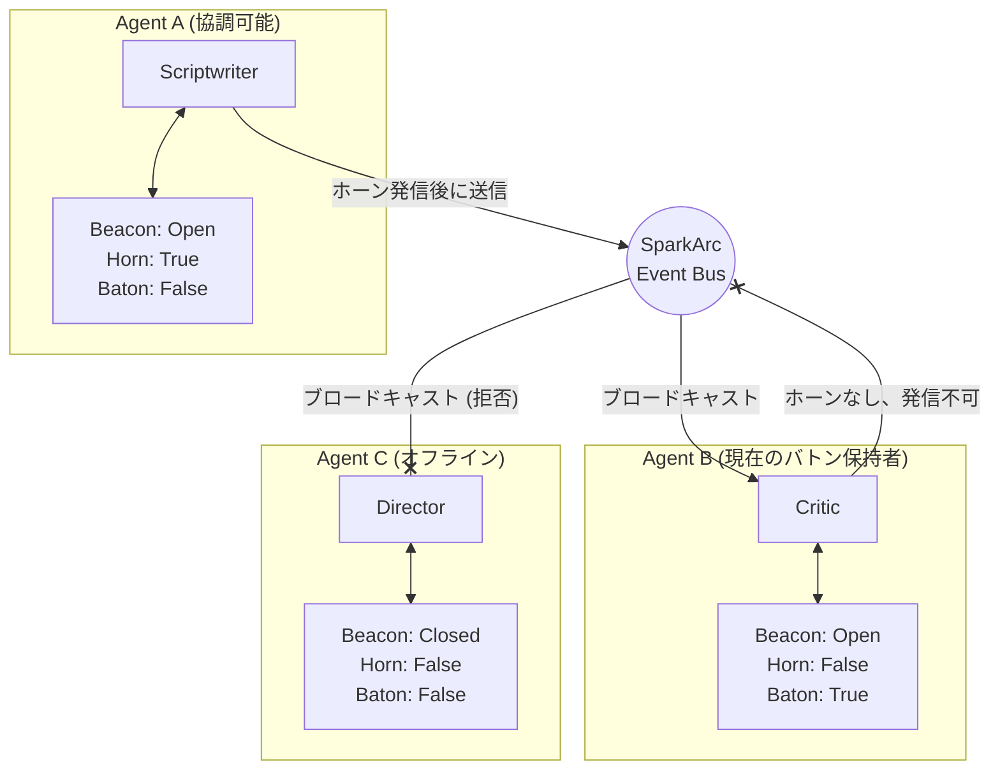

# SparkArc: クロスプラットフォーム Agent 物語制作スタジオ

[简体中文](README.md) | [English](README.en.md) | [日本語](README.ja.md)

SparkArc は、複数 Agent の協調で創作を進める本格的な制作スタジオです。
小さな着想を、公開可能な物語世界と実行可能なコンテンツ資産へ拡張します。

対応領域:

- 小説執筆
- 脚本制作
- Web 演出公開
- ゲームエンジン連携可能な物語データ化

SparkArc は次の全工程を一気通貫でつなぎます。

`着想 -> 世界観 -> テンポ -> 構成 -> 執筆 -> 品質検証 -> 公開 -> 共有 -> 演出`

---

## SparkArc が解く課題

一般的な AI 執筆ツールは、次のどちらかに偏りがちです。

- ブラックボックス生成で構造制御が弱い
- プロンプト設計をユーザー側に押し戻す

SparkArc はプロダクト設計を次のように置き換えます。

1. ユーザーは Director Agent と自然言語で会話する
2. Director が専門 Agent とツールへタスクを分配する
3. 構造化エディタに生成結果を自動反映する
4. どの段階でも人間が介入し、方向修正できる

IDE 級の制御力と、チャット級の操作感を両立するのが SparkArc の価値です。

---

## プロダクトの中核価値

### 1. 本番制作向け Studio UX

- 単一の会話入口でマルチ Agent を指揮
- 世界観・概要・構成・脚本の層別編集
- 生成過程を追跡できるホワイトボックス型体験
- 必要箇所のみ専門 Agent で局所的に改稿
- **Blueprint システム**：プロジェクト単位の `blueprint.json` で創作嗜好・文体制約・ワークフローパラメータを定義

### 2. 人間主導の創作コントロール

SparkArc は「創造の主語は人間」を前提にします。

- `Manual`：AI は整理・検証・提案のみ
- `Hybrid`（推奨）：核となる着想は人間、展開補完は AI
- `Auto`：粗いアイデアから複数方向を自動探索

### 3. 品質と整合性の閉ループ

- `Style Agent`：文体再現で AI らしさを低減
- `Critic Agent`：証拠ベースの編集レビュー（S/A/B/C/D）
- `GraphRAG`（オプション）：長編での事実整合と設定衝突の抑制; 本番対応だがデフォルトでは非マウント

### 4. モバイルとデスクトップの連続性

- 移動中でも触れる軽量編集フロー
- **Auto-Write**：無人バッチパイプライン — AI が章ごとに連続生成、ブラウザ切断後も継続、ネスト進捗リングで再開可能
- 深い編集と管理はデスクトップ Studio で実施
- MCP 経由で外部ツールから着想を取り込み

### 5. 公開・演出まで見据えた成果物

- Web 演出リンクとして即共有
- **バージョンスナップショット**：ワンクリックでスナップショット作成、.arc / 小説の二形式でエクスポート、復元可能
- **Novel モード**：インタラクティブ脚本に加え、純文学小説出力（Markdown）に対応
- ゲームエンジン接続へ自然に拡張
- テキストではなく実行可能な物語資産として管理

### 6. 拡張しやすい Agent 運用モデル

SparkArc は協調権限を以下で分離します。

- `Beacon`：可視性・受信可否
- `Horn`：能動発話権
- `Baton`：現在タスクの推進責任
- `ツール権限階層`：ロールベースのツールアクセス制御により、各 Agent を専用能力ドメインに制約。ハルシネーションによる権限越境汚染を防止し、パイプライン全体の安全性と制御性を担保

大規模化してもエージェント間の混線を抑え、保守可能性を維持できます。

---

## Agent パイプライン（制作視点）

| 段階 | 実務対応 | Agent / Tool | 役割 |
| :-- | :-- | :-- | :-- |
| 0. 調停 | ディレクション | `Director` | LangGraph ベースの多段ツール呼出自律調整、タスク委譲、自動執筆起動、進捗追跡 |
| 1. 企画 | ハイコンセプト | `Muse` | 着想の種を拡張し方向性を作る |
| 2. 設定 | ストーリーバイブル | `Lorebook` | 世界観ルール、設定、人物基盤を整備 |
| 3. 構造 | ビート設計 | `Showrunner` | ビートと章・シーン骨格を生成 |
| 4. 執筆 | 脚本草稿 | `Scriptwriter` | シーン本文を生成; .arc インタラクティブ脚本と小説の二形態出力に対応。Conception Chain 内蔵 |
| 5. 品質 | Script Doctor | `Critic` + `Style` | AI 臭・論理破綻・整合性ズレを検出。GraphRAG はオプションで追加可能 |
| 6. 出力 | 実行資産 | Web Player / Unity SDK | 物語を公開可能・実行可能資産へ変換 |

### Agent 三モーダル呼び出しプロトコル

各専門 Agent のプロンプトは三つの呼び出しモードに厳格に分離され、同一 YAML の三つのトップレベルフィールドで管理されます。「手動パネル」「ユーザーチャット」「監督委譲」の三経路が互いに混線しません：

| モード | YAML フィールド | 出力特性 |
| :--- | :--- | :--- |
| **専門作業モード** | `system` + `user` | 厳格な構造化、パーサーが直接処理可能 |
| **対話モード** | `chat_system` | 自然対話、発散可、形式を強制しない |
| **監督委譲モード** | `pipeline_system` | 厳格な構造化 + ツール実行・永続化 + 監督向け簡潔レポート |

> 📘 完全な実行時ロジック・`pipeline_system` 厳格制約・ツール reference 機構・新 Agent チェックリスト：[アーキテクチャ詳細 §2](docs/architecture.md#2-agent-三模态调用协议完整版) および [AGENTS.md §4.5](AGENTS.md)

---


## システムアーキテクチャ

### 1. Agent クラスタ

SparkArc は単一 LLM に依存せず、専門分化した Agent クラスタを構築します。各 Agent は独自のペルソナ・プロンプトエンジニアリング・モデル設定を持ちます。

> 💡 **国際化**：Agent レジストリ（`registry.py`）は `zh-CN` / `en-US` / `ja-JP` の三言語をネイティブサポート。フロントエンドは i18n マッピング、バックエンドは `resolve_agent_i18n_field()` でロケール別フィールドを抽出。

#### A. 調停者

* **Director Agent（監督）**：
  * **役割**：グローバル入口とコンテキスト管理者。**LangGraph SupervisorGraph** ベースの多段ツール呼出自律調整——`delegate_task` で専門家に委譲、`trigger_auto_write` で自動執筆起動、`check_scriptwriter_status` で進捗確認。
  * **コアコード**：`agent_director.py` + `director_graph.py`

#### B. 創作コア

* **Muse Agent（着想）**：閃きを捉え、多次元タグ（スタイル/トーン/視点）で物語の種に固化。MCP 経由で外部 AI アシスタントから着想を受信可能。
* **Lorebook Agent（世界観・キャラクター）**：単純なシードから世界観を構築——地理・歴史・魔法/技術体系、キャラクターシート一括生成。
* **Showrunner Agent（概要・リズム・アウトライン）**：マクロ物語制御。「Save the Cat」や「Hero's Journey」等の古典モデルに沿ってビートシートとツリー構造アウトラインを生成。
* **Scriptwriter Agent（執筆脚本家）**：唯一の「書き手」。**双態出力**対応：`.arc` インタラクティブ脚本と純文学小説（Markdown）。**Conception Chain** 機構内蔵。

#### C. 品質保証

* **Style Agent**（スタイルクローンサブクラスタ）
  * **役割**：反AI——対象作者の文体をクローンし、AI 特有の高頻度語彙を排除。
  * **サブクラスタ構成**：**Coordinator** + **Validator** + **StyleChatAgent**。

* **Critic Agent（論理審査）**：
  * **役割**：厳格な審読者をシミュレート。`S/A/B/C/D` 五段階評価 + 証拠 + `fix_ticket` 修正指示を出力、本文を直接書き換えない。
  * **モデル戦略**：専用分類器の訓練ではなく、LLM を Judge/Editor として活用。

* **GraphRAG Tool（事実制約、オプション・段階的導入）**：
  * **状態**：本番対応済み、ただし**デフォルトでは非マウント**。プロジェクト単位で段階的有効化可能。
  * **価値**：クロス章一貫性、キャラクター関係安定性、設定回収力を強化。

#### Critic 審査メカニズム

Critic は「これは AI が書いたか？」ではなく「**どこが読者にモデルの作業と感じさせるか**」を回答します。`S/A/B/C/D` 五段階 + 証拠 + `fix_ticket` を出力し、創作者の主導権を保持。

> 📘 完全な四つのコアメカニズムと「LLM vs ML モデル」の論拠：[アーキテクチャ詳細 §6](docs/architecture.md#6-critic-审核机制完整版)

#### 協調データフロー



### 2. スタイルクローンクラスタ

SparkArc で最も技術的に深いモジュール——**UnifiedStyleAnalyzer** の直列分析 + **ValidatorAgent** チューリングテストループで、人間の微妙な文体を捕捉しスタイルプロファイルを生成。

- **直列分析**：長編小説を 30k トークンのチャンクに分割、7 次元の全量分析を各チャンクで実行、チャンク間であらすじを引き継ぎ
- **自己対抗**：ValidatorAgent がスタイルプロファイルに基づき「偽作」を執筆・自己評価、AI 臭を検出したらネガティブ制約を生成して強制注入

#### ワークフロー：直列深度分析



> 📘 完全な直列分析詳細とネガティブ制約メカニズム：[アーキテクチャ詳細 §7](docs/architecture.md#7-风格克隆集群完整版)

### 3. ビーコンバス通信メカニズム

SparkArc は**ビーコンバス**を実装——「ビーコン / ホーン / バトン」の三点セットで可視性・能動発話権・タスク帰属を制御する権限付きメッセージルーティングアーキテクチャ。

> ⚠️ **現在の状態**：完全なインフラ（クラス定義・REST API・フロントエンドパネル）は実装済み、ただし Agent 間の水平自律通信は**予約機能**——現在は全て Director 調整経由。

#### コアメカニズム：ビーコン / ホーン / バトン

各 Agent は独立したランタイム三点セットを所有：**ビーコン**（可視/到達可能）、**ホーン**（能動発話権）、**バトン**（現在タスクチェーンの所有権）。

#### 交互トポロジー図



> 📘 完全な三点セットの定義と応用シナリオ：[アーキテクチャ詳細 §8](docs/architecture.md#8-信标总线核心机制完整版)

#### 監督調整 vs ビーコン協調

SparkArc には**二つの独立した通信メカニズム**が存在します：

- **監督調整**（垂直）：LangGraph ベースの多段ツール呼出自律調整、ビーコン制限なし。
- **ビーコン協調**（水平）：Agent 間通信はビーコン/ホーン/バトンで制約。

> 📘 完全な比較表と設計理由：[アーキテクチャ詳細 §1](docs/architecture.md#1-导演调度-vs-信标协作双系统对比)

---

## データプロトコル

SparkArc は人間可読性と機械解析性を両立するハイブリッドフォーマット **.arc** を定義。Markdown の流れる読書体験と XML の厳格な論理構造を組み合わせ、**超長構造化テキスト生成時の文学的品質を最大化**します。

### フォーマット例

```markdown
# シーンタイトル：最後の別れ
@guide クエストガイド：彼女の最後の道程を共に
@intro シーン初期化描写...

[-1]
ここはナレーション領域。夕日が通りを長く引き伸ばし、プラタナスの影が斑に落ちる。

[0]
ここを覚えている？

[1]
おじいちゃん……あめ……

<choice>
  <opt text="遠くの校門を指差す">
    [0]
    ほら、あそこで初めて会ったんだ。
    @next scene_memory
  </opt>
  
  <opt text="沈黙を保つ">
    [-1]
    沈黙が空気に広がる。
    @act system:AddMood(-5)
  </opt>
</choice>
```

### 解析戦略

サーバー側 `arc_parser.py` は層別解析を採用：シーン分割 → メタデータ抽出 → `<conception>` 推論フィルタリング → 正規表現 + カスタムタグハイブリッド解析（対話行 / `<choice>` 分岐 / `@act` 指令 / `@next` ジャンプ）。

> 📘 完全な四段階解析戦略：[アーキテクチャ詳細 §9](docs/architecture.md#9-arc-格式解析策略)

### Novel 純文学モード

インタラクティブ脚本フォーマットに加え、**純文学小説**出力モードをサポート：

- Scriptwriter Agent が `generate_novel` プロンプトを自動ロード、Markdown 散文を生成
- シーンファイルは `.md` で保存、`novel_parser.py` がアウトライン順に集約
- バージョンスナップショットは `.arc` と `novel` の両形式でエクスポート/復元
- 脚本エディタが小説編集ビューに自動切替

両モードは世界観・キャラクター・アウトライン・ビートシートを共有、最終出力フォーマットのみ分化。

---

## インフラストラクチャ

SparkArc は生産グレードのインフラストラクチャを構築しています。**他のプロジェクトにも容易に移転可能**です。

### 1. Matchbox Agent ゲートウェイ

Matchbox ゲートウェイは Agent 向けに統合 LLM アクセスを提供。GUI 付き独立ゲートウェイ、デュアルチャネル配額課金・レート制限・フルチェーン機能を備えます。

**OpenAI プロトコル互換**、推論フィールドの推論ストリーム自動統合で最適なストリーミング体験を提供。

コア機能：

- **デュアルチャネル設計**：管理チャネル（デフォルト）+ クイック接続チャネル（バイパス）
- **柔軟なホスティング**：システム管理 / BYOK / ハイブリッド
- **多段階クォータ**：`sys_paid` / `self_paid` 独立フロー制御、周期 + 上限制限
- **精密トークン推定**：`tiktoken` + 動的 CJK 補正
- **多目的スロット**：Fast / Reason / Main、タスク複雑度でルーティング

> 📘 完全なデュアルチャネル設計・導入・スロット設定：[Matchbox ゲートウェイ完全ガイド](docs/matchbox-gateway.md)

### 2. データベース自動マイグレーション

SparkArc は**起動時自動マイグレーション**を内蔵、新コード pull 後の手動 DB アップグレード不要で実行可能。

#### 🚑 緊急リカバリ

DB エラーが発生してもデータは安全。models と DB ファイルをコピーし、AI コードアシスタントに SQL で同期を指示、ファイルを戻すだけ。

#### コア機能

1. **マルチ DB ブランチ**：`users.db` と `llm_config.db` が独立 `version_locations`
2. **起動時自動アップグレード**：Alembic API 使用
3. **スマートリネーム検出**：フィールドリネームを自動識別
4. **危険操作インターセプト**：`DROP COLUMN` / `DROP TABLE` は確認必須
5. **孤立バージョン自己修復**：断絶したマイグレーションチェーンを自動修復

> 📘 完全な開発者ワークフローと導入ガイド：[DB マイグレーション完全ガイド](docs/database-migration.md)

### 3. ユーザー管理と権限

ロールベースアクセス制御（RBAC）と自動初期設定：

- **初代管理者**：システムが最初の登録ユーザーを自動的に管理者に設定
- **デフォルト権限**：他のユーザーは全員一般ユーザー（`is_admin = 0`）
- **権限付与**：初代管理者は「管理センター」UI で他ユーザーを管理者に昇格可能

### 4. 意味検索エンジン

SparkArc はプロジェクトレベルの意味検索エンジンを内蔵し、Director Agent に**正規表現 + 意味**のデュアルモード検索と、検索結果に基づくテキスト置換を提供します。

#### 製品機能

- **デュアルモード検索**：`search_project` は正規表現パターンマッチング、`semantic_search` はベクトル類似度による内容理解。結果形式は統一、どちらも `replace_from_search` の入力として利用可能
- **プロジェクト単位トグル**：プロジェクトごとに有効/無効を設定。有効化時に埋め込みモデルの可用性を自動テスト、失敗時は明確なガイダンスを表示
- **デフォルト有効オプション**：新規プロジェクトで意味検索をデフォルト有効にするか設定可能
- **自動インデックス更新**：次回検索時にファイルハッシュ変化を検出、差分インデックス再構築

#### 技術アーキテクチャ

- **ベクトルパイプライン**：LangChain + Chroma で構築、Matchbox ゲートウェイ経由でユーザー設定の Embedding モデルを取得、任意の OpenAI 互換埋め込み API に対応
- **遅延構築 + ハッシュ増分**：初回検索時にインデックスを自動構築、以降は MD5 ファイルハッシュ比較で再利用
- **チャンク戦略**：`SemanticChunker` が意味境界でプロジェクトテキストを分割、ナラティブ参照や行番号範囲のメタデータを保持
- **CJK プロジェクト名互換**：Chroma コレクション名を MD5 ハッシュに変換、CJK 命名規格問題を解決
- **バッチベクトル化**：埋め込み API を10件単位でバッチ呼出、主要モデルのバッチ制限に適応

---

### 5. CI/CD 自動デプロイ

完全な CI/CD パイプライン：プッシュ時に**自動ビルド・テスト・デプロイ**。Gitea Actions と GitLab CI 対応、Gitea ワークフローは GitHub Actions に低コストで移行可能。

パイプライン段階：**チェックアウト → イメージビルド → テスト（予約） → デプロイ → クリーンアップ**

> 📘 完全な Runner 設定・CI Secret・GitHub Actions 移行：[CI/CD デプロイ完全ガイド](docs/cicd-deployment.md)

---

## クロスプラットフォームエコシステム

### コンポーネント論理分離

- **ビジネスロジック (Composables)**：全コアロジックが UI 非依存の Composable 関数にカプセル化。主要 Composable：`useSynopsisLogic` / `useScriptWriterLogic` / `useWorldLogic` / `useStyleLogic` / `useStructureLogic` / `useAIModelManager` / `useAgentRegistry` / `useChatActions` / `useAdminLogic`。**プロジェクトは LUI 方向に進化中——近い将来、あなたの一言が複雑な創作パイプラインを起動します。**
- **ストリーミングインフラ**：`streamingRuntime.ts`（`createStreamingTask`）+ `loadingStats.ts` + `eventBus.ts` + `GlobalLoading.vue` — 完全なストリーミング消費ループ。チャットとビジネスタスクの二本のストリームは独立動作。
- **レスポンシブビュー**：デスクトップ（マルチカラムワークベンチ）+ モバイル（片手操作最適化）。主要ビューにモバイル専用レイアウトあり、ScriptWriter は現在デスクトップのみ。

### Tauri 2 クロスプラットフォームビルド

フロントエンドは Tauri 2 に統合。完全ビルドチュートリアル：[DOC/tauri/README.md](DOC/tauri/README.md)

クイックリファレンス（プロジェクトルートから `cd client`）：

1. インストール：`npm install`
2. デスクトップ（Win/Linux/macOS）：`npm run tauri:build`
3. Android：`npm run tauri:android`
4. iOS：`npm run tauri:ios`
5. ローカルデバッグ：`npm run tauri:dev`

注意：macOS/iOS は macOS デバイス必須、Android は Android Studio + SDK/NDK 必須。

### Unity ゲームエンジン統合（BETA）

Unity SDK（`SparkArc.Unity`）は `presenter/UnitySDK` に配置——極初期ベータ版。

データパイプライン：**作成**（`.arc` または `stories.db` をエクスポート）→ **アセット**（`StreamingAssets` に配置）→ **ランタイム**（`StoryRepository` 自動ロード、`DialogueManager` 駆動、`OnActionTriggered` で `@act` 指令をイベントブロードキャスト）。

---

## クイックスタート

### A. Windows ワンクリック起動（初心者向け推奨）

Docker のリソース負荷や設定の手間を避けるため、Windows ユーザー向けのワンクリック起動スクリプトを用意しています。**Python の手動インストールも Conda もコマンド操作も不要** — ダブルクリックするだけ。

**要件**: Windows 10 以降（64 ビット、初回リリースの 1507 以降なら可）。

#### 使い方

1. 本リポジトリを空フォルダに `git clone` でクローン（ダウンロードだけでは更新を受け取れないため）
2. **プロジェクトルートの `start.bat` をダブルクリック**
3. 初回実行時にポータブル Python（約 40MB）を自動ダウンロードし、依存関係をインストール — 操作不要
4. インストール完了後、バックエンドが自動起動
5. 次回以降はデプロイマーカーを検出し、**インストールをスキップして直接起動**

アクセス先: **http://localhost:6688**、または GitHub Releases からクライアントをダウンロード（推奨）。
スマートフォンからは **http://192.168.x.x（LAN 内 IP）:6688** へアクセス。
リモートアクセスには、内ネットワーク穿透ツールをご利用ください（サーバーをお持ちなら、この方法は使わないでしょう~~~）。

> 💡 **ゼロ汚染設計**: 生成物はすべて `server/.runtime/python/` 内に留まり、このディレクトリを削除すればシステムに痕跡は残りません。
> 💡 **べき等性**: スクリプトはバージョン検出とデプロイマーカーを内蔵し、繰り返し実行しても再ダウンロード・再インストールしません。
> 💡 **pip キャッシュの例外**: pip のダウンロードキャッシュは `%LOCALAPPDATA%\pip\Cache\`（ユーザーレベル、システムレベルではない）に書き込まれ、システムに影響しません。`pip cache purge` で削除可能。

#### 仕組み

スクリプトは以下のフローを自動実行：

1. **PowerShell 7**（`pwsh`）を優先使用。未インストール時は **Windows 組み込み PowerShell 5.x にフォールバック**
2. ミラーから [python-build-standalone](https://github.com/astral-sh/python-build-standalone) ポータブル Python 3.13 をダウンロード
3. .NET 組み込みの `GzipStream` + インライン C# tar デコーダーで `server/.runtime/python/` に展開（**tar.exe 不要、外部依存なし**）
4. `pip install --isolated --no-user` で依存関係をインストール — **パッケージはポータブル環境内に閉じる**
5. 全工程成功後に `server/.runtime/python/.deploy_complete` デプロイマーカーを書き込み
6. ポータブル Python でバックエンドを起動（VS Code F5 は開発者向けワークフローであり、VS Code で選択したインタープリターを使用します）

### B. Docker（推奨）

```bash
git clone https://github.com/your-repo/sparkarc.git
cd sparkarc
docker compose up -d --build
```

起動先: http://localhost:7788

#### 任意: 登録時の人間確認（Cloudflare Turnstile）

SparkArc は登録エンドポイントに Cloudflare Turnstile を接続できます。フロントエンドは Turnstile ウィジェットで token を取得し、バックエンドはユーザー作成前に Cloudflare へ検証します。

プロジェクトルートの `.env` を作成または編集します：

```env
SPARKARC_REGISTRATION_VERIFICATION_ENABLED=1
SPARKARC_REGISTRATION_VERIFICATION_PROVIDER=turnstile
SPARKARC_TURNSTILE_SITE_KEY=your Turnstile Site Key
SPARKARC_TURNSTILE_SECRET_KEY=your Turnstile Secret Key
```

その後、コンテナを再作成してください：

```bash
docker compose up -d --build --force-recreate
```

補足：

- `SPARKARC_TURNSTILE_SITE_KEY` は公開用で、`/api/auth/verification-config` からフロントエンドへ返されます。
- `SPARKARC_TURNSTILE_SECRET_KEY` は秘密鍵で、バックエンドだけが使用します。
- **site key または secret key が未設定の場合、登録確認はデフォルトで無効**になり、自己ホスト初回登録を妨げません。
- 将来 Google や他プロバイダへ切り替える場合は、登録ルートを保ったまま `server/core/verification.py` の provider 実装を拡張してください。

`git pull` 後は再起動ではなく再ビルドしてください。

```bash
git pull --ff-only
docker compose up -d --build --force-recreate
docker compose logs --tail=120 sparkarc
```

理由: 新コードを確実に反映し、古いマウントファイルによる上書き事故を防ぐためです。

### C. ローカル開発

1. Python 環境を作成し `server` 依存を導入
2. `client` でフロントエンドをビルド
3. `server` を起動
4. http://localhost:6688 へアクセス

### 自己ホスト時のアクセス方法：ブラウザとクライアント

SparkArc のバックエンドは Web フロントエンドを直接配信します。自己ホストでは、まずブラウザでバックエンドのアドレスへアクセスするのが最も簡単です。

- Docker: `http://localhost:7788`
- ローカル開発: `http://localhost:6688`
- リモートサーバー: `http://your-server-address:port`

GitHub Releases で配布されるクライアントは、便利なフロントエンド用の外殻です。あなたの私有バックエンドへ自動接続するわけではありません。**デスクトップ版またはモバイル版クライアントを利用する場合は、ログイン前にデフォルトのサーバーアドレスを自分の実際のアドレスへ変更してください。** デフォルトアドレスはメンテナーがホストする公式インスタンスを指している場合があり、私有デプロイ用途には適しません。

よくある例：

- デスクトップクライアントから同じ PC のバックエンドへ接続: `http://localhost:6688` または `http://localhost:7788`
- スマートフォンから同一 LAN 内の PC へ接続: `http://computer-lan-ip:6688` または `http://computer-lan-ip:7788`
- リモート私有デプロイ: サーバーの公開ドメイン/IP とポートを指定

スマートフォン、タブレット、外出先の端末から自分の私有インスタンスにアクセスしたい場合は、クラウドサーバーへデプロイするか、トンネル / リバースプロキシ / トンネリングツールでローカルサービスを自分の端末向けに公開できます。いずれの場合も、アカウント、HTTPS、アクセス制御、ファイアウォール、モデル Key、バックアップを適切に設定してください。

> 💡 私有インスタンスで公開登録を許可する場合は、HTTPS、登録時の人間確認、ファイアウォール / リバースプロキシでのレート制限、バックアップを設定し、`LLM_KEY` と各モデルプロバイダ Key を慎重に管理してください。

---

## i18n と言語ポリシー

- UI 対応言語: `zh-CN`, `en-US`, `ja-JP`
- 設定画面で即時切替可能
- Agent system prompt の言語ルール:

1. 既定では現在ロケールを優先
2. ユーザーが他言語を自発使用、または明示要求した場合のみ切替

フロントエンド実装では、ユーザー表示文言のハードコードを避け、Vue I18n を使用してください。

---

## リポジトリガイド

- メイン貢献ガイド: `.github/CONTRIBUTING.md`（英語）
- Agent 制約と設計規約: `AGENTS.md`
- Agent 言語方針: `agent.md`

---


## プロダクトロードマップ（方向性）

- 立ち絵スタイル統一パイプライン
- 背景画像の軽量生成/編集ワークフロー
- 役割特化型 Scriptwriter サブ Agent パック
- スキーマ駆動のカスタム UI コンポーネント生成

SparkArc は、物語制作を「高品質で、再現可能で、創作者主導」にすることを目標に進化します。

---

## 詳細ドキュメント

| ドキュメント | 内容 |
| :--- | :--- |
| [アーキテクチャ詳細](docs/architecture.md) | Director vs Beacon 比較、Agent 三モーダル規約、Critic 審査メカニズム、スタイルクローンクラスタ、ビーコンバスコアメカニズム、ARC 解析戦略、ツール登録表、ストリーミング基盤 |
| [Matchbox ゲートウェイガイド](docs/matchbox-gateway.md) | デュアルチャネル設計、導入手順、スロット設定、推論ストリーム互換 |
| [DB マイグレーションガイド](docs/database-migration.md) | 開発者ワークフロー、移行導入、履歴クリーンアップリスク |
| [CI/CD デプロイガイド](docs/cicd-deployment.md) | Runner 設定、CI Secret、GitHub Actions 移行 |
| [意味検索エンジン](#4-意味検索エンジン) | デュアルモード検索、プロジェクト単位トグル、遅延構築 + ハッシュ増分、Chroma ベクトルストレージ |
| [AGENTS.md](AGENTS.md) | Agent 開発規約、新 Agent チェックリスト、プロンプト規約 |
| [LEGAL/README.md](LEGAL/README.md) | 法律・運営声明統一入口 |

---

## 締めくくりに

本プロジェクトは設計・開発・テスト全てを私（1deaaa）一人で行いましたので、瑕疵は免れません。普段は時間があまり取れないため、メンテナンスが迅速でない場合もあります——コミュニティからの積極的なご参加をお待ちしています。

本プロジェクトは元々スタジオ内でゲームシナリオシステム開発に使用していた内部ツールでした。

**AI はすでに MCP や Skills 等を通じてゲーム開発の大部分の工程を大幅に加速しています。かつて一人のゲーム夢は、もはや手の届かないものではありません。**

**本プロジェクトを設計した本来の目的は、AI ゲーム開発における極めて重要だが AI がまだ苦手なパズルの欠片——ストーリーシステム——を補完することでした。**

その後、じっくりと技術を磨くために、このプロジェクトを Agent 前沿技術の実験場として位置づけ、まずユーザーを獲得し、フィードバックを基にゲームエンジンへ段階的に統合していく方針に転換しました。

不可抗力がない限り、SparkArc は長期的にオープンソースで維持します。メンテナーが追加する新機能は、原則として公開リポジトリへ優先的に反映します。

個人、クリエイター、小規模チーム、スタジオによる自己ホストや内部利用を歓迎します。Issue、PR、ドキュメント、テンプレート、Agent、ワークフロー、チュートリアル等によるエコシステムへの貢献も歓迎します。

SparkArc は AGPL-3.0-only に基づき公開されています。AGPL-3.0 の条件に従う限り、実行、複製、改変、デプロイ、配布が可能です。SparkArc を改変し、ネットワーク経由でユーザーに提供する場合、そのユーザーに対して該当バージョンの完全な対応ソースコードを提供し（本プロジェクトへの還元も歓迎）、著作権表示、ライセンス表示、出所表示を保持する必要があります。

私自身も同じライセンスに拘束されます。すべての貢献者、デプロイ担当者、コミュニティメンバーと共に、SparkArc のオープンエコシステムを維持していきたいと考えています。

SparkArc の公式インスタンスは 1deaaa / AIdeaStudio のみが独立して運営します。将来的に、公益提供、スポンサー、付与クレジット、有償ホスティング等の形でプロジェクト継続を支える可能性があります。

すべての貢献者、デプロイ担当者、コミュニティメンバーにも、AGPL が守る権利への意識を持ってほしいと考えています。SparkArc は学習、自己ホスト、構築、貢献のために開かれているのであって、出所を消した閉鎖的なホワイトラベル版がコミュニティ成果を一方的に収益化するためのものではありません。著作権表示とライセンス表示を保持し、必要な場合は対応ソースコードを提供し、改変内容と出所を明示し、ブランドと公式インスタンスの境界を尊重してください。適法な自己ホスト、内部利用、学習、研究、エコシステム貢献は歓迎しますが、AGPL 回避、誤認を招くホワイトラベル運営、第三者運営リスクのコミュニティへの転嫁は受け入れません。

明示的な書面声明がない限り、メンテナーは第三者に対して、プロプライエタリ再ライセンス、ホワイトラベル運営、ブランド代理、公式提携、商標利用、AGPL 免除を許諾しません。第三者による SparkArc のデプロイ、改変、配布、運営は AGPL-3.0 を遵守する必要があり、ユーザー、コンテンツ、モデル接続、決済、ポイント、引換コード、サポート、コンプライアンス、法的責任は当該運営者が単独で負います。

**実際の運営者とそのユーザーが生成するコンテンツのコンプライアンス問題は本人と無関係です。** 公開サービスを提供する運営者は、匿名共有、コンテンツ審査、本人確認、ログ保存、モデル利用規制を慎重に扱ってください。

---

## 法律・運営声明

ライセンス方針、公式インスタンス、第三者デプロイ、コンテンツガバナンス、プライバシー処理、知的財産権境界については、[`NOTICE`](NOTICE) および [`LEGAL/README.md`](LEGAL/README.md) を統一入口として参照してください。

---

## ブランド・商標に関する声明

SparkArc は本プロジェクトの公式名称および識別子です。

本プロジェクトのコードは AGPL-3.0-only で公開されていますが、**「SparkArc」の名称、ロゴ、ブランド視覚デザインおよび関連する識別子はコードのライセンス対象に含まれません**。

本プロジェクトに基づくデプロイ、改変版または配布版は、オリジナルプロジェクトとの公式・授権・代理・提携関係を暗示してはなりません。

Matchbox Agent ゲートウェイ（`server/llm/agen_matchbox`）は独立して再利用可能なコンポーネントであり、同ディレクトリ内の `LICENSE` に従って Apache-2.0 で個別にライセンスされています。特に明記がない限り、メインプロジェクトのその他の部分は AGPL-3.0-only でライセンスされています。

