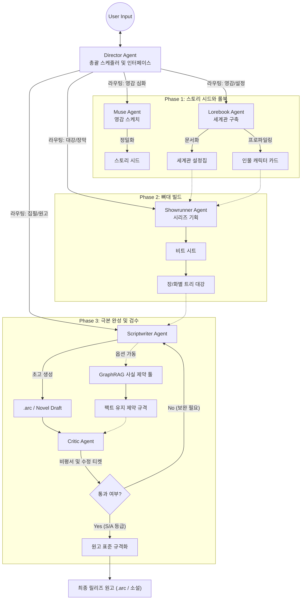
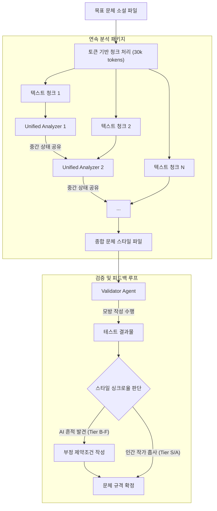
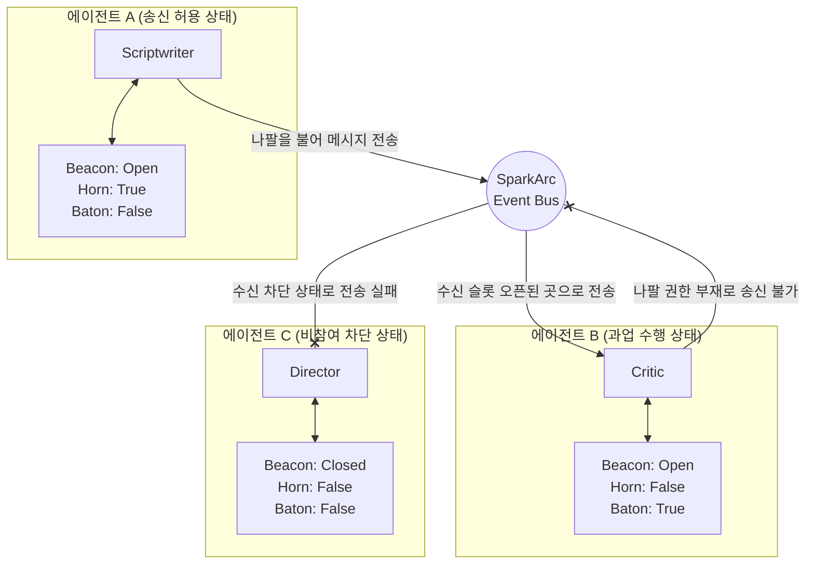

# SparkArc AI 창작 플랫폼

[简体中文](README.md) | [English](README.en.md) | [日本語](README.ja.md) | [한국어](README.ko.md)

> 📢 **지원 및 관심**: SparkArc가 창작에 도움이 되었다면 우측 상단의 **Star**(즐겨찾기 추가로 언제든 다시 찾기)와 **Watch**(Custom -> Releases를 선택하여 신규 업데이트 구독)를 부탁드립니다. 독립적인 오픈소스 프로젝트로서, 모든 Star와 Watch는 커뮤니티 내 노출도 향상과 지속적인 업데이트 및 장기적인 발전에 매우 중요합니다. 지원해 주셔서 감사합니다!
> 
> 💖 **스폰서 및 파트너십**: 만약 귀하가 API 프록시 제공업체, 애그리게이터 또는 GPU 공급업체라면, [**스폰서 및 비즈니스 협력 가이드**](.github/SUPPORT.md)(현재 중문/영문만 지원)를 확인해 주시기 바랍니다. 개발 및 테스트에 필요한 API 크레딧 후원에 대한 보답으로, 자체 호스팅 사용자들을 위한 "기본 구성 배포" 등 홍보 가치가 높은 채널을 제공합니다. **프로젝트의 빠른 업데이트와 반복 개발을 유지하기 위해 스폰서십이 절실히 필요합니다.**

SparkArc AI 창작 플랫폼(SparkArc Studio)은 자율적 멀티 에이전트(Agent) 그룹이 구동하는 창작 플랫폼입니다. 전문적인 창작 파이프라인을 통해 한 줄의 미약한 영감을 온전한 스토리 세계관으로 확장하고 소설이나 시나리오를 집필하며, 미려한 웹(WEB) 연출과 게임 엔진 연출까지 구동할 수 있도록 설계되었습니다.
이 플랫폼은 **영감 — 설정 — 템포 — 대纲(아웃라인) — 집필 — 검증 — 배포 — 공유 — 연출**에 이르는 모든 링크를 관통하여 창작자에게 강력한 생산성 도구를 제공합니다.

---

## 핵심 기능

### 1. 전문 워크스테이션, 직관적인 상호작용

이제 당신이 총감독(총편극)입니다. **채팅창**에서 **디렉터(감독) 에이전트**에게 한마디 던지기만 하면, 에이전트 창작 팀 전체를 구동하여 방대한 세계관을 질서정연하게 창작하기 시작합니다. **다양하고 강력한 구조화된 편집 도구**를 활용해 **모든 창작 프로세스를 자동으로 완료**해 줍니다. 완성된 소설이나 시나리오는 친구에게 공유할 수 있으며, **인터랙티브 웹 연출 단말**을 통해 당신의 영감 속에 깊이 몰입하게 만들 수 있습니다.

SparkArc는 여러 에이전트 간의 협업을 통해 전문적인 창작 워크플로우를 가장 자연스러운 채팅 인터페이스로 구현했습니다:

* **프롬프트와 수동 편집에서의 해방**: 더 이상 에이전트에게 세계관을 챙기면서 대강을 짜라고 복잡한 프롬프트를 작성할 필요가 없으며, 여러 에이전트가 출력한 텍스트를 일일이 복사해서 옮겨 적을 필요도 없습니다. 디렉터 에이전트가 당신의 요구사항을 정확히 이해하고 하위 태스크로 쪼개어 설정 전문가, 시놉시스 기획자, 시나리오 작가 등에게 분배합니다. 이들은 **도구를 사용해 자동으로 문서를 편집**하므로, 당신은 구조화된 텍스트의 정밀한 제어 혜택을 누리면서도 작업 공수는 줄일 수 있습니다.
* **블랙박스의 투명화, 백블루프린트 협업**: 일반적인 AI 도구들은 대개 블랙박스 안에서 최종 장문을 한 번에 생성합니다. 반면 SparkArc는 백그라운드에서 **자율적으로 태스크를 수행**하며 각 단계의 추론 과정을 시각적으로 보여주고 **AI의 사고 흐름(Reasoning)을 설명**해 줍니다. 또한 시나리오 기획, 세계관 등 모든 워크플로우에 **사용자 친화적인 비주얼 편집기**가 준비되어 있어, 결과물이 마음에 들지 않으면 **특정 전문가 에이전트**를 지정해 칼로 도려내듯 부분 수정할 수 있습니다. 맹목적인 '뽑기식' 생성이 아닌, 전 과정이 투명한 백블루프린트 창작입니다.
* **압도적으로 직관적인 전문 창작 경험**: 전문 **IDE 급의 Studio**이지만 복잡한 조작 논리가 전혀 없어 직관적이고 즉시 작동합니다. *백문이 불여일견, 직접 확인해 보세요.*

### 2. 인간 중심, 자유로운 제어

SparkArc는 **영감과 감정이 인간 창작의 핵심이자 타협할 수 없는 영역**이라고 굳게 믿습니다. 철저히 인간 중심으로 설계되어, AI의 개입 수준을 자유롭게 조작할 수 있습니다.

* **스타일 클론(문체 복제) 및 반(Anti)-AI**: 스타일 분석 엔진을 활용해 창작자 본인 또는 특정 유명 작가의 고유한 서사 톤, 어휘 패턴, 감정 색채를 그대로 복제합니다. 이를 통해 **AI가 쓴 글에서 흔히 나타나는 고빈도 단어 문제를 효과적으로 해결**하고, **생성된 텍스트의 AI 냄새(AI味)를 대폭 줄였습니다.**
* **프로젝트급 시맨틱 검색**: 디렉터 에이전트에게 프로젝트 전반의 시맨틱(의미론적) 검색 능력을 부여합니다. AI는 더 이상 단순 글자 매칭(정규식)에 의존하지 않고 내용의 의도를 이해하여 검색하며, 여러 파일에 흩어진 관련 단락을 정확히 찾아내고 해당 검색 결과를 바탕으로 텍스트를 교체할 수도 있습니다. 프로젝트별로 독립된 스위치를 제공하며, 신규 프로젝트 생성 시 기본 활성화되도록 설정할 수 있습니다.
* **팩트 기반의 제약적 글쓰기**: 크리틱(비평가) 에이전트가 먼저 현재 씬이나 소설 전반에 대해 **5차원 검사**(구조, 언어, 대화, AI 작성 탐지, 문학적 가치, 논리적 캐릭터 설정)를 수행하여 **최종 등급, 본문 내 증거 및 수정 가이드라인**을 출력합니다. GraphRAG 기반의 사실 제약 도구가 제품화되어 필요에 따라 그레이스케일로 활성화할 수 있습니다. 활성화되면 "반드시 팩트 유지 / 충돌 방지 / 보완 정보 필요" 등의 제약 사항을 전달하여 크리틱 에이전트의 "증거 기반 진단 + 제약 조건 기반 피드백"의 이중 보호막을 형성합니다. 이를 통해 **장편 소설 작성 시 설정 붕괴(吃书)를 막고 높은 수준의 반-AI 품질을 구현**합니다. 또한 강제로 수정하지 않고 창작자의 최종 결정권을 존중합니다.

인스피레이션이 떠오르는 순간의 퀵 메모부터 한 땀 한 땀 다듬는 자구 수정까지, SparkArc는 다양한 개입 모드를 지원합니다:

* **완전 수동**: 순수한 구조화 편집기로서 작동합니다. AI는 분석, 검증, 제안만 제공합니다. 당신이 직접 단어 하나하나를 통제하며 SparkArc의 우수한 레이어 관리 시스템을 통해 복잡한 스토리를 정리할 수 있습니다.
* **반자동 [추천]**: 최적의 '인간과 기계의 공동 댄스' 경험입니다. 당신이 핵심 아이디어, 주요 반전, 감정선의 클라이맥스를 제공하면 AI가 세부 묘사와 윤문을 담당합니다. 언제든 개입하여 수정하거나 다시 쓰게 지시할 수 있으며 AI는 즉시 새로운 방향에 적응합니다.
* **완전 자동**: 모호한 생각 하나만 제공하면 AI가 머릿속에서 브레인스토밍을 거쳐 여러 옵션의 시놉시스나 짧은 스토리 단편을 제안하여 당신의 창작 욕구를 자극합니다.

### 3. 무경계 창작, 시공간을 초월한 작업

영감은 대개 **컴퓨터 밖(지하철, 산책길, 혹은 친구나 AI와의 잡담 중)에서** 불쑥 찾아옵니다.

* **지하철 안에서의 조각 창작**: 모바일 기기에 완벽히 최적화되어 한 손으로 조작할 수 있습니다. 출퇴근 자투리 시간에 아웃라인을 검토하고, 영감을 기록하거나 간단한 선택지를 골라 스토리를 진행할 수 있습니다. 높은 자동화 수준 덕분에 5분의 지하철 탑승 시간 동안에도 의미 있는 스토리를 작성할 수 있습니다.
* **전체 플랫폼 지원**: Windows, macOS, Linux, Android, iOS 등 모든 기기(컴퓨터, 태블릿, 모바일 스마트폰)를 지원하여 언제 어디서나 전문 Studio로 활용할 수 있습니다.
* **영감 우체통 MCP**: 애플리케이션의 경계를 허뭅니다. MCP(Model Context Protocol)를 통해 **RikkaHub**, **CherryStudio** 등 MCP를 지원하는 모든 AI 비서와 대화하거나 리서치하던 중 번뜩인 아이디어를 한 줄의 명령어로 영감 우체통에 즉시 전송하여 스토리의 씨앗으로 등록할 수 있습니다.
* **무인 오토 라이팅 (Auto-Write)**: 오토 라이팅 파이프라인을 켜면 브라우저를 꺼두어도 백그라운드에서 대강에 맞춰 씬별로 계속 작성합니다. 언제든 다시 열어 실시간 진행 상황을 볼 수 있고 일시정지, 이어서 쓰기, 끊긴 지점 복구를 완벽히 지원하며 직관적인 서클 진행률 표시를 제공합니다.

### 4. 영감의 불씨를 나누고 세계를 선보이기

**AI 덕분에 마음속에 고이 담아두었던 주인공들이 무대에 설 수 있게 되었습니다.** 단순 텍스트 공유가 아닌 완성된 비주얼 연출을 보여줄 수 있습니다.

* **WEB 연출 단말**: 링크 하나만 전달하면 관객이 즉시 연출 페이지에 접속하여 게임이나 시나리오에 몰입할 수 있습니다.
* **버전 스냅샷 및 내보내기**: 원클릭으로 버전 스냅샷을 만들어 저장하며, `.arc` 인터랙티브 극본 형태 또는 일반 텍스트 소설 형태 둘 다로 내보낼 수 있고 필요 시 스냅샷 상태로 즉시 롤백할 수 있습니다.
* **기획 중인 기능**: *더 큰 그림을 준비하고 있으니 기대해 주세요.*
  > 1. 캐릭터 일러스트 생성 및 일관된 화풍 고정 기능
  > 2. 이미지 생성 및 편집 모델을 활용한 간단한 비주얼 배경 제공
  > 3. 시나리오 작가(Scriptwriter) 에이전트의 커스텀 파생(예: 일상 전문, 아이템 설정 전문 등 하위 에이전트 확장)
  > 4. 사용자가 정의한 데이터 구조를 바탕으로 에이전트가 프론트엔드 UI 컴포넌트를 직접 짜고 데이터베이스에 저장하는 LUI/GEN-UI 모델

### 5. 산업용 생산성, 창작의 민주화

조작이 간편하고 친근한 창작 플랫폼일 뿐만 아니라 실제 게임 및 미디어 산업의 생산성 도구입니다. **생성된 시나리오는 Unity, Unreal Engine, Godot 등 주요 게임 엔진에 쉽게 임포트할 수 있습니다. AI 발전에 발맞추어 머지않아 누구나 원하는 스토리와 게임을 직접 창작할 수 있는 권리를 갖게 될 것입니다.**

* **코드 프리 결합**: 기획자는 텍스트와 드라마적 요소에만 집중하고 코드를 단 한 줄도 쓰지 않고도 연출 및 게임 로직을 제어하고 즉시 텍스트를 업데이트할 수 있습니다.
* **블루프린트 시스템**: 프로젝트마다 개별 `blueprint.json`을 통해 스타일 규범, 창작 성향, 워크플로우 매개변수를 제약하여 AI가 제멋대로 쓰지 않고 약속된 프레임워크 내에서 작성하게 합니다.
* **Unity 예제**: 기본 제공되는 **Unity 패키지 예제**를 제공합니다. 당신의 극본은 문서 속의 죽은 텍스트가 아닌, 게임 내에서 즉시 살아 움직이는 액티브 에셋이 됩니다.

### 6. 통념을 깨는 자율 에이전트 협업 버스

* **신호등 / 나팔 / 깃발 (Beacon / Horn / Baton)**: SparkArc는 멀티 에이전트의 거동을 제어하기 위해 직관적인 용어를 사용합니다. **신호등(Beacon)**은 타 에이전트가 나를 보고 메시지를 보낼 수 있는지를 결정하고, **나팔(Horn)**은 내가 다른 에이전트에게 먼저 발언할 권한이 있는지를 결정하며, **깃발(Baton)**은 현재 이 업무 체인의 소유권이 누구에게 있는지를 뜻합니다. 이 세 가지 요소를 분리함으로써 가시성, 송신 권한, 태스크 귀속을 명확히 제어하고 멀티 에이전트 그룹의 컨텍스트 부하를 크게 낮추어 추후 새로운 에이전트 확장을 용이하게 합니다.
* **도구 권한 등급화**: 도구 분배 매커니즘을 기반으로 한 권한 통제입니다. 서로 다른 역할을 가진 에이전트들을 각각 고유한 능력 도메인 내로 제약하여, 복잡한 업무 중 AI가 환각을 일으켜 타 영역의 데이터를 덮어쓰거나 오염시키는 것을 원천 차단하고 전체 파이프라인의 안전성과 신뢰성을 확보합니다.

---

SparkArc의 아키텍처는 헐리우드 극본가 및 AAA 게임사의 시나리오 생산 프로세스를 그대로 벤치마킹했습니다:

| 단계 | 전통적인 역할 | 에이전트 / 도구 | 기능 설명 |
| :--- | :--- | :--- | :--- |
| **0. 조율 및 스케줄링** | 감독 / 조율 센터 | **Director (감독 에이전트)** | 글로벌 엔트리 및 컨텍스트 제어자. LangGraph 멀티스텝 툴 호출을 통해 자율적으로 업무를 스케줄링하고 위임하며 진행 상황을 추적하는 사용자와의 직접 인터페이스 노드입니다. |
| **1. 기획 / 크리에이티브** | 로그라인 / 하이 콘셉트 | **Muse (영감 에이전트)** | 찰나의 스쳐 지나가는 영감을 포착하여 스타일, 장르, 시점 등 다차원 태그를 기반으로 견고한 스토리 시드로 변환하고 확장합니다. |
| **2. 세계관 설계** | 스토리 바이블 / 월드 가이드 | **Lorebook (설정 전문가)** | 물리 법칙, 마법/기술 계통, 세계의 역사·정치, 주요 등장인물 카드(Character Sheets)를 작성하여 스토리 전체의 논리적 일관성을 설계합니다. |
| **3. 구조화** | 비트 시트 / 트리트먼트 | **Showrunner (기획자 에이전트)** | 스토리의 큰 뼈대를 정합니다. 기승전결 혹은 영웅의 여정(Hero's Journey) 등 클래식 내러티브 구조에 맞춰 장막을 나누고 세부 비트 시트와 장/화별 대강을 구성합니다. |
| **4. 집필** | 스크린플레이 / 극본 집필 | **Scriptwriter (작가 에이전트)** | 실질적인 집필을 담당합니다. 기획된 대강 내에 대사, 행동 지문, 씬 묘사를 채워 넣으며, `.arc` 인터랙티브 포맷과 순수 소설(Markdown) 포맷을 모두 지원합니다. 생각 사슬(Conception Chain)을 통해 집필 전 스스로 논리 추론을 거칩니다. |
| **5. 품질 보증 (QA)** | 스크립트 닥터 / 검토 | **Critic (비평가) & Style (스타일 클론)** | 크리틱은 독자의 입장에서 대사의 어색함, AI 작성 패턴 검출, 세계관 충돌 등을 진단해 등급과 수정 요구서를 발행합니다. 스타일 클론은 스타일 모델링을 통해 AI 특유의 고빈도 어휘를 제거하고 목표 작가의 톤을 입힙니다. GraphRAG를 그레이스케일로 가동하여 장기 연상 기억을 보강합니다. |
| **6. 제작 / 빌드** | 구현 / 에셋화 | **WEB 연출 단말 / Unity SDK** | 극본을 디지털 에셋으로 배포합니다. `.arc` 데이터를 파싱하여 대화 시스템, 연출 스케줄링, 퀘스트 트리거를 직접 구동합니다. |

## 목차

* [🚀 빠른 시작](#-빠른-시작)
* [시스템 아키텍처](#시스템-아키텍처)
  * [1. 에이전트 클러스터](#1-에이전트-클러스터)
  * [2. 스타일 클론 클러스터](#2-스타일-클론-클러스터)
  * [3. 신호등 버스 통신 메커니즘](#3-신호등-버스-통신-메커니즘)
* [데이터 프로토콜](#데이터-프로토콜)
  * [ARC 인터랙티브 극본 포맷](#arc-인터랙티브-극본-포맷)
  * [Novel 순수 소설 모드](#novel-순수-소설-모드)
* [인프라스트럭처](#인프라스트럭처)
  * [1. Matchbox 에이전트 게이트웨이](#1-matchbox-에이전트-게이트웨이)
  * [2. 데이터베이스 자동 마이그레이션](#2-데이터베이스-자동-마이그레이션)
  * [3. 사용자 관리 및 권한](#3-사용자-관리-및-권한)
  * [4. 시맨틱 검색 엔진](#4-시맨틱-검색-엔진)
  * [5. CI/CD 자동 배포](#5-cicd-자동-배포)
* [플랫폼 생태계 및 아키텍처](#플랫폼-생태계-및-아키텍처)
* [📚 더 깊이 알아보기](#-더-깊이-알아보기)
* [개발자 에필로그](#개발자-에필로그)

---

## 🚀 빠른 시작

⚠️ 본 프로젝트는 클라이언트와 서버가 분리되어 있습니다. **반드시 아래 가이드에 따라 백엔드 서버를 먼저 실행해야 사용 가능합니다.**

**클라이언트는 브라우저로 서버 주소에 직접 접속하여 사용하거나, 공식 Release 릴리즈 페이지에서 전용 데스크톱/모바일 앱을 다운로드하여 실행할 수 있습니다.** 앱 실행 시 서버 API 경로를 확인하고 자동으로 연결을 시도합니다.

원활한 체험을 위해 개발자가 임시 서버 인스턴스를 유지하고 있습니다. 백엔드를 직접 실행하지 않아도 클라이언트가 자동으로 이 공용 서버에 연결되며, 회원가입 후 즉시 사용할 수 있습니다.
**다만 예산과 시간 한계로 서비스의 안정성을 전적으로 보장할 수 없으며 수시로 점검 또는 중단될 수 있습니다. 중요한 창작 데이터는 반드시 개인 서버를 직접 배포하여 관리해 주십시오.**

### 방법 1: Windows 원클릭 실행 (초보자 권장)

Docker 설정 리소스 부담과 환경 구성 번거로움을 줄이기 위해 Windows 사용자 전용 원클릭 실행 스크립트를 제공합니다.

**시스템 사양**: Windows 10 이상 (64비트 버전).

#### 실행 방법

1. 빈 폴더를 생성하고 Git 명령으로 본 저장소를 복제합니다(단순 다운로드 시 업데이트 업데이트 관리가 어려울 수 있습니다).
   `git clone https://github.com/your-repo/sparkarc.git`
2. **프로젝트 루트 폴더 내의 `start.bat` 파일을 더블클릭합니다.**
3. 최초 실행 시 휴대용 포터블 파이썬 환경(약 40MB) 및 필요한 모든 패키지 의존성을 자동으로 다운로드하고 빌드하므로 아무 작업도 하지 않고 기다려 주시면 됩니다.
4. 모든 설치가 완료되면 자동으로 백엔드 API 서비스가 구동됩니다.
5. 이후 다시 실행할 때는 배포 플래그가 탐지되어 **설치 단계를 건너뛰고 즉시 구동됩니다.**

접속 주소: 브라우저로 **<http://localhost:6688>** 접속 또는 전용 클라이언트 앱 실행.
모바일 기기에서 접속할 경우: **<http://192.168.x.x(사용자 PC의 공유기 내부 IP 주소):6688>** 접속.
원격 접근(외부 접속)이 필요한 경우 ngrok 등 포트 포워딩/터널링 기술을 활용해 주십시오.

> 💡 **오염 방지 설계**: 모든 바이너리 및 라이브러리 결과물은 `server/.runtime/python/` 경로 하위에 격리되어 생성되므로, 해당 폴더만 지우면 PC 내 잔여물 없이 깔끔하게 제거할 수 있습니다.
> 💡 **멱등성 설계**: 빌드 플래그 및 버전 체크를 수행하여 매번 중복 다운로드하지 않습니다.
> 💡 **pip 캐시 예외**: 다운로드 속도 개선을 위한 pip 캐시는 운영체제 사용자 전역 경로(`%LOCALAPPDATA%\pip\Cache\`)에 임시 보관되며, 정리하고자 할 경우 `pip cache purge` 명령을 실행해 주십시오.

### 방법 2: Docker Compose 배포 (권장)

가장 간편한 멀티 플랫폼 배포 방식으로 단 두 줄의 명령어로 시작합니다:

```bash
# 1. 저장소 복제
git clone https://github.com/your-repo/sparkarc.git
cd sparkarc

# 2. 서비스 빌드 및 실행
docker compose up -d --build
```

서비스가 구동되면 다음 주소로 접속합니다: **<http://localhost:7788>**

> 💡 **포트 격리**: 로컬 가상 환경(Conda 등)과의 포트 충돌을 막기 위해 Docker 배포판은 포트 `7788`을 기본 사용하고 로컬 네이티브 빌드는 `6688` 포트를 사용합니다. (운영 서버 배포 시 두 환경의 동시 실행은 DB 세션 락 오류를 일으킬 수 있으므로 주의해야 합니다).
> 💡 **볼륨 바인딩**: 데이터베이스와 사용자 에셋 데이터는 `server/` 하위 폴더에 바인딩되어 영구 보존되므로 컨테이너를 재시작해도 손실되지 않습니다.
> 💡 **마스터 암호 위치**: 보안 암호화 마스터 키인 `LLM_KEY`는 내부적으로 `server/llm/agen_matchbox/.env` 파일 내에 작성되며, 별도의 상위 `.env`를 수동 작성할 필요가 없습니다.

#### 🔄 새 버전 업데이트 방식 (매우 중요)

새로운 업데이트가 릴리즈되었을 때 단순히 `docker compose restart` 명령만 수행하면 컨테이너 이미지가 갱신되지 않아 최신 코드가 실행되지 않습니다.

`git pull` 명령을 마친 후 아래 가이드라인을 반드시 지켜 업데이트를 진행하십시오:

```bash
# 1) 최신 코드 풀
git pull --ff-only

# 2) 컨테이너 재빌드 및 강제 교체 (필수)
docker compose up -d --build --force-recreate

# 3) (선택) 서비스 부팅 로그 확인
docker compose logs --tail=120 sparkarc
```

이 방식은 다음 절차를 보장합니다:
1. 최신 Git 코드가 새 이미지 내부로 정확히 빌드됩니다.
2. 부팅 단계에서 Git에 추적된 신규 자산들이 영구 볼륨 영역과 겹쳐 구버전 리소스를 덮어씁니다.
3. 데이터베이스 파일(`*.db`), 개인 자산(`_userdata`), 비밀번호 키(`.env`) 등 지속 볼륨 에셋은 안전하게 보존됩니다.

### 방법 3: 로컬 네이티브 개발 환경 (二次 개발용)

VS Code에서 F5 단축키를 이용해 직접 실행하고 중단점을 걸어 디버깅할 때 적합한 배포 방식입니다. Docker 없이 다음 단계를 따라 수동 세팅을 진행하십시오:

1. **파이썬 개발 환경 준비**
   ```bash
   # 1. Conda 가상 환경 생성 및 진입 (Miniconda 또는 Anaconda 사전 설치 필요)
   conda create -n sparkarc python=3.13 -y
   conda activate sparkarc

   # 2. 파이썬 의존성 라이브러리 설치 (요구사항은 server/ 폴더 기준)
   pip install -r server/requirements.txt
   ```

2. **프론트엔드 정적 파일 빌드**
   ```bash
   # client 폴더로 이동하여 패키지 설치 및 빌드
   cd client
   npm install
   npm run build
   ```

3. **서버 시작 (VS Code 디버깅 또는 CLI)**
   사전 작업 과정에서 예외가 없다면 VS Code에서 F5 단축키를 눌러 백엔드를 기동합니다.
   서버 구동 후 다음 주소로 테스트할 수 있습니다: **<http://localhost:6688>**

#### 선택 사항: 회원가입 캡차 연동 (Cloudflare Turnstile)

가입 요청 시의 악의적인 봇을 예방하기 위해 Cloudflare Turnstile 서비스를 내장하고 있습니다. 해당 검증은 신규 회원가입 엔드포인트에 대해서만 강제 적용됩니다.

프로젝트 루트 디렉터리에 `.env` 파일을 만들거나 열어서 아래 환경 변수를 삽입하십시오:

```env
SPARKARC_REGISTRATION_VERIFICATION_ENABLED=1
SPARKARC_REGISTRATION_VERIFICATION_PROVIDER=turnstile
SPARKARC_TURNSTILE_SITE_KEY=당신의 Turnstile Site Key
SPARKARC_TURNSTILE_SECRET_KEY=당신의 Turnstile Secret Key
```

주요 안내:
- `SPARKARC_TURNSTILE_SITE_KEY`는 공개 사이트 키이며, 프론트엔드가 `/api/auth/verification-config` 엔드포인트를 호출할 때 전송되어 Turnstile 위젯을 활성화합니다.
- `SPARKARC_TURNSTILE_SECRET_KEY`는 서버 내에서 검증에만 활용되며 외부에 유출되지 않는 비밀 키입니다.
- **해당 값들을 기입하지 않은 공백 상태일 경우 봇 차단 플러그인은 비활성화로 작동**하여 최초 설치 단계의 계정 생성을 방해하지 않습니다.
- 타 캡차 플랫폼(Google reCAPTCHA 등)으로 교체를 고려하실 경우, `server/core/verification.py` 내의 검증 로직 클래스만 구현하여 주시면 유연하게 플러그인 교체가 가능합니다.

### 클라이언트 및 자율 배포 단말 접속 가이드

SparkArc 백엔드 서버는 기본적으로 정적 빌드된 프론트엔드 웹페이지를 동시에 자체 호스팅하고 있습니다. 가장 쉬운 접근 방법은 아래 로컬 주소를 사용하는 것입니다:

- Docker 배포 시: `http://localhost:7788`
- 로컬 CLI 네이티브 배포 시: `http://localhost:6688`
- 외부 서버 설치 시: `http://서버IP주소:포트`

GitHub 릴리즈 탭에 빌드된 데스크톱 및 모바일 전용 네이티브 앱은 서버를 직접 탐색하여 찾아가는 클라이언트 도구에 해당하며, 고유의 백엔드를 자동으로 포함하고 있지 않습니다. **따라서 패키지 실행 후 반드시 로그인 화면 우측 상단이나 하단 설정 영역에서 접속하고자 하는 백엔드 API 주소를 수동으로 수정해 주셔야 합니다.** 기본 입력된 주소는 관리자가 임시로 제공하는 시범용 엔드포인트이므로 장기간 데이터 유지용으로는 적합하지 않습니다.

- 데스크톱 로컬 백엔드 연동: `http://localhost:6688` 또는 `http://localhost:7788`
- 동일 공유기 망 내 모바일 디바이스 연동: `http://사용자PC의내부IP:6688` 또는 `http://사용자PC의내부IP:7788`
- 퍼블릭 서버 배포판 연동: 할당된 외부 IP 주소 및 포트 기재

외부 접근이 허용된 네트워크에 배포할 경우 사전에 HTTPS 프로토콜 보안 인증, Turnstile 봇 보호망, 역방향 프록시를 통한 트래픽 제어, 정기적인 DB 백업 정책을 확실하게 구축하시길 권장합니다.

> 💡 공용 서비스로 배포할 시 마스터 암호 키인 `LLM_KEY`가 유출되지 않도록 서버 셸 접근 통제에 특히 신경 써 주십시오.

---

## 시스템 아키텍처

### 1. 에이전트 클러스터

SparkArc는 복잡하고 단일한 거대 LLM을 직접 구동하지 않고, 임무와 성향에 맞춘 다중 에이전트(Agent) 협동 네트워크를 이용해 전체 워크플로우를 소화합니다. 각 에이전트에게는 독립된 백그라운드 프롬프트, 역할 지침, 고유 지정 LLM 모델 사양이 동적으로 할당됩니다.

> 💡 **다국어 대응**: 에이전트 등록 관리부인 `registry.py`는 기본적으로 `zh-CN`, `en-US`, `ja-JP` 및 `ko-KR` 4개국어 체계를 준수합니다. 백엔드의 `resolve_agent_i18n_field()`가 수신된 API 요청 헤더의 Locale에 맞추어 해당하는 국가 언어 데이터를 에이전트 정보창에 내보내 줍니다.

#### A. 조율 센터

* **Director Agent (감독 에이전트)**:
  * **핵심 역할**: 전체 창작 시나리오 태스크의 시작점이며 영구 세션을 관리합니다. 내부적으로 **LangGraph SupervisorGraph** 다자간 추론 노드를 활용하여 사용자의 자유 문장 질문을 해독하고, 하위 태스크를 자율 판단하여 도구를 사용해 다른 전문가들에게 과업을 위임(`delegate_task`), 백그라운드 논스톱 집필 가동(`trigger_auto_write`), 진행률을 반환(`check_scriptwriter_status`)합니다. 사용자와 대면하는 단일 접점 창구입니다.
  * **주요 코드**: `agent_director.py` + `director_graph.py` (LangGraph 구성 정의)

#### B. 창작 코어 에이전트

* **Muse Agent (영감 에이전트)**:
  * **핵심 역할**: 단편적인 로그라인이나 스쳐 지나가는 단어(Seed)를 접수해 톤앤매너, 성향, 시점 등 정밀 다차원 필터 태그를 입히며 입체적인 스토리의 시작점으로 가공하고 다듬습니다. 외부 MCP 프로토콜을 이용해 다른 비서 도구의 메모도 수신받아 영감 시드로 편입시킵니다.
* **Lorebook Agent (설정 전문가)**:
  * **핵심 역할**: 세계관 설정의 브레인입니다. 세계관 시드를 기반으로 정치 지형, 지리학, 과학기술 계통, 마법 체계를 구축하고 세계관과 아귀가 맞물리는 등장인물 인적 관계망과 성격 특징(Character Sheets)을 팩트 기반으로 찍어냅니다.
* **Showrunner Agent (기획 에이전트)**:
  * **핵심 역할**: 서사 템포와 씬의 흐름을 설계합니다. 클래식 극본 이론에 충족하도록 막 구조(Acts)를 단단히 고정하고, **비트 시트(Beat Sheet)**와 **트리형 장/화 대강 아웃라인(Tree Outline)**을 구성하여 씬이 길을 잃지 않게 스토리 레일을 깝니다.
* **Scriptwriter Agent (작가 에이전트)**:
  * **핵심 역할**: 극의 실제 살점을 붙여 대본을 뽑아내는 에이전트입니다. Showrunner가 깔아놓은 아웃라인 범위 내에서 대사, 묘사, 캐릭터 움직임 지문을 작성합니다. 인터랙티브 극본 포맷인 `.arc`와 순수 소설 포맷(Markdown)을 모두 지원하며, 생성 개시 단계에서 스스로 추론 공간 `<conception>` 내에 사고 전개 논리를 정리해 본문 붕괴를 예방하는 생각 사슬(Conception Chain)이 가동됩니다.

#### C. 품질 보증 (QA)

* **Style Agent (문체 클론 하위 클러스터)**
  * **핵심 역할**: 반-AI 문학 톤 필터입니다. 창작자가 복제를 희망하는 작품 파일들을 학습 분석하여 단어 선택, 특유의 문장 템포, 묘사 밀도를 스타일 프로파일로 정립하고 AI 생성 시 해당 톤을 준수하도록 조율하여 AI 특유의 인위적인 문맥 냄새를 걷어냅니다.
  * **구성**: **Coordinator** (분석 태스크 워크플로우 제어), **Validator** (생성문图링 회피 테스트 및 거부), **StyleChatAgent** (스타일 자료 질의응답) 3개 세부 에이전트로 동작합니다.
* **Critic Agent (비평가 에이전트)**:
  * **핵심 역할**: 까다로운 메인 에디터 역할을 담당합니다. 직접 글을 건드리지 않고 작성된 결과물을 가져와 **독자의 감각적 관점에서 인위적인 AI 흐름 검출, 어색한 대화, 서사 가치 저하, 논리 설정 오류**를 검출하고 등급 평정서를 발행합니다.
  * **활용 시점**: 대화방 창구뿐만 아니라 Scriptwriter 집필 화면 우측 탭에서 필요시 수동 호출하여 씬별 5차원 비평을 얻을 수 있습니다.
  * **검토 규격**: 획일화된 소수점 점수 대신 현실적인 **S / A / B / C / D** 등급을 부여하며, 본문 내 정확한 문제 구절을 캡처한 증거와 대응 수정 지시서 `fix_ticket`을 동시 출력하여 에이전트의 오작동을 교정합니다.
  * **모델 세팅**: 분석 및 귀인 추론에 특화된 고성능 AI 모델을 전담 배치하여 일반적인 판별 확률 예측 모델 대비 높은 실용적 가치를 제공합니다.
* **GraphRAG Tool (사실 제약 툴, 그레이스케일 가동)**:
  * **핵심 역할**: 프로젝트 설정, 롤북, 기생성된 이전 챕터 정본을 실시간 그래프 데이터베이스로 얽어 메어 후속 씬 생성 시 참고해야 하는 팩트 구속 리스트를 도출합니다.
  * **포지션**: 기본 에이전트들의 API 호출 시점에는 연산 리소스 보호를 위해 **꺼져 있는 상태**이나, 설정 붕괴가 의려되는 거대한 세계관에서 창작자가 그레이스케일 기능으로 켜서 Critic의 검출력과 합작해 이중 확인 장치로 기능합니다.

#### Critic 비평 평가 기준

Critic은 단순히 "이 문장이 AI 생성인가"를 판단하지 않고, **"독자가 보기에 문장 중 어느 부분에서 기계가 기계적으로 쓴 흔적(AI味)이 묻어나는가"**를 조준합니다. 본문 증거와 `fix_ticket` 가이드를 생성하며, 본문 강제 덮어쓰기 권한은 차단되어 인간 창작자의 연출 우선권을 존중합니다.

> 📗 평가 프로세스의 4단계 행동 수칙과 LLM 모델을 주 판별기로 차용한 설계 타당성은 [아키텍처 가이드라인 §6](docs/architecture.md#6-critic-审核机制完整版)을 참고해 주십시오.

#### 에이전트 간 데이터 협업 프로세스



#### 에이전트 3개 호출 모드 협약 (Three-Mode Prompt Protocol)

각 전문 분야 에이전트는 기동 상황에 의거해 단일 `yaml` 파일에 명시된 3가지의 시스템 지침 지쿠를 분리 작동시킴으로써, 상호 호출 텍스트가 꼬이는 오작동을 차단합니다:

| 기동 모드 | YAML 맵 키 | 출력 속성 |
| :--- | :--- | :--- |
| **태스크 전용 모드** | `system` + `user` | 파서가 읽어 들이는 기계적 포맷 엄격 준수. 일체의 일상적 인사말이나 꼬리말 생략. |
| **사용자 일대일 모드** | `chat_system` | 자연스러운 일상 톤앤매너. 스토리 토론 및 상향식 제안 위주. 포맷 구속 없음. |
| **감독 태스크 위임 모드** | `pipeline_system` | 감독 에이전트에게 전송하는 보고서 규격. 백그라운드 툴 조작 및 과업 요약 중심. |

> 📗 실제 런타임 제어 장치, `pipeline_system` 작성 시 강제 금지 수칙, 도구 Reference 전사 과정은 [아키텍처 가이드라인 §2](docs/architecture.md#2-agent-三模态调用协议完整版) 및 [AGENTS.md §4.5](AGENTS.md) 문서에서 면밀히 다루고 있습니다.

---

### 2. 스타일 클론 클러스터

SparkArc만의 독자적인 기능으로서, **UnifiedStyleAnalyzer** 연속 분할 처리기와 **ValidatorAgent** 자율 튜링 테스트 루프를 가동하여 타깃 텍스트의 미세한 문학적 습관을 추출해 냅니다.

- **분할 분석**: 타깃 소설 텍스트를 30k tokens 크기로 연속 분할하고, 각 조각에 대해 7가지 척도의 깊이 분석을 적용하며 조각 사이의 캐릭터 거동/줄거리를 피드로 연결하여 컨텍스트를 유지합니다.
- **적대적 대조 루프**: ValidatorAgent가 추출된 스타일 가이드를 기준으로 직접 테스트 텍스트를 써보고, 만약 평가 파트에서 기계적인 AI 뉘앙스를 감지할 경우 스스로 네거티브 제약(Negative Prompt) 피드백을 발생시켜 필터를 극대화합니다.

#### 분석 및 검증 프로세스



> 📗 스타일 분석 매개변수와 어조 대치 가이드는 [아키텍처 가이드라인 §7](docs/architecture.md#7-风格克隆集群完整版)에서 확인하실 수 있습니다.

---

### 3. 신호등 버스 통신 메커니즘 (Beacon Event Bus)

여러 에이전트 간의 얽히고설키는 통신 권한과 무분별한 메시지 순환 참조(브로드캐스팅 루프)를 정비하기 위해, SparkArc는 독자적인 통신 규격인 **신호등 버스 (Beacon Event Bus)**를 구현했습니다. "신호등(Beacon) / 나팔(Horn) / 깃발(Baton)" 모델을 활용해 가상 워크룸 내의 에이전트들의 가시 권한을 통제합니다.

> ⚠️ **현 상태 안내**: 신호등 버스에 필요한 핵심 클래스, 백엔드 API, 대시보드 그래픽 노드 뷰어 등은 정상 배포되어 테스트 가능합니다. 다만 대규모 에이전트 무리의 대화 흐름 과부하를 예방하기 위해, **현재 버전의 멀티 에이전트 협업은 감독(Director)의 일방향 트리거로 수렴하여 작동**하며 자율적인 수평 협력은 프로토콜로 준비되어 있습니다.

#### 세부 상태 정의

- **신호등(Beacon)**: 내 슬롯이 열려 있어 타 에이전트가 나에게 메시지를 던질 수 있는지 여부
- **나팔(Horn)**: 내가 통신망 버스에 선제적으로 대화를 던질 발언권을 쥐고 있는지 여부
- **깃발(Baton)**: 현재 발생한 시나리오 작성 업무 체인의 실행권(CPU)을 쥐고 있는지 여부

#### 통신 컴포넌트 구조



> 📗 자세한 통신 시나리오와 상태 전이 논리는 [아키텍처 가이드라인 §8](docs/architecture.md#8-信标总线核心机制完整版)에 수록되어 있습니다.

#### 감독 지시형 vs 신호등 협력형 (이중 라우팅 체계)

SparkArc는 태스크 성격에 대응해 **전혀 결이 다른 두 가지 통신 방식**을 독립 작동합니다:

- **감독 지시 체계** (수직): Director가 LangGraph 상태 머신으로 전문가를 호출하며 신호등 통제를 통과해 최우선 기동합니다.
- **신호등 협력 체계** (수평): 에이전트들의 수평 호출을 버스가 판단해 메시지 유통을 분배하며 무분별한 에이전트 간의 핑퐁 루프를 억제합니다.

> 📗 세부 속성 대조표 및 그래픽 뷰어 연동은 [아키텍처 가이드라인 §1](docs/architecture.md#1-导演调度-vs-信标协作双系统对比)을 참조하십시오.

---

## 데이터 프로토콜

SparkArc는 인간 창작자가 눈으로 보고 읽기 편하면서도 파서 기계가 칼같이 분해하기 적합한 하이브리드 인터랙티브 시나리오 문서 규격인 **.arc**를 고안했습니다. 마크다운(Markdown)의 자연스러운 글줄 읽기 질감과 XML 태그의 엄격한 구조 제어를 결합한 포맷으로, **초장문 스토리 제작 시 AI 작가의 서사 왜곡을 최소화하면서 문학성을 유지하는 검증된 구조입니다.**

### 포맷 예시

```markdown
# 씬 타이틀: 마지막 작별 인사
@guide 지문 가이드: 그녀가 떠나는 마지막 길을 동행하기
@intro 씬 기본 카메라 및 배경 묘사...

[-1]
나레이션 영역입니다. 석양이 비치는 골목길은 길게 그림자를 드리우고, 플라타너스 잎사귀가 바람에 흔들립니다.

[0]
이 장소를 기억하고 계시나요?

[1]
할아버지…… 사탕……

<choice>
  <opt text="먼 학교 정문 쪽을 가리킨다">
    [0]
    보세요, 저곳이 우리가 처음 만난 자리입니다.
    @next 씬_과거회상
  </opt>
  
  <opt text="묵묵히 서 있는다">
    [-1]
    무거운 침묵이 공기 속에 가라앉습니다.
    @act system:AddMood(-5)
  </opt>
</choice>
```

### 파싱 작동 원리

서버사이드의 `arc_parser.py` 컴포넌트가 계층형 분석을 수행합니다: 씬 분할 처리 → 에셋 데이터 맵핑 → 생각 영역인 `<conception>` 브라켓 소거 → 정규식 패턴 분석 (대화 시퀀스 / `<choice>` 옵션 브랜치 / `@act` 게임 트리거 / `@next` 화면 점프 분석).

> 📗 4단계 텍스트 슬라이싱 정규식 공식은 [아키텍처 가이드라인 §9](docs/architecture.md#9-arc-格式解析策略)에 기재되어 있습니다.

### Novel 순수 소설 모드

인터랙티브 대화극 포맷 외에도, 일반적인 줄글 형태의 **순수 문학 소설** 집필 모드를 지원합니다. 프로젝트 설정 단에서 소설 모드로 전환할 시:

- 작가 에이전트가 `generate_novel` 프롬프트 모듈을 불러와 줄글 마크다운 문서로 글을 뽑아냅니다.
- 씬 데이터가 일반 `.md` 파일들로 저장되며, `novel_parser.py`가 전체 아웃라인 조각을 모아 한 권의 소설 텍스트로 자동 병합합니다.
- 스냅샷 백업 시스템도 `.arc` 포맷과 `.md` 소설 포맷을 자동 구분하여 파일 번들을 아카이빙합니다.

---

## 인프라스트럭처

복잡하고 민감한 멀티 에이전트 서비스 플랫폼의 견고함을 유지하기 위해 SparkArc는 다수의 산업 표준 컴포넌트 인프라를 직접 구축해 두었습니다. 범용성을 중시하여 개발되어 **사용자 본인의 타 AI 에이전트 시스템으로 쉽게 이식 가능합니다.**

### 1. Matchbox 에이전트 게이트웨이 (화재 에이전트 게이트웨이)

모든 AI 호출과 스트리밍 통신은 하부의 **Matchbox 에이전트 게이트웨이**가 전담 처리합니다. OpenAI 프로토콜과 호환되며, 복잡한 독자 추론 필드를 규격화된 스트림으로 가공해 프론트엔드에 송출합니다.

주요 특징:
- **듀얼 채널(Dual-Channel) 아키텍처**: 내부 핵심 연산을 전담하는 제어 채널(Default Admin Channel)과 속도 최적화를 위한 패스스루 통로인 직결 채널로 작동합니다.
- **인프라 결제 분리**: 서버 호스팅 키를 사용하는 `sys_paid` 방식과 사용자 개인 키를 기입하는 `self_paid` 방식을 완벽하게 처리하여 과금 운영 모델에 유연성을 부여합니다.
- **토큰 카운터 엔진**: `tiktoken` 분석과 다국어 CJK 문자 오차 교정 상수를 탑재해 과금 정산 시 오차 범위를 획기적으로 차단합니다.
- **태스크별 슬롯 스케줄러**: 연산 요구 수준에 매칭해 Fast (가성비 추론 모델), Reason (고성능 추론 및 사고 체계 모델), Main (기본 에이전트 지향 모델) 슬롯에 AI 요청을 똑똑하게 분기합니다.

> 📗 게이트웨이 연동 파라미터 및 API 튜닝 안내는 [게이트웨이 활용 백서](docs/matchbox-gateway.md)에 상세 서술되어 있습니다.

### 2. 데이터베이스 자동 마이그레이션

사용자가 Git을 이용해 새로운 릴리즈 소스코드를 내려받았을 때, 별도의 데이터베이스 DDL 스크립트를 수동 기동할 필요 없이 서버 프로세스 구동과 동시에 DB 스키마를 최신 상태로 올리는 **시동 단계 자율 마이그레이션**이 동작합니다.

#### 🚑 데이터가 꼬였을 때의 응급 구제 수칙
자동화 마이그레이션이 예기치 못한 충돌로 멈추더라도 사용자의 원본 데이터 에셋은 절대 임의 훼손되지 않으니 안심하십시오. 에러를 뿜으며 기동이 불가할 때는 다음 단계를 따라 복구하십시오:
1. 에러 로그가 가리키는 DB 파일(`users.db` 또는 `llm_config.db`)과 최신 `models.py` 소스 코드를 복사하여 AI 코딩 어시스턴트에게 넘깁니다.
2. AI에게 "원본 테이블 데이터를 손상하지 않고 최신 models.py 구조와 스키마를 일치시키는 SQL DDL 구문을 알려달라"고 요청합니다. (DB 데이터는 대칭키 암호화되어 있어 AI 서비스에 날것으로 유출되지 않습니다).
3. 쿼리 명령을 적용해 수정한 DB 파일을 제자리로 덮어쓰고 서버를 부팅하면 문제가 해결됩니다.

#### 마이그레이션 주요 이점
1. **격리형 멀티 DB 관리**: 회원 계정을 담는 `users.db`와 에이전트 환경 정보의 `llm_config.db`를 분리해 버전 충돌을 차단합니다.
2. **부팅 단 자동 제어**: Alembic 라이브러리 API를 래핑하여 서버 시작 단계에서 버전을 직접 판별하고 자동 승격합니다.
3. **스키마 변경 감지 및 자동 차단**: 중요 테이블의 컬럼 드롭(`DROP COLUMN`) 등 파괴적 행동 감지 시 콘솔 창에 경고를 날려 2차 사고를 방지합니다.

> 📗 개발자 로컬 스키마 갱신 및 마이그레이션 파일 자동 추출 절차는 [데이터베이스 마이그레이션 가이드](docs/database-migration.md)를 확인해 주십시오.

### 3. 사용자 권한 통제 (RBAC)

시스템은 역할 기반 권한 제어(RBAC) 모델을 채택하고 있으며, 최초 구축 편의를 위한 헬퍼 스크립트를 지니고 있습니다.

- **최초 어드민 지정**: 프로젝트 세팅 이후 **가장 먼저 회원가입 절차를 마친 계정**에게 자동으로 관리자 최고 등급(`is_admin = 1`)을 인가하여 AI 설정 제어권을 인도합니다.
- **기본 가입 등급**: 첫 번째 가입자를 제외한 이후 가입자들은 일괄적으로 일반 사용자 권한을 부여받습니다.
- **관리자 권한 수여**: 선임 어드민이 웹 화면의 "관리 콘솔"에서 특정 사용자의 ID를 검색해 관리자 권한을 인계 또는 공유해 줄 수 있습니다.

### 4. 시맨틱 검색 엔진 (Semantic Search Engine)

프로젝트 내부의 세계관, 스토리 대강, 등장인물 특징, 이전 시나리오 로그를 벡터 벡터화하여 에이전트들이 복잡한 스토리의 실마리를 까먹지 않도록 돕는 **의미론적 프로젝트 검색 엔진**을 탑재하고 있습니다.

- **지능형 다차원 검색**: 정규식 정밀 일치 검색인 `search_project`와 내용의 문학적 뉘앙스를 식별해 거리를 좁히는 `semantic_search` 벡터 검색을 양방향 믹스해 동작합니다.
- **백그라운드 비동기 변환**: 파일 내용에 변경이 발생한 경우, 파일의 MD5 해시 변화를 자동 탐지해 백그라운드 스레드에서 점진적으로 벡터 인덱스를 갱신하여 쿼리 대기 지연을 줄입니다.
- **Chroma 데이터 관리**: 운영체제별 한글 완성형 자소 깨짐 이슈를 해결하기 위해 벡터 컬렉션 식별코드를 MD5 해시로 평탄화해 디스크 입출력 에러를 예방합니다.

---

### 5. CI/CD 자동 배포 파이프라인

코드 형상관리 저장소에 Commit을 푸시하면 **자동으로 컨테이너 가상화 이미지를 제작하고 빌드 테스트를 수행하여 실제 인스턴스에 배포**하는 무인 파이프라인 인프라가 갖춰져 있습니다. Gitea Actions 및 GitLab CI 규격을 지원합니다.

> 📗 배포 단계 상세 코드와 러너 설정법은 [CI/CD 자동 배포 가이드](docs/cicd-deployment.md)를 참고하십시오.

---

## 플랫폼 생태계 및 아키텍처

### 레이어 독립화 설계 (Composable)

지하철 조각 창작이나 모바일 기기의 레이아웃 이질감을 극복하기 위해, SparkArc는 핵심 비즈니스 로직과 UI 컴포넌트 디자인을 엄격하게 쪼개어 개발했습니다:

* **핵심 Composables**: UI 마크업 코드와 철저히 단절되어 독립 테스트 및 이식이 가능합니다:
  - `useSynopsisLogic` / `useScriptWriterLogic` — 시놉시스 및 실시간 집필 연산
  - `useWorldLogic` / `useStyleLogic` — 설정 데이터 관리 및 스타일 모델링
  - `useAIPlatformManager` — 게이트웨이 파라미터 제어
* **스트리밍 서비스 레이어**: 모든 스트리밍 로직은 프론트엔드의 `streamingRuntime.ts`에 래핑된 `createStreamingTask`로 단일화하여 생명주기를 감시하고 취소 플래그를 백엔드에 안전하게 보냅니다.

* **반응형 다바이스 적응**:
  * **데스크톱 전용 뷰**: 화면이 넓은 모니터 환경에 매칭한 IDE형 복합 분할 에디터를 인가합니다.
  * **모바일 전용 뷰**: 한 손 터치가 적합하도록 화면 밑에서 올라오는 드로어 인터페이스와 가독성 높은 카드 탭 중심으로 재배열하여 가벼운 시나리오 작성과 비평 확인을 돕습니다. (세부 작가 편집 데스크는 화면 해상도 사양상 현재 데스크톱 뷰에서만 진입을 허용하고 있습니다).

### Tauri 2 기반 데스크톱 / 모바일 네이티브 크로스 빌드

HTML/JS 정적 에셋을 그대로 래핑하여 Windows, macOS, Linux 데스크톱 프로그램 및 Android, iOS 스마트폰 앱으로 네이티브 배포할 수 있는 빌드 프레임워크 Tauri 2가 내장되어 있습니다. 자세한 크로스 빌드 세팅 환경 준비는 [DOC/tauri/README.md](DOC/tauri/README.md)에 상세히 수록되어 있습니다.

### Unity 게임 엔진 통합 (BETA SDK)

Unity 프로젝트 안에서 제작한 인터랙티브 극본을 게임 스토리 에셋으로 직접 인식하고 작동시키는 패키지인 `SparkArc.Unity` 라이브러리가 `presenter/UnitySDK` 경로에 베타 버전으로 제공됩니다.

#### 데이터 변환 파이프라인

1. **디자이너 탭**: 작업대 화면에서 빌드를 완수하고 아웃풋한 `.arc` 극본 파일 또는 `.db` SQLite 시나리오 파일을 다운로드합니다.
2. **유니티 임포트**: 다운로드한 자산 파일을 유니티 에셋 폴더 아래의 `StreamingAssets` 경로로 끌어다 놓습니다.
3. **런타임 동작**:
    - **StoryRepository**: 유니티 씬 구동과 동시에 스토리 노드를 불러와 가상 메모리에 캐시합니다.
    - **DialogueManager**: 현재 액티브 스토리 노드 인덱스를 제어하며 선택지 분기 버튼을 렌더링하고 지문을 송출합니다.
    - **이벤트 핸들러**: 시나리오 지문에 삽입해 둔 `@act` 명령어 셋이 파싱되면 `OnActionTriggered(string func, string[] args)` 유니티 이벤트가 트리거됩니다. 이를 게임 개발자가 수신하여 캐릭터 애니메이션 기동, 퀘스트 수락, 카메라 워킹 등 자체 비즈니스 클래스로 바인딩하여 유연하게 대화 연출을 확장합니다.

---

## 로컬라이징 및 다국어 지원 정책

- 프론트엔드 UI 화면 지원 언어: `zh-CN` (간체중문), `en-US` (영어), `ja-JP` (일본어), `ko-KR` (한국어)
- 다국어 번역 리소스는 Vue I18n 모듈로 동작하며, 하드코딩 문구 사용은 프론트엔드 기여 수칙상 철저히 제한됩니다.
- 에이전트 지침 언어 적용 정책:
  1. 기동 헤더에 전달받은 Locale 정보를 기본 준수하여 동작합니다.
  2. 사용자가 임의로 어조나 번역을 타국어로 입력하기 시작하면, 해당 입력을 감지해 에이전트의 거동 언어도 해당 타깃 언어로 자동 매칭해 응답을 전개합니다.

---

## 관련 리소스 위치

- 상세 컨트리뷰션 규칙: `.github/CONTRIBUTING.md` (영문)
- 에이전트 코딩 약속 및 YAML 속성 관리법: `AGENTS.md`
- 에이전트 언어 구동 방침: `agent.md`

---

## 📚 추가 세부 기술 백서 링크

| 문서 | 주제 |
| :--- | :--- |
| [아키텍처 세부 명세](docs/architecture.md) | LangGraph 감독 트리거링 설계, 에이전트 3모드 지침 작동 조건, Critic 판별 기준, 스타일 분석 매개변수, ARC 정규식 공식 등 |
| [게이트웨이 연동 가이드](docs/matchbox-gateway.md) | BYOK 인증, 토큰 정산 오차 보정, 다차원 슬롯 모델 스케줄링 |
| [데이터베이스 마이그레이션 백서](docs/database-migration.md) | 개발환경 스키마 갱신법, 테이블 컬럼 유실 예방 대책 |
| [CI/CD 파이프라인 가이드](docs/cicd-deployment.md) | 러너 설치, 토큰 변수 주입, 원격 가동 플로우 |
| [LEGAL/README.md](LEGAL/README.md) | 법적 면책 조항 및 서비스 이용규약 모음집 |

---

## 개발자 에필로그

본 프로젝트는 기획, 설계, 개발 및 테스트에 이르기까지 1deaaa 개인의 손으로 구축된 실험적 프로젝트이므로 버그나 미비한 설계가 다수 존재할 수 있습니다. 적극적인 Pull Request와 발상 아이디어를 환영합니다.

프로젝트는 본래 저희 인디 게임 개발 스튜디오의 스토리 다이얼로그 관리 연출 시스템을 자동화하기 위한 사내 내부 도구로 탄생했습니다.

**오늘날 AI는 MCP, 스마트 코딩 스킬 등 게임 개발의 수많은 영역을 극적으로 혁신해 주고 있으며, 과거 한 사람의 외로운 꿈이었던 게임 개발은 더 이상 도달 불가능한 신기루가 아닙니다.**

**SparkArc는 게임 제작 파이프라인에서 AI가 상대적으로 취약한 핵심 영역인 '설정이 붕괴하지 않는 고품질 유기적 스토리텔링'을 보강하고자 고안된 도구입니다.**

이 도구를 보다 견고하게 만들기 위해 기술 고도화를 진행했고, 더 많은 개발자와 크리에이터에게 도움이 되기를 바라는 마음에 오픈소스 배포를 유지하고 있습니다.

SparkArc는 AGPL-3.0-only 라이선스로 공개되어 있습니다. 라이선스의 의무 조항을 따르는 한 복제, 개조, 자율 배포가 완전히 허용됩니다. 만약 해당 소스코드를 개작하여 네트워크 서비스를 제공할 시에는 수정된 소스코드 전체를 투명하게 공개해야 할 의무가 동시 부가됩니다. 

**오픈소스 배포의 본질은 건강한 생태계 조성에 있으며, 오픈소스 커뮤니티의 성과를 단순 화이트 라벨링하여 자사 전유물처럼 닫아걸고 부당 이득을 챙기거나 커뮤니티 생태계에 위협을 주는 행위는 단호히 반대합니다.**

따라서 타인 소유의 백화점식 모방 솔루션 판매를 위한 상업용 브랜드 래핑, 라이선스 예외(AGPL Exception) 묵인은 공식적으로 제공하지 않습니다. 타인의 가상 솔루션 가동으로 인해 야기되는 이용자 결제 분쟁, 저작권 분쟁, 불법 내용물 호스팅 문제 등은 개별 배포 운영자에게 전액 민형사상 귀속됩니다.

**타인의 불법적 데이터 수집 행위나 불공정 활용으로 파생되는 어떠한 사건 사고도 개발자 개인에게 귀속되지 않음을 명시합니다.** 공용 서비스를 구동하고자 하시는 호스팅 배포자들께서는 각 지역 국가 법령이 지정하는 실명 인증, 정보 보호 감사, 유해 정보 필터링 의무 사항을 사전에 철저히 준수하시길 권고합니다.

감사합니다.

