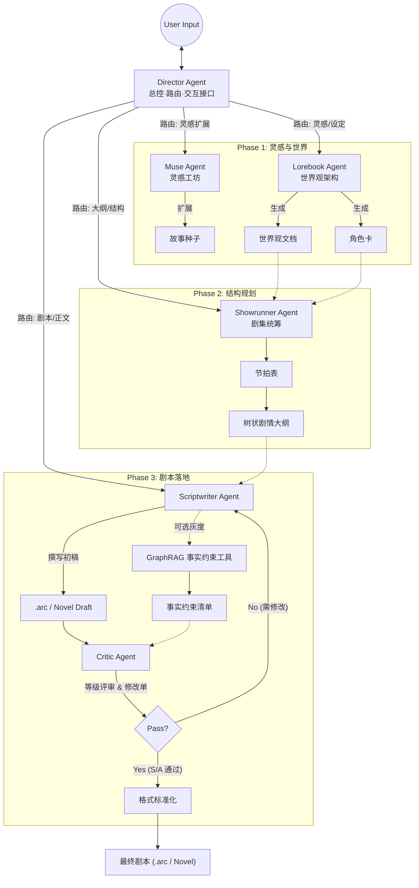
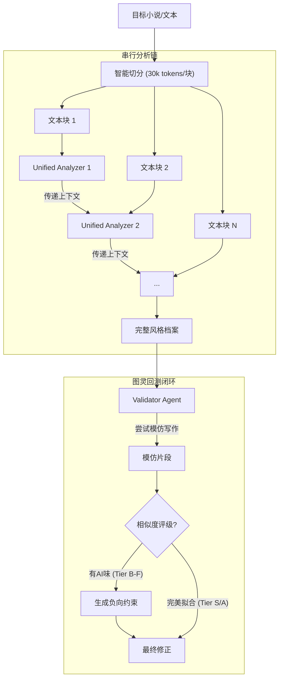
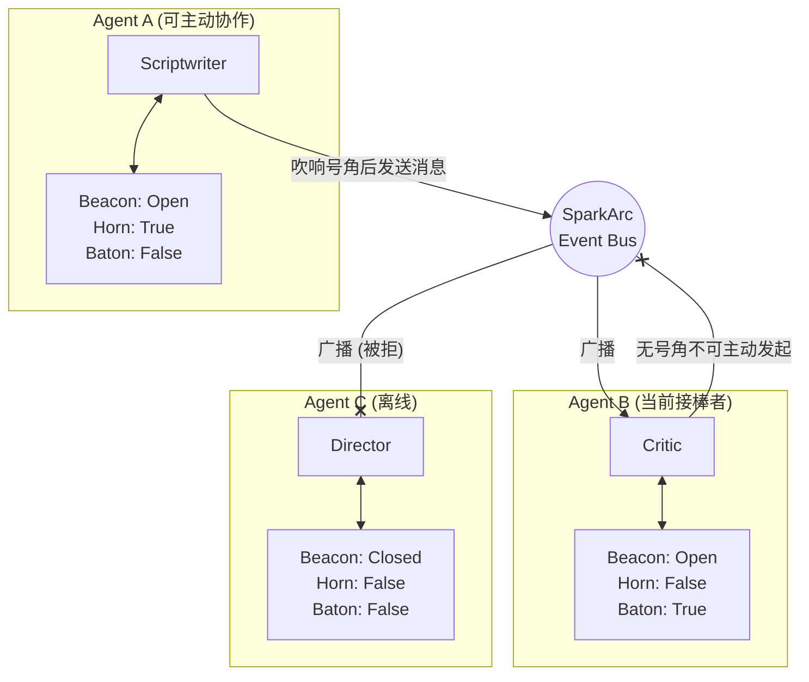

# 引火AI创作台

[简体中文](README.md) | [English](README.en.md) | [日本語](README.ja.md)

引火AI创作台（SparkArc Studio）是一个Agent自主智能集群驱动的创作平台，旨在通过专业创作流水线，将星星灵感之火扩展为完整的故事世界，创作小说、剧本，并驱动精美的WEB演出甚至游戏引擎演出。
它打通了**灵感——设定——节奏——大纲——编写——验证——发布——分享——演出**的全链路，为创作者提供了一套强大的生产力工具。

---

## 核心功能

### 1. 专业Studio，直觉交互

现在，你是总编剧。只需要**在聊天框**对**导演**说句话，它就可以驱动起一整个智能体创作团队，有条不紊地开始创作你的庞大世界观，用**多种强大的结构化编辑工具**帮你**自动完成全流程创作**。把小说/剧本分享给你的朋友，在**交互式演出端**让TA**沉浸于你的灵感**。

SparkArc 致力于将专业的创作流通过多智能体协作，暴露于最自然的聊天交互之下：

* **告别提示词，告别手动编辑**：你不再需要编写复杂提示词来约束 AI 既要写大纲又要顾及世界观，你也不需要去到处复制各个Agent所输出的文本。导演 Agent 能听懂你的诉求，切分子任务，并精准分发给设定专家、文案策划或执笔编剧，他们**用工具帮你自动编辑**，让你既能享受到严格结构化文本的精准控制，又无需因此增加半点工作。
* **黑盒展开，白盒协作**：普通的 AI 工具往往是在黑盒中直接生成最终长文。而 SparkArc 能在后台**自主流转**并向你展示每一步的推演过程，并向你**解释AI的思路**。SparkArc对全流程的文案都设计了**友好的可视化编辑器**，如不满意，可以**指定专家**进行手术刀式的局部修改。生成不再是盲文抽卡，而是全流程可视的白盒创作。
* **超——友好的专业创作体验**：是专业**IDE级别的Studio** ，但没有复杂操作逻辑，所见即所得。*再吹牛你也不信，试试就知道。*

### 2. 以人为本，自由掌控

SparkArc 坚信，**灵感与情感是人类创作不可剥夺的核心**。坚持以人为本，允许你自由控制AI的介入程度。

* **风格克隆与反AI**: 利用分析集群复刻创作者本人或著名作者创作者独特的叙事声音、用词习惯与情感色彩。**有效解决了AI创作通篇高频词**的问题，大大**降低了创作的AI味道**。
* **项目级语义检索**：为导演 Agent 赋予全项目语义搜索能力。AI 不再只能逐字正则匹配，而是理解内容含义进行检索，精准定位跨文件的相关段落，并支持基于搜索结果的文本替换。按项目独立开关，新项目可配置默认启用。
* **事实约束写作**：先由 Critic 对当前场景或整篇小说做**五维审查**（结构/语言/对白/AI检测、文学承载、逻辑人设），输出**等级、原文证据与修改工单**。GraphRAG 事实约束工具已生产化，可按需灰度启用——启用后返回“必须保持事实 / 避免冲突 / 待补充信息”，与 Critic 形成“证据化诊断 + 约束化返工”双保险，**防止长篇小说吃书，高质量反 AI**，且默认不自动改稿，保留创作者主导权。

无论是灵感迸发时的快速记录，还是精雕细琢时的逐字推敲，SparkArc 提供各种程度的介入模式：

* **全手动**: 纯粹的结构化编辑器。AI只提供梳理、验证和建议。你完全掌控每一个字，利用 SparkArc 优秀的分层管理功能梳理复杂故事。
* **半自动[推荐]**: 最佳的“人机共舞”体验。你提供核心灵感、关键反转或情感高光，AI 负责填充细节与润色。你随时可以打断、修改、重写，AI 会立即适应你的新方向。
* **全自动**: 仅需一个模糊的想法，AI 为你进行头脑风暴，生成多个可选的短篇故事或大纲，激发你的创作欲望。

### 3. 无界创作，不拘于时

灵感往往诞生于**电脑之外——地铁上、散步时，或是一次和朋友的——甚至和AI的闲聊中**。

* **“地铁时间” 碎片化创作**: 专为移动端适配，让你能单手操作，利用通勤的碎片时间审阅大纲、记录灵感或进行简单的剧情选择。高度的自动化让你可以在五分钟的地铁时间完成创作。
* **全平台支持**：支持所有常见平台，*win、mac、linux、andriod、ios，电脑、平板、手机——都是你的专业Studio！*
* **灵感信箱 MCP**: 打破应用边界。通过 MCP，你的 **RikkaHub**、**CherryStudio** 、任何其他支持MCP的 AI 助手，**闲聊、谈心、调研的时候灵感爆发？只需要一句话，都能一键发送至灵感信箱，成为故事的种子**。
* **无人值守自动撰写**: 一键启动 Auto-Write 管道，AI 按大纲逐章逐场景连续生成，**断连不断写**——关闭浏览器也不影响，重新打开即可恢复实时进度。支持暂停/续写/断点恢复，前端展示嵌套进度环。

### 4. 分享星火，展示世界

**AI倍速下，你心中多年的主角可以登台演出了**。不是简单的分享文本，而是你创作的完整演出。

* **WEB演出端**：随时分享你的灵感。观众只需**点击链接**，即可进入剧本。
* **版本快照与导出**：支持一键创建版本快照，可按 `.arc` 互动剧本或纯文学小说两种格式导出，也可从快照一键恢复到工作区。
* **规划中功能**：*这个饼很大，请你等一下。*

>1.支持生成角色立绘 并固定生成风格确保所有立绘风格一致
2.结合图片生成模型和图片编辑模型实现简易的背景图片功能
3.允许自定义scriptwritter功能 衍生出子agent 比如日常剧情写手、物品设定写手等等
4.用户可以自定义数据结构 由agent生成对应的解析组件在前端显示编辑 并把这个组件代码保存到数据库中 也就是LUI或者GEN-UI化

### 5. 工业生产，创作平权

不只是操作简单友好的专业创作平台，更是生产力工具。**生成的剧本可以轻松接入到unity、虚幻、Godot等游戏引擎。相信随着AI的发展，以后人人都有创作故事乃至创作游戏的权利**。

* **程序解耦**: 策划只需专注于文本与戏剧性，无需编写一行代码，即可控制演出、游戏行为并随时迭代文本。
* **蓝图系统**: 每个项目可配置专属的 `blueprint.json`，定义创作偏好、风格约束与流程参数，让 AI 在你的框架内创作，而非从零猜测。
* **Unity示例**: 提供简易的 **Unity示例**。你的剧本不再是躺在文档里的死文字，而是可以直接运行的游戏资产。

### 6. 打破常规，自主集群

* **信标 / 号角 / 旗帜**: SparkArc 使用一套形象化的 Agent 协作术语来约束多智能体行为。信标决定“别人能不能看见你、能不能把消息送到你这里”；号角决定“你有没有资格主动向别的 Agent 发话”；旗帜代表“当前这条任务链在谁手里推进”。这套三件套把可见性、主动通信权和任务归属拆开，降低多 Agent 集群的上下文心智负担，为以后扩展更多 agent 提供稳定框架。
* **工具权限分级**: 建立在工具分配机制上的权限分级。不同角色的 Agent 被约束在专属的能力域内，有效防止大模型在复杂任务中产生幻觉时的越权污染，保证了整个创作流水线的安全性与可控性。

---

SparkArc 的架构严格复刻了好莱坞/3A游戏的标准剧本生产流程：

| 阶段             | 传统对应                  | 配合 Agent/工具                          | 功能描述                                                                                                 |
| :--------------- | :------------------------ | :--------------------------------------- | :------------------------------------------------------------------------------------------------------- |
| **0. 沟通调度**  | 总导演/调度中心           | **Director (导演)**                      | 全局入口与上下文管理者。基于 LangGraph 多轮工具调用自主调度，可委派任务、触发自动撰写、检查进度，是直接面向用户的交互节点。                               |
| **1. 策划/创意** | Logline / High Concept    | **Muse (灵感种子)**                      | 捕捉稍纵即逝的 Flash Idea，通过多维标签（风格/基调/视点）将其固化为故事种子。                            |
| **2. 世界观**    | Story Bible / World Guide | **Lorebook (设定专家)**                  | 确立物理法则、魔法体系、地理政治以及核心人物小传，确保后续创作的逻辑自洽。                               |
| **3. 结构**      | Beat Sheet / Treatment    | **Showrunner (文案策划)**                | "救猫咪"还是"英雄之旅"？在此阶段确立故事骨架，划分幕结构，生成精确的节拍表。                             |
| **4. 撰写**      | Screenplay / Script       | **Scriptwriter (执笔编剧)** | 最终的“笔”。在结构框架内填充血肉，处理场景描述、动作指导与角色对白；支持 `.arc` 互动剧本与纯文学小说双态输出。内置构思链 (Conception Chain) 机制。 |
| **5. 质量保证**  | Script Doctor / Coverage  | **Critic (逻辑审核) & Style (文风克隆)** | 逻辑审核负责模拟苛刻的审稿人提供冲突或逻辑漏洞的专业反馈；文风克隆负责通过目标文风约束消除 AI 味高频词。GraphRAG 事实约束工具已生产化，可按需灰度启用以增强跨章节一致性。 |
| **6. 制作**      | Implementation / Assets   | **WEB演出端/Unity SDK**                  | 剧本资产化。解析 `.arc` 数据，驱动游戏内的对话系统、演出调度与任务触发。                                 |

## 目录

* [🚀 快速开始](#-快速开始)
* [系统架构](#系统架构)
  * [1. 智能体集群](#1-智能体集群)
  * [2. 风格克隆集群](#2-风格克隆集群)
  * [3. 信标总线通信机制](#3-信标总线通信机制)
* [数据协议](#数据协议)
  * [ARC 互动剧本格式](#arc-互动剧本格式)
  * [Novel 纯文学模式](#novel-纯文学模式)
* [基础设施](#基础设施)
  * [1. 火柴Agent网关](#1-火柴agent网关)
  * [2. 数据库自动迁移](#2-数据库自动迁移)
  * [3. 用户管理与权限](#3-用户管理与权限)
  * [4. 语义检索引擎](#4-语义检索引擎)
  * [5. CI/CD 自动化部署](#5-cicd-自动化部署)
* [全平台生态与架构](#全平台生态与架构)
* [📚 深入了解](#-深入了解)
* [开发者本人写在最后](#开发者本人写在最后)

---

## 🚀 快速开始

### 方式一：Docker 一键部署（推荐）

最简单的部署方式，只需 2 步：

```bash
# 1. 克隆项目
git clone https://github.com/your-repo/sparkarc.git
cd sparkarc
# 2. 启动服务
docker compose up -d --build
```

服务启动后访问：**<http://localhost:7788>**

> 💡 **端口区分**：Docker 环境使用 `7788`，裸机环境使用 `6688`，便于同时运行（部分情况下并行调试）和环境区分（生产环境**严禁同时运行以避免可能的数据冲突**）。
> 💡 **数据持久化**：用户数据和数据库会自动保存在宿主机 `server/` 目录中，重启容器不会丢失。
> 💡 **主密钥位置**：`LLM_KEY` 默认写入 `server/llm/agen_matchbox/.env`，无需单独创建 `server/.env`。

#### 可选：开启注册人机验证（Cloudflare Turnstile）

SparkArc 支持在注册阶段接入 Cloudflare Turnstile。它只保护“注册”入口：前端显示 Turnstile 组件并取得 token，后端在创建用户前调用 Cloudflare `siteverify` 接口验证 token。

在项目根目录创建或编辑 `.env`，加入：

```env
SPARKARC_REGISTRATION_VERIFICATION_ENABLED=1
SPARKARC_REGISTRATION_VERIFICATION_PROVIDER=turnstile
SPARKARC_TURNSTILE_SITE_KEY=你的 Turnstile Site Key
SPARKARC_TURNSTILE_SECRET_KEY=你的 Turnstile Secret Key
```

然后重新创建容器：

```bash
docker compose up -d --build --force-recreate
```

说明：

- `SPARKARC_TURNSTILE_SITE_KEY` 是公开站点密钥，会通过 `/api/auth/verification-config` 发给前端。
- `SPARKARC_TURNSTILE_SECRET_KEY` 是私钥，只在后端使用，不会返回给前端。
- **如果没有配置 site key 或 secret key，注册验证默认关闭**，不会影响自部署开发者首次注册。
- 如果你后续想换成 Google、腾讯云等验证平台，保持注册路由不变，扩展 `server/core/verification.py` 的 provider 即可。

#### 🔄 拉取新版本后的正确更新方式（非常重要）

请不要只执行 `docker compose restart`。这只会重启旧容器，不能保证新代码生效。

每次 `git pull` 后，请固定执行：

```bash
# 1) 拉取代码
git pull --ff-only

# 2) 重新构建并替换容器（必须）
docker compose up -d --build --force-recreate

# 3) 可选：查看最近日志确认启动成功
docker compose logs --tail=120 sparkarc
```

该流程会确保：

1. 镜像内最新 Git 代码一定被重新构建。
2. 启动时会把受 Git 管理的文件同步回挂载目录，避免旧持久化文件遮蔽新版本。
3. 用户数据库与个人数据（如 `*.db`、`_userdata`、`.env`）继续持久化，不会被覆盖。

### 方式二：本地裸机开发环境

配置完成后VS Code 按F5启动，同样非常便捷。适合**不想用Docker**或者二次开发，请按以下步骤配置：

1. **初始化 Python 环境**

   ```bash
   # 1. 创建并激活 Conda 环境（先确保你部署好了miniconda或anaconda）
   conda create -n sparkarc python=3.12 -y
   conda activate sparkarc

   # 2. 安装后端依赖（依赖清单在项目根目录）
   pip install -r requirements.txt
   ```

2. **配置模型与密钥 (GUI)**
这一步可以跳过，仅用于演示后端大模型管理工具管理模型的流程。同样可以在前端配置。

   ```bash
   # 启动后端配置工具
   cd server/llm/agen_matchbox
   python matchbox_cfg_gui.py
   ```

   * **主密钥**：输入 `LLM_KEY` 用于加密存储。
   * **API Key**：在 GUI 中选择平台（如 DeepSeek/OpenRouter），填入 Key 并保存。
   * **验证**：点击“测试选中模型”，确保显示“测试成功”。

3. **构建前端界面**

   ```bash
   # 返回项目根目录后进入 client
   cd ../../../client
   npm install
   npm run build
   ```

4. **启动后端服务**

   ```bash
   # 返回根目录后进入 server
   cd ../server
   python app.py
   ```

5. **访问应用**
   服务启动后访问：**<http://localhost:6688>**

### 自部署时如何访问：浏览器与客户端

SparkArc 的后端会直接托管前端页面。自部署完成后，最简单的访问方式就是打开浏览器访问你的后端地址：

- Docker 部署：`http://localhost:7788`
- 本地裸机启动：`http://localhost:6688`
- 远程服务器部署：`http://你的服务器地址:端口`

GitHub Release 中提供的客户端只是一个更方便的外壳/前端入口，并不会自动连接到你的私有后端。**如果你下载了桌面端或移动端客户端，请在登录前先把默认服务器地址改成你自己的实际地址**。默认地址可能指向维护者托管的官方实例，不适合私有部署用户直接使用。

常见填写方式：

- 桌面端访问本机后端：`http://localhost:6688` 或 `http://localhost:7788`
- 手机访问同一局域网内的电脑：`http://电脑局域网IP:6688` 或 `http://电脑局域网IP:7788`
- 远程私有部署：填写你的服务器公网域名/IP 与端口

如果你希望在手机、平板或外地设备上访问自己的私有实例，可以自行购买云服务器部署；也可以用更简单的方案，把本机服务通过内网穿透工具暴露给自己的设备。无论采用哪种方式，请自行做好账号、HTTPS、访问控制、防火墙、模型 Key 与数据备份配置。

> 💡 如果你的私有实例开放公网注册，建议同时配置 HTTPS、注册人机验证、防火墙/反向代理限流、备份策略，并妥善保管 `LLM_KEY` 与各模型平台 Key。

---

## 系统架构

### 1. 智能体集群

SparkArc 不依赖单一的大模型，而是构建了一个分工明确的智能体集群。每个 Agent 都有独立的人设、提示词工程和模型配置。

> 💡 **国际化**：Agent 注册表（`registry.py`）原生支持 `zh-CN` / `en-US` / `ja-JP` 三语，前端通过 i18n 映射、后端通过 `resolve_agent_i18n_field()` 按请求 locale 提取对应字段。新增语言只需在每个 Agent 条目中加一组翻译。

#### A. 调度者

* **Director Agent (导演)**：
  * **职责**：全局入口与上下文管理者。基于 **LangGraph SupervisorGraph** 实现多轮工具调用自主调度——通过 `delegate_task` 委派专家、`trigger_auto_write` 触发无人撰写、`check_scriptwriter_status` 查询进度，取代了早期的规则式意图识别方案。它负责维护用户会话的连贯性，记录关键决策，并作为“总线”的默认接收端。
  * **核心代码**：`agent_director.py` + `director_graph.py`（LangGraph SupervisorGraph 定义）

#### B. 创意核心

* **Muse Agent (灵感)**：
  * **职责**：创意的起点。捕捉稍纵即逝的灵感火花，通过多维标签（风格/基调/视点）将其固化为故事种子，并可自动扩展为更完整的创意概念。支持通过 MCP 从外部 AI 助手接收灵感。
* **Lorebook Agent (世界观、角色)**：
  * **职责**：从零构建世界观。它能根据简单的种子（Seed）生成详尽的地理、历史、魔法/科技体系，并批量生成与世界观契合的角色卡（Character Sheets）。
* **Showrunner Agent (梗概、节奏、大纲)**：
  * **职责**：宏观叙事把控。它负责生成**节拍表 (Beat Sheet)** 和 **树状剧情大纲 (Tree Outline)**，确保故事结构符合“救猫咪”或“英雄之旅”等经典叙事模型。
* **Scriptwriter Agent (执笔编剧)**：
  * **职责**：微观场景落地。它是唯一的“写手”，负责将大纲转化为具体的剧本正文。支持**双态输出**：`.arc` 互动剧本格式（含对话分支、行为指令、场景跳转）与纯文学小说格式（Markdown）。内置**构思链 (Conception Chain)** 机制，在输出正文前会先生成 `<conception>` 标签进行逻辑推演。

#### C. 质量保证

* **Style Agent**（风格克隆子集群）
  * **职责**：反AI，通过模仿指定作家甚至你本人的文风，来确保大模型在创作的时候避开AI常使用的高频词组，**最大化降低AI味道**。
  * **子集群结构**：由 **Coordinator**（协调分析流程）、**Validator**（图灵回测闭环）、**StyleChatAgent**（风格档案问答交互）三个子 Agent 协作完成。详见[风格克隆集群](#2-风格克隆集群)章节。
* **Critic Agent (逻辑审核)**：
  * **职责**：模拟严苛的审稿人。它不直接修改文本，而是审查剧本/小说片段中**读者可感知的 AI 味残留、对白失真、文学承载不足、逻辑与人设问题**，并输出结构化的审稿意见。
  * **工作模式**：既可在聊天面板中自然语言对话，也可在 ScriptWriter 右侧面板手动触发结构化审查。
  * **输出协议**：使用 **S / A / B / C / D** 五档等级，而不是数字分数；同时输出原文证据、命中问题与 `fix_ticket` 风格修改单，便于后续返工。
  * **模型策略**：优先利用大模型的判别与归因能力，把它当成 **LLM Judge / Editor**，而不是训练一个只会给概率分数的专有分类器。

* **GraphRAG Tool（事实约束，可选灰度）**：
  * **职责**：把项目内世界观、角色、大纲与剧本片段转成可检索的关系图谱，在写作或审稿时返回可执行的事实约束。
  * **当前状态**：已生产化，但**默认不挂载任何 Agent**，可按需灰度启用。启用后建图固定走 Fast 槽位，查询阶段跟随调用 Agent 的模型配置。
  * **质量价值**：重点增强跨章节一致性、角色关系稳定性与设定回收能力，降低长线写作中的“吃书”。

#### Critic 审核机制

Critic 回答的不是"这段是不是 AI 写的"，而是"**这段文字哪里会让读者觉得像模型在完成任务**"。它输出 `S/A/B/C/D` 五档等级 + 原文证据 + `fix_ticket` 修改单，默认不直接改写正文，保留创作者主导权。

> 📗 完整的四条核心机制与"为什么用 LLM 而非 ML 模型"论证，请参阅 [架构深度文档 §6](docs/architecture.md#6-critic-审核机制完整版)

#### 协作数据流



#### Agent 三模态调用协议

每个专家 Agent 的提示词严格区分三种调用模态，通过同一 `yaml` 的三个顶层字段承载，保证"手动面板""用户聊天""导演委派"三条路径互不串味：

| 模态 | YAML 字段 | 输出特征 |
| :--- | :--- | :--- |
| **专有工作模式** | `system` + `user` | 严格结构化，可被解析器直接落盘 |
| **用户交互模式** | `chat_system` | 自然对话、可发散、不强制格式 |
| **导演委派模式** | `pipeline_system` | 严格结构化 + 工具落盘 + 向导演简报 |

> 📗 完整的运行态逻辑、`pipeline_system` 写法硬约束、工具 reference 机制与新增 Agent 自检清单，请参阅 [架构深度文档 §2](docs/architecture.md#2-agent-三模态调用协议完整版) 及 [AGENTS.md §4.5](AGENTS.md)


---

### 2. 风格克隆集群

SparkArc 最具技术深度的模块——通过 **UnifiedStyleAnalyzer** 串行分析 + **ValidatorAgent** 图灵回测闭环，捕捉人类作者微妙的文风并生成风格档案，用于约束后续生成、消除 AI 味高频词。

- **串行分析**：长篇小说按 30k tokens 切块，逐块 7 维度全量分析，块间传递剧情概括保持上下文
- **自我对抗**：ValidatorAgent 基于风格档案写"伪作"并自评，发现 AI 味则生成负向约束强制注入

#### 工作流：串行深度分析



> 📗 串行分析细节与负向约束机制的完整说明，请参阅 [架构深度文档 §7](docs/architecture.md#7-风格克隆集群完整版)


---

### 3. 信标总线通信机制

为了解决多 Agent 之间复杂的交互权限与消息路由问题，SparkArc 设计并实现了**信标总线**。这是一种带权限控制的消息路由架构，使用“信标 / 号角 / 旗帜”三件套来模拟真实协作中的“是否可见”“是否可主动发话”“当前任务在谁手里”。

> ⚠️ **当前状态**：信标总线的完整基础设施（类定义、REST API、前端交互面板）均已实现并可通过 UI 操作，但目前 Agent 间的水平自主通信为**预留能力**——当前所有 Agent 协作均通过 Director 直接调度完成。随着 Agent 数量增长，该机制将逐步启用以防止广播风暴和死循环。

#### 核心机制：信标 / 号角 / 旗帜

每个 Agent 拥有独立的三件套：**信标**（是否可见/可触达）、**号角**（能否主动发话）、**旗帜**（当前任务链在谁手里），三者拆开可见性、主动通信权和任务归属，降低多 Agent 集群的上下文心智负担。

#### 交互拓扑图



> 📗 完整的三件套定义与应用场景，请参阅 [架构深度文档 §8](docs/architecture.md#8-信标总线核心机制完整版)

#### 导演调度 vs 信标协作（两套独立系统）

SparkArc 中存在**两套独立且职责不同的通信机制**：

- **导演调度**（垂直）：Director 基于 LangGraph 多轮工具调用自主调度，不受信标限制，可直接实例化 Agent 并调用。
- **信标协作**（水平）：Agent 间自主通信受信标/号角/旗帜共同约束，防止广播风暴与死循环。

> 📗 完整的对比表、交互模式示意图及设计理由，请参阅 [架构深度文档 §1](docs/architecture.md#1-导演调度-vs-信标协作双系统对比)


---

## 数据协议

SparkArc 定义了一种兼顾**人类可读性**与**机器解析能力**的混合格式 —— **.arc**。它结合了 Markdown 的流畅阅读体验与 XML 的严谨逻辑结构，并基于严谨的调查研究，**最大化的保全了大模型在超长结构化文本创作时的创作文学质量。**

### 格式示例

```markdown
# 场景标题：最后的告别
@guide 任务指引：陪她走完最后一段路
@intro 场景初始化描述...

[-1]
这里是旁白区域。落日将街道拉得极长，梧桐树影斑驳。

[0]
还记得这里吗？

[1]
老爷爷……糖……

<choice>
  <opt text="指着远处的校门口">
    [0]
    你看，那是我们第一次见面的地方。
    @next 场景_回忆
  </opt>
  
  <opt text="保持沉默">
    [-1]
    沉默在空气中蔓延。
    @act system:AddMood(-5)
  </opt>
</choice>
```

### 解析原理

服务端 `arc_parser.py` 采用分层解析：场景分割 → 元数据提取 → `<conception>` 思维链过滤 → 正则+自定义标签混合解析（对话行 / `<choice>` 分支 / `@act` 指令 / `@next` 跳转）。

> 📗 完整的四步解析策略细节，请参阅 [架构深度文档 §9](docs/architecture.md#9-arc-格式解析策略)

### Novel 纯文学模式

除了互动剧本格式，SparkArc 还支持**纯文学小说**输出模式。当项目切换为小说模式时：

- Scriptwriter Agent 自动加载 `generate_novel` 专属提示词，产出纯文学正文（Markdown 格式）
- 场景文件以 `.md` 存储，通过 `novel_parser.py` 按大纲顺序聚合为完整小说文本
- 版本快照系统支持 `.arc` 和 `novel` 双格式导出与恢复
- 剧本编辑器自动切换为小说编辑视图

两种模式共享同一套世界观、角色、大纲和节拍表，仅在最终输出格式上分化。


---

## 基础设施

为了这个庞大平台的稳定性，SparkArc搭建了许多功能完备的基础设施。它们都考虑了通用性，你可以**轻松地迁移到你自己的项目上**。**我希望我的工作可以帮到更多想在这个浪潮中做点东西的开发者**。

### 1. 火柴Agent网关

底层由火柴Agent网关统一接管，它是面向 Agent 开发的独立大模型网关。组件严格执行接口抽离，可部署在其他项目。具备自带 GUI 界面、极细颗粒度的双口径配额计费、限流等全链路功能。

网关**兼容 Open AI 协议**，并支持自动将常见的推理字段统一为推理流，确保最佳的流式体验。

核心能力概览：

- **双通道设计**：强管理通道（默认业务通道）+ 轻量直连通道（旁路能力）
- **灵活托管模式**：系统托管 / BYOK / 混合模式，站长自由决定商业模式
- **多口径配额与账单**：`sys_paid` / `self_paid` 独立流控，周期性限流 + 总量封顶
- **精准 Token 估算**：基于 `tiktoken` + 动态 CJK 修正系数，确保计费精准
- **多用途槽位**：Fast（快速）/ Reason（推理）/ Main（默认），按任务复杂度路由模型

> 📗 完整的双通道设计、接入链路、槽位配置与推理流兼容细节，请参阅 [火柴Agent网关完整指南](docs/matchbox-gateway.md)


### 2. 数据库自动迁移

SparkArc 内置了**启动期自动迁移**能力，确保用户拉取新代码后无需手动升级数据库即可运行。

#### 🚑 首先，把救命方法写最前面

自动迁移机制尽可能地考虑了各种极端情况，但仍然无法避免数据库版本错误的可能。
我们无法避免开发者（当然也包括我本人）在开发过程中犯的错。
但有一点可以保证，那就是数据安全。如果出现了数据库相关报错，不要惊慌，你的数据是完好无损的。
请把定义表结构的 models和出错的数据库文件复制出来。

1. 把 models 和数据库文件 给 AI代码助手
2. 告诉 AI 使用 SQL 语句同步数据库文件到 Models 最新版本。必须保证数据安全。（由于数据库密钥数据采用加密存储，所以无需担心 AI 泄露）
3. 把数据库文件覆盖回去
4. git pull 最新代码，重启，结束

#### 核心特性

1. **多数据库分支**：`users.db` 与 `llm_config.db` 采用独立 `version_locations`，互不干扰
2. **启动自动升级**：启动时使用 Alembic API 直接升级
3. **临时库生成迁移**：生成脚本基于迁移链构造临时 DB，不再受开发机真实 DB 污染
4. **智能重命名检测**：自动识别字段重命名并询问确认
5. **危险操作拦截**：`DROP COLUMN` / `DROP TABLE` 强制交互确认
6. **孤儿版本自愈**：迁移链被打断时保守补缺失表/列并对齐版本号，默认不删除额外结构
7. **head 漂移保护**：版本号已是 head 但缺字段时直接报错，避免悄悄吞掉应提交的 migration

> 📗 完整的开发者工作流、迁移接入指南与清理历史风险说明，请参阅 [数据库自动迁移完整指南](docs/database-migration.md)


### 3. 用户管理与权限

系统采用基于角色的访问控制（RBAC），并通过自动化机制简化初始配置。

* **首位管理员**：系统会自动将**第一个注册的用户**设为管理员，拥有修改系统模型平台的权限。
* **默认权限**：除首位用户外，所有新注册的用户默认为普通用户 (`is_admin = 0`)。
* **权限授予**：首位管理员可通过 UI 界面中的"管理中心"授权其他用户成为管理员。

---

### 4. 语义检索引擎

SparkArc 内置了项目级语义检索引擎，为导演 Agent 提供**正则搜索 + 语义搜索**双模式检索能力，并支持基于搜索结果的文本替换。

#### 产品能力

- **双模式检索**：`search_project` 正则搜索支持精确模式匹配，`semantic_search` 语义搜索基于向量相似度理解内容含义，两者结果格式统一、均可作为 `replace_from_search` 的输入
- **项目级开关**：每个项目独立启用/禁用，启用时自动测试嵌入模型可用性，失败时给出明确指引
- **默认启用**：支持配置新项目是否默认启用语义检索
- **自动索引更新**：项目内容变更后，下次搜索时自动检测文件哈希变化并增量重建索引

#### 技术架构

- **向量化管线**：基于 LangChain + Chroma 构建，通过火柴网关获取用户配置的 Embedding 模型，支持任意 OpenAI 兼容嵌入 API
- **懒构建 + 哈希增量**：首次搜索时自动构建索引，后续通过 MD5 文件哈希比对检测变更，未变更时复用已有索引
- **分块策略**：`SemanticChunker` 按语义边界切分项目文本，保留叙事定位（`narrative_ref`）、行号范围等元数据
- **中文项目名兼容**：Chroma collection name 通过 MD5 哈希转换，解决中文项目名不符合命名规范的问题
- **批量向量化**：按 batch_size=10 分批调用嵌入 API，适配主流模型的批量限制

---

### 5. CI/CD 自动化部署

SparkArc 内置了完整的 CI/CD 流水线，支持代码推送后**全自动构建镜像、测试并部署**，无需任何手动干预。

支持 Gitea Actions 和 GitLab CI，且 Gitea Actions 工作流可低成本迁移至 GitHub Actions。

流水线阶段：**检出代码 → 构建镜像 → 测试（预留） → 部署 → 清理**

> 📗 完整的 Runner 配置、CI Secret、GitHub Actions 迁移说明，请参阅 [CI/CD 自动化部署完整指南](docs/cicd-deployment.md)


---

## 全平台生态与架构

### 组件逻辑布局解耦

为了实现**地铁五分钟**的无缝体验，SparkArc 采用分离架构：

* **Business Logic (Composables)**: 所有的核心业务逻辑被封装在独立的 Composable 函数中，不依赖具体 UI。关键 Composable 包括：
  - `useSynopsisLogic` / `useScriptWriterLogic` — 梗概与编剧
  - `useWorldLogic` / `useStyleLogic` / `useStructureLogic` — 世界观、风格、结构
  - `useAIModelManager` / `useAIPlatformManager` / `useAIEmbeddingManager` — 模型与平台管理
  - `useAgentRegistry` / `useChatActions` / `useAdminLogic` — Agent 注册、聊天与管理
  - **项目正在往LUI的方向演进。不久的以后，你的每一句话，都可以开启一个复杂的创作流。**
* **流式基础设施层**：前端统一通过 `streamingRuntime.ts` 的 `createStreamingTask` 托管所有业务流式任务，配合 `loadingStats.ts`（全局遮罩统计）、`eventBus.ts`（事件总线）、`GlobalLoading.vue`（全局加载 UI）形成完整的流式消费闭环。聊天流与业务任务流两条主链路独立运行，互不干扰。

* **全尺寸屏幕适配**:
  * **Desktop Views**: 针对宽屏优化的复杂工作台，提供多列布局与详细控制面板。
  * **Mobile Views**: 针对竖屏优化的流式交互界面，强调阅读体验与快速操作。大部分核心视图（梗概、结构、世界观、风格分析等）均提供独立移动端视图，编剧台（ScriptWriter）目前仅支持桌面端。

### Tauri 2 跨平台构建

前端已接入 Tauri 2，Windows / Linux / macOS / Android / iOS 的完整“傻瓜化”构建教程请查看 [DOC/tauri/README.md](DOC/tauri/README.md)。

简易发布速查（进入项目根目录后 `cd client`）：

1. 安装依赖：`npm install`
2. 桌面端（Windows / Linux / macOS）：`npm run tauri:build`
3. Android：`npm run tauri:android`
4. iOS：`npm run tauri:ios`
5. 本地调试（桌面端）：`npm run tauri:dev`

注意事项：

* **macOS / iOS** 需要在 macOS 设备上编译与签名。
* **Android** 需要安装 Android Studio，并配置好 SDK / NDK 环境。
* **构建产物** 会自动同步到项目根目录的 `app-build/` 下并按平台区分。

### Unity 游戏引擎集成（BETA）

> Unity SDK (`SparkArc.Unity`) 目前作为独立模块位于 `presenter/UnitySDK`，旨在为独立游戏开发者提供开箱即用的剧情解决方案。**该功能尚处于极早期测试阶段，覆盖情景难免较少，敬请期待。**

#### 全流程数据管线

1. **创作端**: 策划完成剧本创作，导出标准化的 `.arc` 文件或 `stories.db` SQLite 数据库。
2. **资产层**: 将数据库文件放入 Unity 项目的 `StreamingAssets` 目录。
3. **运行时**:
    * **StoryRepository**: 游戏启动时自动加载并缓存剧本数据。
    * **DialogueManager**: 核心驱动器。解析当前的 Story Node，处理文本显示、选项分支跳转。
    * **Event System**: 剧本中的 `@act` 行为指令通过统一的 `OnActionTriggered(string func, string[] args)` 事件广播，开发者在业务层注册对应处理器（如播放动画、添加任务），无需修改对话系统代码。

通过这套管线，开发者可以实现灵活的剧情迭代——修改剧本无需重新编译代码，运行时手动调用重载方法即可刷新数据库。

---

> **SparkArc** —— 灵感之火，世界之弧：让每一个热衷创作者都能创造世界。

## 📚 深入了解

| 文档 | 内容 |
| :--- | :--- |
| [架构深度文档](docs/architecture.md) | 导演调度 vs 信标协作对比、Agent 三模态完整协议、Critic 审核机制、风格克隆集群、信标总线核心机制、ARC 解析策略、工具注册表、流式基础设施层 |
| [火柴Agent网关指南](docs/matchbox-gateway.md) | 双通道设计、接入链路、槽位配置、推理流兼容 |
| [数据库自动迁移指南](docs/database-migration.md) | 开发者工作流、迁移接入指南、清理历史风险 |
| [CI/CD 部署指南](docs/cicd-deployment.md) | Runner 配置、CI Secret、GitHub Actions 迁移 |
| [AGENTS.md](AGENTS.md) | Agent 开发规范、新增 Agent 自检清单、提示词协议 |
| [语义检索引擎](#4-语义检索引擎) | 双模式检索、项目级开关、懒构建+哈希增量、Chroma 向量存储 |
| [LEGAL/README.md](LEGAL/README.md) | 法律与运营声明统一入口 |

---

## 开发者本人写在最后
本项目从设计、开发、到测试，全程由我(Mournight)一人完成，所以难免有许多瑕疵。我平时时间较为紧张，维护工作可能不会那么的及时，欢迎各位佬积极参与维护。

这个项目最早是工作室内部用于游戏剧情系统开发使用。

**因为AI已经通过MCP、skills等极大的加速了游戏开发的大部分流程，曾经一个人的游戏梦，现在再也不是遥不可及。**

**设计它，初衷是补全AI游戏开发的一块非常重要、AI尚不擅长的拼图——剧情系统**。

后来打算潜心沉淀，便把这个项目作为Agent前沿技术的试验田，让它能够先有用户，后续再听取反馈慢慢迭代到游戏引擎上。

除非不可抗力，我会保持 SparkArc 长期开源。无论未来新增什么功能，维护者都会优先同步到公开仓库。

我欢迎个人、创作者、小团队和工作室自部署 SparkArc，用于个人创作或内部协作。也欢迎大家以 Issue、PR、文档、工作流、教程等方式共同建设生态。

SparkArc 基于 AGPL-3.0-only 发布。你可以在遵守 AGPL-3.0 的前提下运行、复制、修改、部署和分发本项目。若你修改 SparkArc 并通过网络向他人提供服务，应按 AGPL-3.0 要求向该服务用户提供对应版本的完整源码（欢迎贡献回本项目），并保留版权、许可证和来源声明。

我本人亦受协议约束，欢迎各位贡献者、部署者和社区成员一起维护 SparkArc 的开放生态。

SparkArc 的官方实例仅由 Mournight / AIdeaStudio 独立运营。官方实例未来可能以公益、赞助、付费额度、托管服务或其他方式维持项目持续开发。

我也希望每一位贡献者、部署者和社区成员都保留这种意识：**SparkArc 的开放不是为了让人闭源套壳、抹去来源、拿社区成果单向牟利**。**请一起维护 AGPL 赋予用户和贡献者的权利**：**保留署名与许可**，按要求**公开对应源码**，**标明修改与来源**，尊重品牌和官方实例边界。

**合规自部署、内部使用、学习研究、贡献生态都被欢迎；规避 AGPL、白标冒充或把第三方运营风险转嫁给社区的行为不被接受。**

除非另有明确书面声明，维护者不向第三方授予闭源商业化、白标运营、品牌代理、官方联名、商标使用或 AGPL 豁免授权。任何第三方部署、修改、分发或运营 SparkArc，均必须遵守 AGPL-3.0，并自行承担其用户、内容、模型接入、支付、点数、兑换码、客服、合规和法律责任。

**实际运营者和其用户产生的任何生成式内容的合规问题均与本人无关**。在此也提醒对公众开放服务的各位站长：请谨慎处理匿名分享、内容审核、实名要求、日志留存与模型合规问题。

---

## 法律与运营声明

为便于说明官方实例、第三方部署、内容治理、隐私处理与知识产权边界，仓库根目录新增了 [`LEGAL/README.md`](LEGAL/README.md) 作为统一入口。

当前中文法律与运营文档包括：

- [`NOTICE`](NOTICE)
- [`LEGAL/LicensePolicy.zh-CN.md`](LEGAL/LicensePolicy.zh-CN.md)
- [`LEGAL/TrademarkPolicy.zh-CN.md`](LEGAL/TrademarkPolicy.zh-CN.md)
- [`LEGAL/TermsOfService.zh-CN.md`](LEGAL/TermsOfService.zh-CN.md)
- [`LEGAL/PrivacyPolicy.zh-CN.md`](LEGAL/PrivacyPolicy.zh-CN.md)
- [`LEGAL/OfficialInstancePolicy.zh-CN.md`](LEGAL/OfficialInstancePolicy.zh-CN.md)
- [`LEGAL/ThirdPartyOperatorNotice.zh-CN.md`](LEGAL/ThirdPartyOperatorNotice.zh-CN.md)
- [`LEGAL/ContentPolicy.zh-CN.md`](LEGAL/ContentPolicy.zh-CN.md)
- [`LEGAL/EvidenceAndIPCompliance.zh-CN.md`](LEGAL/EvidenceAndIPCompliance.zh-CN.md)

说明：

- 仓库级法律文件用于公开证据、站内复用和第三方部署参考。
- 站内 ToS 接口默认读取 `server/data/TermsOfService.md`；`LEGAL/TermsOfService.zh-CN.md` 作为第三方部署参考模板保留。
- 第三方部署者在向公众提供服务前，应按自身情况补充运营主体、域名、备案/许可、投诉邮箱与隐私信息。

## 品牌与商标声明

SparkArc 是本项目的官方名称与标识。

本项目代码基于 AGPL-3.0-only 开源，但 **"SparkArc" 名称、Logo、品牌视觉及相关标识不包含在代码授权范围内**。

任何基于本项目的部署、修改版或分发版，均不得暗示与原项目存在官方、授权、代理或合作关系。

火柴 Agent 网关（`server/llm/agen_matchbox`）是独立可复用组件，按该目录内 `LICENSE` 以 Apache-2.0 单独授权；根项目其他部分除非另有说明，按 AGPL-3.0-only 授权。
