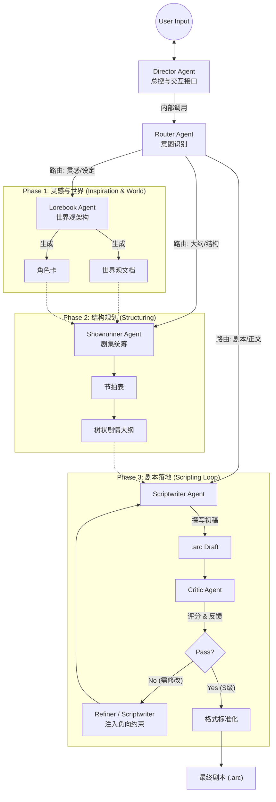
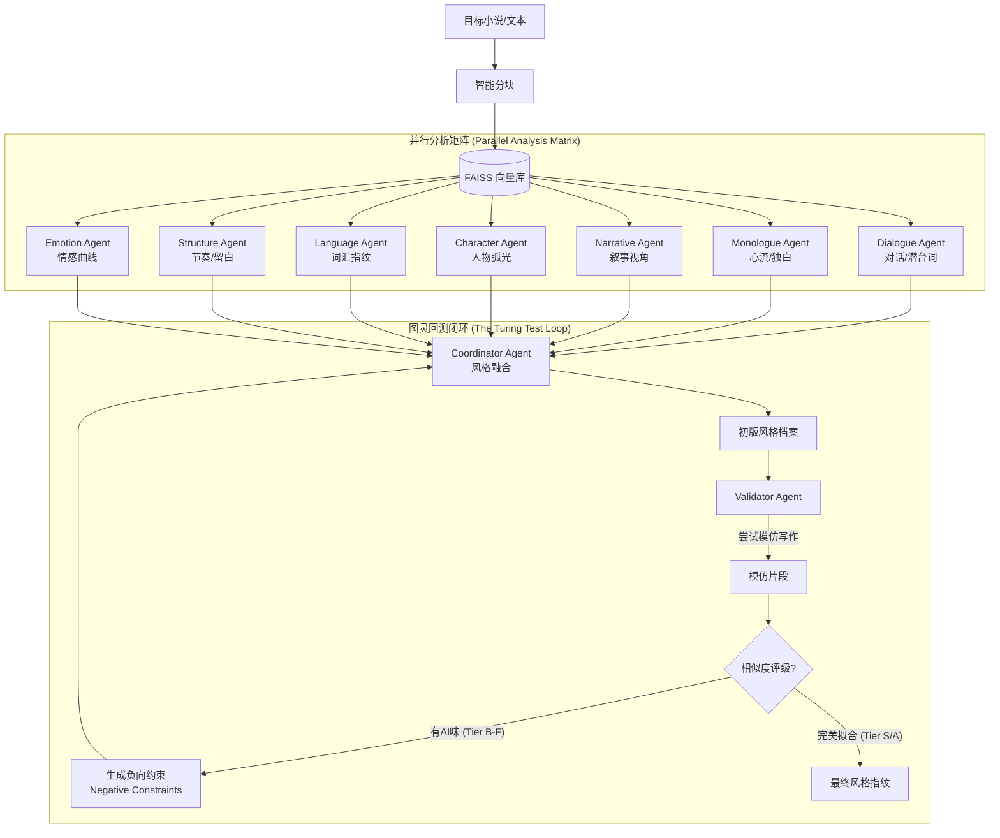
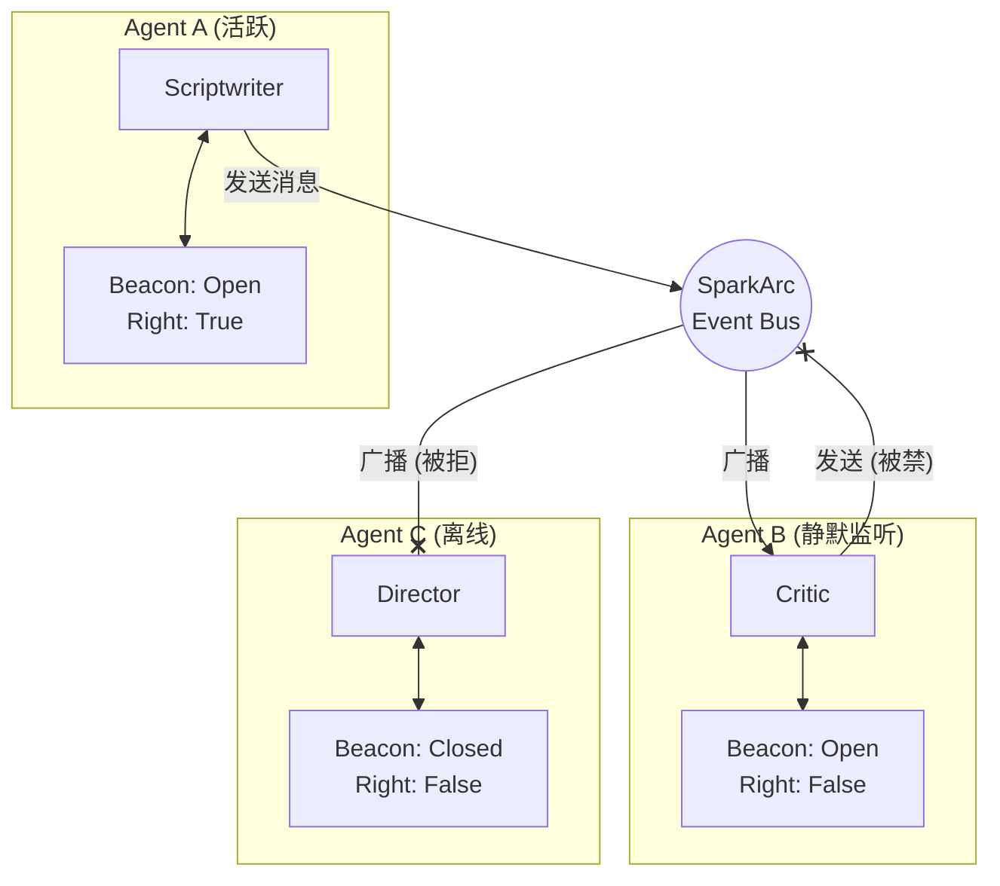

# SparkArc: 下一代 AI 辅助世界构建与剧本创作引擎

> **不仅仅是生成文字，而是构建世界的蓝图。**

SparkArc 是一个深度集成的智能化创作平台，旨在通过模拟专业影视工业流水线，将模糊的创意转化为结构严谨、逻辑自洽且风格独特的交互式剧本。它打通了从**灵感构思 -> 风格克隆 -> 剧本撰写 -> 逻辑审查 -> 最终演出**的全链路，为创作者和独立游戏开发者提供了一套强大的生产力工具。

---

## 目录

- [核心理念](#核心理念)
- [系统架构详解](#系统架构详解)
    - [1. 智能体集群 (The Agent Swarm)](#1-智能体集群-the-agent-swarm)
    - [2. 风格克隆集群 (Style Analysis Cluster)](#2-风格克隆集群-style-analysis-cluster)
    - [3. 信标总线通信机制 (Beacon Bus Protocol)](#3-信标总线通信机制-beacon-bus-protocol)
- [数据协议：ARC 格式](#数据协议arc-格式)
- [基础设施与安全](#基础设施与安全)
- [跨平台生态](#跨平台生态)

---

## 核心理念

传统的 AI 写作往往面临“逻辑断裂”、“风格同质化”和“难以交互”三大痛点。SparkArc 通过以下技术手段重新定义了 AI 创作：

1.  **Agent 协同而非单一生成**：模拟现实中的编剧团队，不同 Agent 司职撰稿、审核、润色，通过多轮迭代保证质量。
2.  **世界蓝图 (World Blueprint)**：产出的不仅仅是文本，而是包含逻辑分支、变量控制、场景跳转的结构化数据，可直接驱动游戏引擎。
3.  **去 AI 化 (De-AI)**：通过独创的“图灵回测”机制，强制 AI 摒弃说教感和通用句式，深度模仿目标作者的“呼吸感”。

---

## 🚀 快速开始

### 方式一：Docker 一键部署（推荐）

最简单的部署方式，只需 3 步：

```bash
# 1. 克隆项目
git clone https://github.com/your-repo/sparkarc.git
cd sparkarc

# 2. 配置 LLM_KEY（复制示例文件并填写密钥）
cp server/.env.example server/.env
# 编辑 server/.env，设置 LLM_KEY=你的密码

# 3. 启动服务
docker-compose up -d
```

服务启动后访问：**http://localhost:6688**

> 💡 **数据持久化**：用户数据和数据库会自动保存在 Docker 卷中，重启容器不会丢失。

### 方式二：本地开发环境 (配置流程)

项目自带了预置的模型配置，但 **API Key 默认为无效占位**。首次部署请按以下步骤激活：

1.  **激活python环境 启动 LLM 配置工具**：
    ```bash
    cd server/llm/llm_mgr
    python llm_mgr_cfg_gui.py
    ```
2.  **设置主密钥**：
    程序会提示你输入 `LLM_KEY`（用于加密你的 API Key），这将会保存到环境变量，作为加密系统平台密钥与所有用户自定义密钥的唯一凭证。请务必妥善保存。
3.  **填入 API Key**：
    在 GUI 中选中你拥有的平台（如 DeepSeek / OpenRouter），在右侧填入你的真实 Key 并点击 **“保存 API Key”**。
4.  **验证**：
    选中一个左侧模型，点击 **“测试选中模型”**。出现“测试成功”字样即可。

---

## 系统架构详解

### 1. 智能体集群 (The Agent Swarm)

SparkArc 不依赖单一的大模型，而是构建了一个分工明确的智能体集群。每个 Agent 都有独立的人设、提示词工程（Prompt Engineering）和模型配置。

#### A. 守门人 (The Gatekeepers)
*   **Director Agent (导演)**：
    *   **职责**：全局入口与上下文管理者。它负责维护用户会话的连贯性，记录关键决策，并作为“总线”的默认接收端。
    *   **模型策略**：使用高稳定性模型（Temperature 0.1），确保指令理解的准确性。
*   **Router Agent (路由)**：
    *   **职责**：轻量级意图识别。它快速分析用户输入的自然语言（如“帮我生成一个赛博朋克世界观”），将其精准分发给对应的专业 Agent。
    *   **模型策略**：使用 **Fast Slot**（如 GPT-4o-mini），极低延迟，确保交互流畅。

#### B. 创意核心 (The Creative Core)
*   **Lorebook Agent (世界观架构师)**：
    *   **职责**：从零构建世界观。它能根据简单的种子（Seed）生成详尽的地理、历史、魔法/科技体系，并批量生成与世界观契合的角色卡（Character Sheets）。
*   **Showrunner Agent (剧集统筹)**：
    *   **职责**：宏观叙事把控。它负责生成**节拍表 (Beat Sheet)** 和 **树状剧情大纲 (Tree Outline)**，确保故事结构符合“救猫咪”或“英雄之旅”等经典叙事模型。
*   **Scriptwriter Agent (执笔编剧)**：
    *   **职责**：微观场景落地。它是唯一的“写手”，负责将大纲转化为具体的 `.arc` 格式剧本。它内置了**思维链 (Chain of Thought)** 机制，在输出正文前会先生成 `<thought>` 标签，进行逻辑推演。

#### C. 质量保证 (Quality Assurance)
*   **Critic Agent (逻辑审核)**：
    *   **职责**：模拟严苛的审稿人。它不直接修改文本，而是对剧本进行多维度评分（逻辑闭环、人设一致性、情感张力），并输出结构化的 **Feedback JSON**。
    *   **模型策略**：使用 **Reason Slot**（如 o1-preview 或 Claude-3.5-Sonnet），具备极强的逻辑推理能力。

#### 协作数据流 (Collaboration Data Flow)



---

### 2. 风格克隆集群 (Style Analysis Cluster)

这是 SparkArc 最具技术深度的模块。为了捕捉人类作者微妙的文风，我们设计了一个由 **9 个 Agent** 组成的复杂子系统。

#### 工作流：从 RAG 到图灵回测


#### 核心技术点
1.  **7 维正交分析**：
    我们将“文风”解构为 7 个互不重叠的维度。例如，`DialogueAgent` 专注于分析“沉默的运用”和“话轮转换节奏”，而 `LanguageAgent` 则专注于统计“高频词汇”和“句式长短分布”。
2.  **Validator 的自我对抗**：
    `ValidatorAgent` 是一个独立的评判者。它会基于生成的风格档案尝试写一段“伪作”，然后自我评分。如果发现生成的文字带有 AI 特有的“说教感”或“总分总结构”，它会生成一条**负向约束 (Negative Constraint)**（例如：“禁止使用‘然而’作为转折”，“禁止在对话后立即解释心理活动”），并强制注入到风格档案中。

---

### 3. 信标总线通信机制 (Beacon Bus Protocol)

为了解决多 Agent 之间复杂的交互权限与消息路由问题，SparkArc 研发了**信标总线 (Beacon Bus)**。这是一种基于发布/订阅模式的改进型通信架构，旨在模拟真实人类社交中的“倾听”与“发言”状态。

#### 核心机制：BeaconState
每个接入总线的 Agent (`SparkBaseAgent`) 都拥有一个独立的 **BeaconState (信标状态机)**，包含两个原子权限：

1.  **可见性 (Visibility / `is_open`)**：
    *   **定义**：决定该 Agent 是否“在线”并能接收广播。
    *   **应用场景**：当 `Scriptwriter` 正在撰写长篇剧本时，它会将 `is_open` 设为 `False`，物理隔绝外部干扰，进入“心流模式”。
2.  **话语权 (Authority / `has_communication_right`)**：
    *   **定义**：决定该 Agent 是否有权主动向总线“发言”。
    *   **应用场景**：在风格分析的“总结阶段”，只有 `Coordinator` 拥有话语权，其他 7 个分析 Agent 只能被动响应查询。这种 **RBAC (基于角色的访问控制)** 机制有效防止了多 Agent 系统常见的“广播风暴”和死循环。

#### 交互拓扑图


---

## 数据协议：ARC 格式

SparkArc 定义了一种兼顾**人类可读性**与**机器解析能力**的混合格式 —— **.arc**。它结合了 Markdown 的流畅阅读体验与 XML 的严谨逻辑结构。

### 格式示例
```markdown
# 场景标题：最后的告别
@guide 任务指引：陪她走完最后一段路
@intro 场景初始化描述...

[-1]
这里是旁白区域。落日将街道拉得极长，梧桐树影斑驳。
(系统自动识别为 Narration 节点)

[0]
（紧紧牵着她的手）
还记得这里吗？
(系统识别为 Player 节点，[0] 映射为当前玩家)

[1]
（歪着头，眼神茫然）
老爷爷……糖……
(系统识别为 NPC 节点，[1] 映射为 Character ID 1)

<choice>
  <opt text="指着远处的校门口">
    [0]
    你看，那是我们第一次见面的地方。
    @next 场景_回忆杀
  </opt>
  
  <opt text="保持沉默">
    [-1]
    沉默在空气中蔓延。
    <trigger>AddMood(-5)</trigger> <!-- 自定义逻辑触发器 -->
  </opt>
</choice>
```

### 解析原理
服务端 `arc_parser.py` 采用分层解析策略：
1.  **场景分割**：首先根据 `#` 标记将文本切分为独立的场景块。
2.  **元数据提取**：提取 `@guide`, `@intro` 等元数据。
3.  **思维链过滤**：自动移除 `<thought>` 标签内容，保留纯净剧本。
4.  **混合解析**：使用正则表达式处理对话行 (`[ID]`)，同时使用 XML 解析器处理 `<choice>` 分支结构，确保逻辑树的准确性。

---

## 基础设施与安全

### 通用大模型管理器 (LLM Manager)
底层由 `LLM_Manager` 统一接管，实现了企业级的模型管理能力。

*   **多层级密钥管理**：
    *   支持系统级全局 Key (环境变量/注册表) 与用户级独立 Key。
    *   使用 `Fernet` 对称加密算法在本地存储敏感信息，拒绝明文保存。
*   **精准 Token 估算**：
    *   摒弃不稳定的 API 返回值，采用 **本地混合估算 (Local Hybrid Estimation)** 算法。
    *   基于 `tiktoken` 基准，结合 **动态 CJK 修正系数**，准确还原 Qwen/DeepSeek 等国产模型在中文环境下的高压缩率特性，确保计费统计精准可靠。
*   **智能槽位路由 (Smart Slots)**：
    系统预设三种算力槽位，自动根据任务复杂度路由模型，平衡成本与效果：
    *   **Fast (快速槽)**： 轻量级廉价模型 —— 建议用于自动路由等。
    *   **Reason (推理槽)**：创作能力强的旗舰模型 —— 建议用于灵感、大纲以及剧本撰写。
    *   **Main (默认槽)**：默认模型。

### 用户管理与权限 (User Management & Permissions)

系统采用基于角色的访问控制（RBAC），但为了安全起见，初始状态下没有任何用户具备管理员权限。

*   **默认权限**：所有新注册的用户默认为普通用户 (`is_admin = 0`)。
*   **引导管理员**：系统没有“首位注册用户自动提权”的逻辑。**第一个管理员必须手动通过数据库设置**。
*   **操作方法**：
    使用 SQLite 管理工具打开 `server/users.db`，执行以下 SQL 语句：
    ```sql
    -- 将 ID 为 1 的用户设为管理员
    UPDATE users SET is_admin = 1 WHERE id = 1;
    ```
    设置成功后，该用户即可访问 `/api/admin` 下的所有管理功能，并通过 UI 界面授权其他管理员。

---

## 跨平台生态

### Web 演出端 (Client)
基于 **Vue.js + Vite** 构建的轻量级播放器。
*   **即时渲染**：浏览器端实时解析 `.arc` 脚本。
*   **可视化编辑**：所见即所得的调试环境，支持实时修改剧本并预览效果。

### Unity 游戏引擎集成
专为独立游戏开发者打造的 **C# SDK**。
*   **原生解析**：`.arc` 文件被直接解析为 `DialogNode` 图结构。
*   **事件驱动**：通过 `EventBus` 将剧本中的 `<trigger>` 标签映射为游戏内的 C# 方法调用（如播放动画、增减道具）。
*   **零代码剧情制作**：策划只需编写文本，无需触碰代码即可控制游戏流程。

*   **智能槽位路由 (Smart Slots)**：
    系统预设三种算力槽位，自动根据任务复杂度路由模型，平衡成本与效果：
    *   🚀 **Fast (快速槽)**：`GPT-4o-mini` / `Claude-Haiku` —— 用于格式清洗、简单分类。
    *   🧠 **Reason (推理槽)**：`o1-preview` / `Claude-3.5-Sonnet` —— 用于风格分析、逻辑审查、复杂大纲构建。
    *   ✍️ **Main (主力槽)**：`GPT-4o` —— 用于剧本正文撰写，平衡速度与质量。

---

## 🌍 跨平台生态

### Web 演出端 (Client)
基于 **Vue.js + Vite** 构建的轻量级播放器。
*   **即时渲染**：浏览器端实时解析 `.arc` 脚本。
*   **可视化编辑**：所见即所得的调试环境。

### Unity 游戏引擎集成
专为独立游戏开发者打造的 **C# SDK**。
*   **原生解析**：`.arc` 文件被直接解析为 `DialogNode` 图结构。
*   **事件驱动**：通过 `EventBus` 将剧本中的 `<trigger>` 标签映射为游戏内的 C# 方法调用（如播放动画、增减道具）。
*   **零代码剧情制作**：策划只需编写文本，无需触碰代码即可控制游戏流程。

---

> **SparkArc** —— 让每一个创作者都能拥有自己的 AI 编剧团队。
