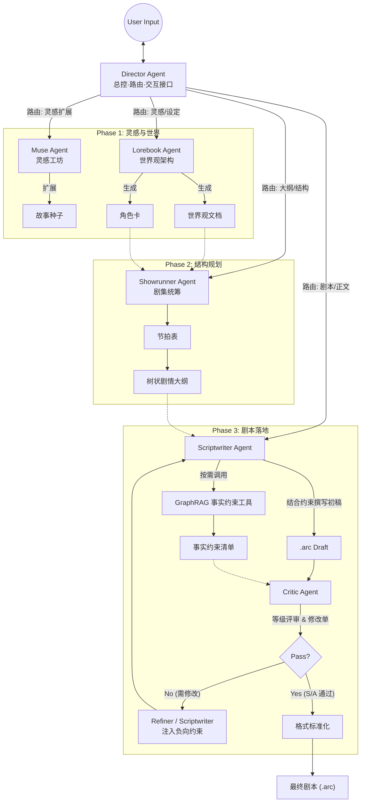
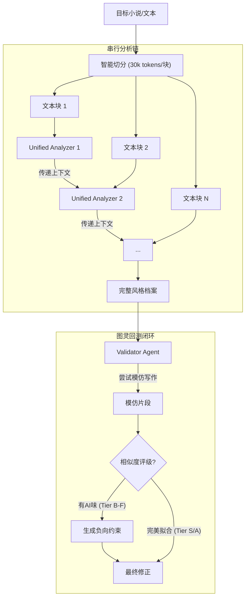
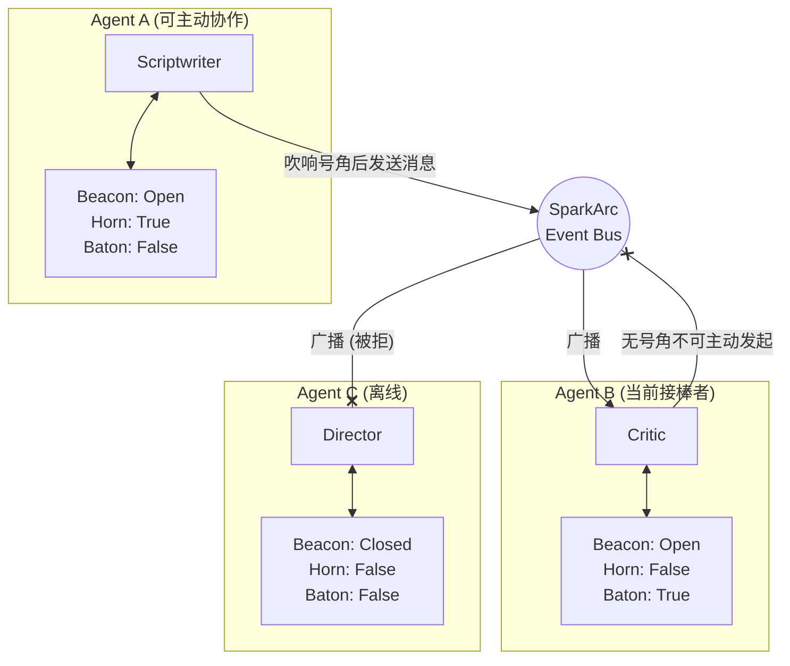
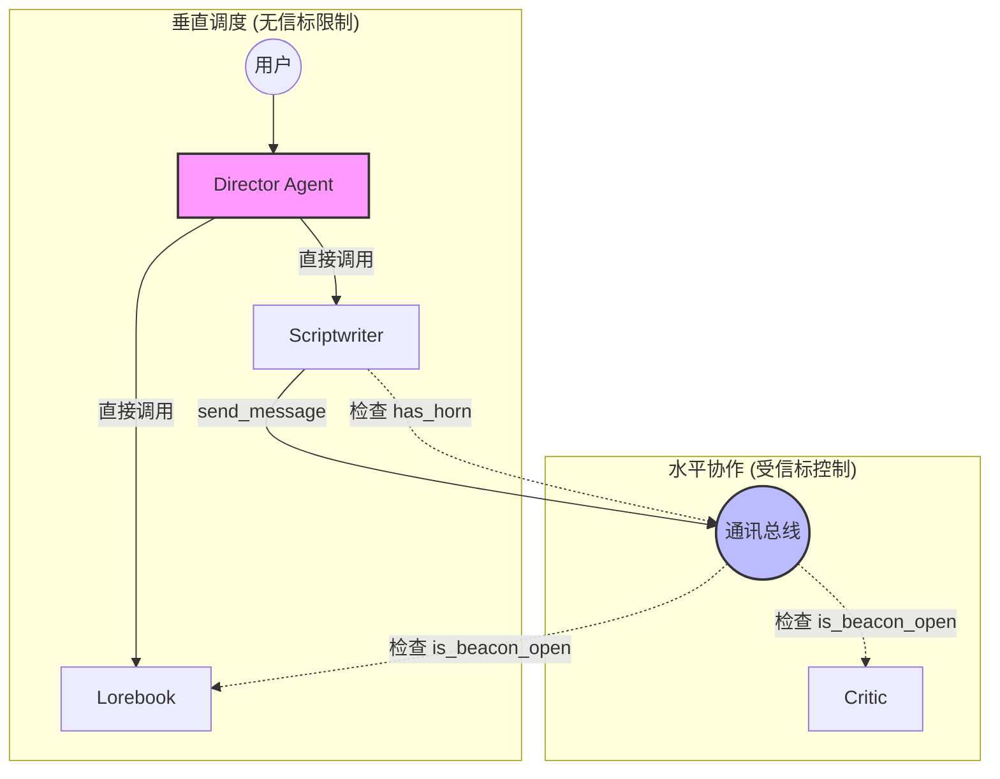

# SparkArc: 跨平台智能创作流

SparkArc 是一个Agent自主智能集群驱动的创作平台，旨在通过专业创作流水线，将星星灵感之火扩展为完整的故事世界，创作小说、剧本，并驱动精美的WEB演出甚至游戏引擎演出。
它打通了**灵感——设定——节奏——大纲——编写——验证——发布——分享——演出**的全链路，为创作者提供了一套强大的生产力工具。

---

## 核心功能

### 1. 专业Studio，直觉交互

现在，你是总编剧。只需要**在聊天框**对**导演**说句话，它就可以驱动起一整个智能体创作团队，有条不紊地开始创作你的庞大世界观，用**多种强大的结构化编辑工具**帮你**自动完成全流程创作**。把小说/剧本分享给你的朋友，在**交互式演出端**让TA**沉浸于你的灵感**。

SparkArc 致力于将专业的创作流通过多智能体协作，暴露于最自然的聊天交互之下：

* **告别提示词，告别手动编辑**：你不再需要编写复杂提示词来约束 AI 既要写大纲又要顾及世界观，你也不需要去到处复制各个Agent所输出的文本。导演 Agent 能听懂你的诉求，切分子任务，并精准分发给设定专家、文案策划或执笔编剧，他们**用工具帮你自动编辑**，让你既能享受到严格结构化文本的精准控制，又无需因此增加半点工作。
* **黑盒展开，白盒协作**：普通的 AI 工具往往是在黑盒中直接生成最终长文。而 SparkArc 能在后台**自主流转**并向你展示每一步的推演过程，并向你**解释AI的思路**。SparkArc对全流程的文案都设计了**友好的可视化编辑器**，如不满意，可以**指定专家**进行手术刀式的局部修改。生成不再是盲文抽卡，而是全流程可视的白盒创作。
* **超——友好的专业创作体验**：是专业**IDE级别的Studio** ，但没有复杂操作逻辑，所见即所得。*再吹牛你也不信，试试就知道。*

### 2. 以人为本，自由掌控

SparkArc 坚信，**灵感与情感是人类创作不可剥夺的核心**。坚持以人为本，允许你自由控制AI的介入程度。

* **风格克隆与反AI**: 利用分析集群复刻创作者本人或著名作者创作者独特的叙事声音、用词习惯与情感色彩。**有效解决了AI创作通篇高频词**的问题，大大**降低了创作的AI味道**。
* **事实约束写作**：先由 Critic 对当前场景或整篇小说做**五维审查**（结构/语言/对白/AI检测、文学承载、逻辑人设），输出**等级、原文证据与修改工单**；再由 GraphRAG 返回“必须保持事实 / 避免冲突 / 待补充信息”。这套“证据化诊断 + 约束化返工”的双保险流程，**既能防止长篇小说吃书，也能高质量反 AI**，控一致性，且默认不自动改稿，保留创作者主导权。

无论是灵感迸发时的快速记录，还是精雕细琢时的逐字推敲，SparkArc 提供各种程度的介入模式：

* **全手动**: 纯粹的结构化编辑器。AI只提供梳理、验证和建议。你完全掌控每一个字，利用 SparkArc 优秀的分层管理功能梳理复杂故事。
* **半自动[推荐]**: 最佳的“人机共舞”体验。你提供核心灵感、关键反转或情感高光，AI 负责填充细节与润色。你随时可以打断、修改、重写，AI 会立即适应你的新方向。
* **全自动**: 仅需一个模糊的想法，AI 为你进行头脑风暴，生成多个可选的短篇故事或大纲，激发你的创作欲望。

### 3. 无界创作，不拘于时

灵感往往诞生于**电脑之外——地铁上、散步时，或是一次和朋友的——甚至和AI的闲聊中**。

* **“地铁时间” 碎片化创作**: 专为移动端适配，让你能单手操作，利用通勤的碎片时间审阅大纲、记录灵感或进行简单的剧情选择。高度的自动化让你可以在五分钟的地铁时间完成创作。
* **全平台支持**：支持所有常见平台，*win、mac、linux、andriod、ios，电脑、平板、手机——都是你的专业Studio！*
* **灵感信箱 MCP**: 打破应用边界。通过 MCP，你的 **RikkaHub**、**CherryStudio** 、任何其他支持MCP的 AI 助手，**闲聊、谈心、调研的时候灵感爆发？只需要一句话，都能一键发送至灵感信箱，成为故事的种子**。

### 4. 分享星火，展示世界

**AI倍速下，你心中多年的主角可以登台演出了**。不是简单的分享文本，而是你创作的完整演出。

* **WEB演出端**：随时分享你的灵感。观众只需**点击链接**，即可进入剧本。
* **规划中功能**：*这个饼很大，请你等一下。*

>1.支持生成角色立绘 并固定生成风格确保所有立绘风格一致
2.结合图片生成模型和图片编辑模型实现简易的背景图片功能
3.允许自定义scriptwritter功能 衍生出子agent 比如日常剧情写手、物品设定写手等等
4.用户可以自定义数据结构 由agent生成对应的解析组件在前端显示编辑 并把这个组件代码保存到数据库中 也就是LUI或者GEN-UI化

### 5. 工业生产，创作平权

不只是操作简单友好的专业创作平台，更是生产力工具。**生成的剧本可以轻松接入到unity、虚幻、Godot等游戏引擎。相信随着AI的发展，以后人人都有创作故事乃至创作游戏的权利**。

* **程序解耦**: 策划只需专注于文本与戏剧性，无需编写一行代码，即可控制演出、游戏行为并随时迭代文本。
* **Unity示例**: 提供简易的 **Unity示例**。你的剧本不再是躺在文档里的死文字，而是可以直接运行的游戏资产。

### 6. 打破常规，自主集群

* **信标 / 号角 / 旗帜**: SparkArc 使用一套形象化的 Agent 协作术语来约束多智能体行为。信标决定“别人能不能看见你、能不能把消息送到你这里”；号角决定“你有没有资格主动向别的 Agent 发话”；旗帜代表“当前这条任务链在谁手里推进”。这套三件套把可见性、主动通信权和任务归属拆开，降低多 Agent 集群的上下文心智负担，为以后扩展更多 agent 提供稳定框架。
* **工具权限分级**: 建立在工具分配机制上的权限分级。不同角色的 Agent 被约束在专属的能力域内，有效防止大模型在复杂任务中产生幻觉时的越权污染，保证了整个创作流水线的安全性与可控性。

---

SparkArc 的架构严格复刻了好莱坞/3A游戏的标准剧本生产流程：

| 阶段             | 传统对应                  | 配合 Agent/工具                          | 功能描述                                                                                                 |
| :--------------- | :------------------------ | :--------------------------------------- | :------------------------------------------------------------------------------------------------------- |
| **0. 沟通调度**  | 总导演/调度中心           | **Director (导演)**                      | 全局入口与上下文管理者。负责意图识别与任务分发，是直接面向用户的交互节点。                               |
| **1. 策划/创意** | Logline / High Concept    | **Muse (灵感种子)**                      | 捕捉稍纵即逝的 Flash Idea，通过多维标签（风格/基调/视点）将其固化为故事种子。                            |
| **2. 世界观**    | Story Bible / World Guide | **Lorebook (设定专家)**                  | 确立物理法则、魔法体系、地理政治以及核心人物小传，确保后续创作的逻辑自洽。                               |
| **3. 结构**      | Beat Sheet / Treatment    | **Showrunner (文案策划)**                | "救猫咪"还是"英雄之旅"？在此阶段确立故事骨架，划分幕结构，生成精确的节拍表。                             |
| **4. 撰写**      | Screenplay / Script       | **Scriptwriter (执笔编剧) + GraphRAG 工具** | 最终的“笔”。在结构框架内填充血肉，处理场景描述、动作指导与角色对白；必要时调用 GraphRAG 事实约束，降低跨章节冲突。 |
| **5. 质量保证**  | Script Doctor / Coverage  | **Critic (逻辑审核) & Style (文风克隆) & GraphRAG 工具** | 逻辑审核负责模拟苛刻的审稿人提供冲突或逻辑漏洞的专业反馈；文风克隆负责通过目标文风约束消除 AI 味高频词；GraphRAG 提供跨文档事实证据。 |
| **6. 制作**      | Implementation / Assets   | **WEB演出端/Unity SDK**                  | 剧本资产化。解析 `.arc` 数据，驱动游戏内的对话系统、演出调度与任务触发。                                 |

## 目录

* [核心理念](#核心理念)
* [🚀 快速开始](#-快速开始)
* [系统架构详解](#系统架构详解)
* [1. 智能体集群](#1-智能体集群)
* [2. 风格克隆集群](#2-风格克隆集群)
* [3. 信标总线通信机制](#3-信标总线通信机制)
* [数据协议：ARC 格式](#数据协议arc-格式)
* [基础设施与安全](#基础设施与安全)
  * [1. 数据库自动迁移](#数据库自动迁移)
  * [2. 通用大模型管理器](#通用大模型管理器-llm-manager)
  * [3. 用户管理与权限](#用户管理与权限)
  * [4. CI/CD 自动化部署](#4-cicd-自动化部署)
* [全平台生态](#-全平台生态)

---

## 🚀 快速开始

### 方式一：Docker 一键部署（推荐）

最简单的部署方式，只需 3 步：

```bash
# 1. 克隆项目
git clone https://github.com/your-repo/sparkarc.git
cd sparkarc
# 2. 启动服务
docker compose up -d --build
```

服务启动后访问：**<http://localhost:7788>**

> 💡 **端口区分**：Docker 环境使用 `7788`，裸机环境使用 `6688`，便于同时运行（部分情况下并行调试）和环境区分（生产环境**严禁同时运行以避免可能的数据冲突**）。
> 💡 **数据持久化**：用户数据和数据库会自动保存在宿主机 `server/` 目录中，重启容器不会丢失。
> 💡 **主密钥位置**：`LLM_KEY` 默认写入 `server/llm/agen_matchbox/.env`，无需单独创建 `server/.env`。

#### 🔄 拉取新版本后的正确更新方式（非常重要）

请不要只执行 `docker compose restart`。这只会重启旧容器，不能保证新代码生效。

每次 `git pull` 后，请固定执行：

```bash
# 1) 拉取代码
git pull --ff-only

# 2) 重新构建并替换容器（必须）
docker compose up -d --build --force-recreate

# 3) 可选：查看最近日志确认启动成功
docker compose logs --tail=120 sparkarc
```

该流程会确保：

1. 镜像内最新 Git 代码一定被重新构建。
2. 启动时会把受 Git 管理的文件同步回挂载目录，避免旧持久化文件遮蔽新版本。
3. 用户数据库与个人数据（如 `*.db`、`_userdata`、`.env`）继续持久化，不会被覆盖。

### 方式二：本地裸机开发环境

配置完成后VS Code 按F5启动，同样非常便捷。适合**不想用Docker**或者二次开发，请按以下步骤配置：

1. **初始化 Python 环境**

   ```bash
   # 1. 创建并激活 Conda 环境（先确保你部署好了miniconda或anaconda）
   conda create -n sparkarc python=3.12 -y
   conda activate sparkarc

   # 2. 安装后端依赖
   cd server
   pip install -r requirements.txt
   ```

2. **配置模型与密钥 (GUI)**
这一步可以跳过，仅用于演示后端大模型管理工具管理模型的流程。同样可以在前端配置。

   ```bash
   # 启动后端配置工具
   cd llm/agen_matchbox
    python matchbox_cfg_gui.py
   ```

   * **主密钥**：输入 `LLM_KEY` 用于加密存储。
   * **API Key**：在 GUI 中选择平台（如 DeepSeek/OpenRouter），填入 Key 并保存。
   * **验证**：点击“测试选中模型”，确保显示“测试成功”。

3. **构建前端界面**

   ```bash
   # 返回项目根目录后进入 client
   cd ../../../client
   npm install
   npm run build
   ```

4. **启动后端服务**

   ```bash
   # 返回根目录后进入 server
   cd ../server
   python app.py
   ```

5. **访问应用**
   服务启动后访问：**<http://localhost:6688>**

---

## 系统架构详解

### 1. 智能体集群

SparkArc 不依赖单一的大模型，而是构建了一个分工明确的智能体集群。每个 Agent 都有独立的人设、提示词工程和模型配置。

#### A. 调度者

* **Director Agent (导演)**：
  * **职责**：全局入口与上下文管理者。它负责维护用户会话的连贯性，记录关键决策，并作为"总线"的默认接收端。同时内置轻量级意图识别模块，快速分析用户输入的自然语言（如"帮我生成一个赛博朋克世界观"），将其精准分发给对应的专业 Agent。

#### B. 创意核心

* **Muse Agent (灵感)**：
  * **职责**：创意的起点。捕捉稍纵即逝的灵感火花，通过多维标签（风格/基调/视点）将其固化为故事种子，并可自动扩展为更完整的创意概念。支持通过 MCP 从外部 AI 助手接收灵感。
* **Lorebook Agent (世界观、角色)**：
  * **职责**：从零构建世界观。它能根据简单的种子（Seed）生成详尽的地理、历史、魔法/科技体系，并批量生成与世界观契合的角色卡（Character Sheets）。
* **Showrunner Agent (梗概、节奏、大纲)**：
  * **职责**：宏观叙事把控。它负责生成**节拍表 (Beat Sheet)** 和 **树状剧情大纲 (Tree Outline)**，确保故事结构符合“救猫咪”或“英雄之旅”等经典叙事模型。
* **Scriptwriter Agent (执笔编剧)**：
  * **职责**：微观场景落地。它是唯一的“写手”，负责将大纲转化为具体的 `.arc` 格式剧本。它内置了**构思链 (Conception Chain)** 机制，在输出正文前会先生成 `<conception>` 标签，进行逻辑推演。

#### C. 质量保证

* **Style Agent**（风格克隆）
  * **职责**：反AI，通过模仿指定作家甚至你本人的文风，来确保大模型在创作的时候避开AI常使用的高频词组，**最大化降低AI味道**。
* **Critic Agent (逻辑审核)**：
  * **职责**：模拟严苛的审稿人。它不直接修改文本，而是审查剧本/小说片段中**读者可感知的 AI 味残留、对白失真、文学承载不足、逻辑与人设问题**，并输出结构化的审稿意见。
  * **工作模式**：既可在聊天面板中自然语言对话，也可在 ScriptWriter 右侧面板手动触发结构化审查。
  * **输出协议**：使用 **S / A / B / C / D** 五档等级，而不是数字分数；同时输出原文证据、命中问题与 `fix_ticket` 风格修改单，便于后续返工。
  * **模型策略**：优先利用大模型的判别与归因能力，把它当成 **LLM Judge / Editor**，而不是训练一个只会给概率分数的专有分类器。

* **GraphRAG Tool（事实约束）**：
  * **职责**：把项目内世界观、角色、大纲与剧本片段转成可检索的关系图谱，在写作或审稿时返回可执行的事实约束。
  * **工具阶段策略**：建图固定走 Fast 槽位，查询阶段跟随调用 Agent 的模型配置；默认按需调用，不强制接管创作流程。
  * **质量价值**：重点增强跨章节一致性、角色关系稳定性与设定回收能力，降低长线写作中的“吃书”。

#### Critic 审核机制（简述）

Critic 的核心目标不是回答“这段是不是 AI 写的”，而是回答：**这段文字哪里会让读者觉得像模型在完成任务。**

其核心机制非常简单：

1. **阅读体验导向，而不是来源检测**：
   它关注解释腔、段尾升华、对白过度完整、抽象词堆积、动作/感官承载不足等“可被读者感知”的问题。
2. **少量等级分类，而不是伪精确分数**：
   使用 `S/A/B/C/D` 五档等级，更符合大模型的分类特性，也更符合人类编辑直觉。
3. **证据化批评，而不是空泛评价**：
   每条命中尽量引用原文短片段，并说明“哪里假、为什么假、该如何改”。
4. **输出修改单，而不是直接洗稿**：
   Critic 负责生成结构化 `fix_ticket`，描述修改目标、必须保留项与建议操作，默认不直接改写正文。

为什么这里优先利用大模型，而不是专有 ML 模型？原因很直接：

- **大模型更擅长复杂语义判别**：AI 味通常不是一个单点特征，而是结构、语气、对白效率、叙事承载的综合失真；这类问题很难用单一分类器稳定覆盖。
- **大模型能给出“证据 + 原因 + 修改建议”**：专有 ML 模型通常只能输出一个概率或标签，而 Critic 需要像编辑一样指出具体句子并解释问题。
- **不依赖额外标注与训练流水线**：在创作领域，风格与问题口径会不断变化。使用大模型可以通过 Prompt 和协议快速迭代，而不必先积累大规模标注集再训练专用模型。
- **天然适合长文本与项目上下文**：Critic 可以直接结合世界观、角色、大纲和当前场景一起审稿，这比只看局部特征的专有模型更贴近真实编辑工作流。

#### 协作数据流



---

### 2. 风格克隆集群

这是 SparkArc 最具技术深度的模块。为了捕捉人类作者微妙的文风，我们设计了一个精简高效的分析子系统，核心由 **UnifiedStyleAnalyzer（统一分析器）** 和 **ValidatorAgent（验证器）** 组成。

#### 工作流：串行深度分析



#### 风格分析流程

1. **智能流式分析**：
    我们将长篇小说切分为 30k tokens 的大块（约 4.5 万字），由 `UnifiedStyleAnalyzer` 进行**串行分析**。
    * **上下文传递**：每块分析结束时，分析器会生成一份"剧情概括"传递给下一块，确保 AI 知道前文发生了什么（如角色关系变化、伏笔）。
    * **全维覆盖**：每个块都由同一个分析器进行 7 维度（对话、独白、叙事、角色、语言、结构、情感）的全量分析，避免了碎片化检索导致的上下文丢失。
2. **自我对抗**：
    `ValidatorAgent` 是一个独立的评判者。它会基于生成的风格档案尝试写一段“伪作”，然后自我评分。如果发现生成的文字带有 AI 特有的“说教感”或“总分总结构”，它会生成一条**负向约束**（例如：“禁止使用‘然而’作为转折”，“禁止在对话后立即解释心理活动”），并强制注入到风格档案中。

---

### 3. 信标总线通信机制

为了解决多 Agent 之间复杂的交互权限与消息路由问题，SparkArc 设计并实现了**信标总线**。这是一种带权限控制的消息路由架构，使用“信标 / 号角 / 旗帜”三件套来模拟真实协作中的“是否可见”“是否可主动发话”“当前任务在谁手里”。

> ⚠️ **当前状态**：信标总线的完整基础设施（类定义、REST API、前端交互面板）均已实现并可通过 UI 操作，但目前 Agent 间的水平自主通信为**预留能力**——当前所有 Agent 协作均通过 Director 直接调度完成。随着 Agent 数量增长，该机制将逐步启用以防止广播风暴和死循环。

#### 核心机制：信标 / 号角 / 旗帜

每个接入总线的 Agent（`SparkBaseAgent`）都拥有一套独立的运行态三件套：

1. **信标 (`is_beacon_open`)**：
    * **定义**：决定该 Agent 是否对其他 Agent 可见、可被触达、可接收外部消息。
    * **应用场景**：当 `Scriptwriter` 正在撰写长篇剧本时，它可以关闭信标，物理隔绝外部干扰，进入“心流模式”。
2. **号角 (`has_horn`)**：
    * **定义**：决定该 Agent 是否有资格主动向总线发话、向其他 Agent 发起协作。
    * **应用场景**：通过控制哪些 Agent 拥有号角，可以限定谁能主动跨 Agent 发起下一跳，避免广播风暴与无边界互相打断。
3. **旗帜 (`has_baton`)**：
    * **定义**：表示当前这条任务链的接力棒在谁手里，也就是当前任务由谁继续推进。
    * **应用场景**：导演把任务交给 `Lorebook` 后，旗帜会转移给 `Lorebook`；当结果需要回导演复核时，旗帜再交回导演。

#### 交互拓扑图



#### 架构澄清：导演调度 vs 信标协作（两套独立系统）

SparkArc 中存在**两套独立且职责不同的通信机制**，它们共同构成完整的 Agent 治理体系，而非功能冗余：

| 维度           | 导演调度机制 (Director)    | 信标协作机制 (Beacon/Communication) |
| :------------- | :------------------------- | :---------------------------------- |
| **设计目标**   | 响应用户请求，快速分发任务 | 控制 Agent 之间的自主协作边界       |
| **触发源**     | 用户输入 (外部)            | Agent 自身的业务逻辑 (内部)         |
| **信息流向**   | 垂直 (自上而下)            | 水平 (对等)                         |
| **受信标限制** | ❌ 不受限                   | ✅ 受信标/号角/旗帜共同约束          |
| **核心代码**   | `agent_director.py`        | `communication.py`                  |

**为何需要两套系统？**

1. **垂直指令流 (Director -> Agent)**
    * 当用户说"帮我写一段对话"，Director 必须**立即、无障碍地**将任务分发给 `Scriptwriter`。
    * 如果此时 `Scriptwriter` 的信标是关闭的（比如正在执行另一个长任务），用户的请求不应该被拒绝。
    * 因此，**Director 拥有"上帝权限"**：它可以直接实例化 Agent 并调用 `chat()` 方法，绕过信标检查。

2. **水平协作流 (Agent <-> Agent)**
    * 如果 `Scriptwriter` 在写作过程中想要咨询 `Lorebook` 获取设定，这属于**自主协作**。
    * 如果没有限制，可能出现 A→B→C→A 的死循环调用，或者多个 Agent 同时广播导致消息风暴。
    * 因此，**信标机制强制介入**：发起方必须先拥有“号角”，接收方必须开启“信标”，而“旗帜”则用于表达当前这条任务链归谁推进。

**交互模式示意图**



---

## 数据协议：ARC 格式

SparkArc 定义了一种兼顾**人类可读性**与**机器解析能力**的混合格式 —— **.arc**。它结合了 Markdown 的流畅阅读体验与 XML 的严谨逻辑结构，并基于严谨的调查研究，**最大化的保全了大模型在超长结构化文本创作时的创作文学质量。**

### 格式示例

```markdown
# 场景标题：最后的告别
@guide 任务指引：陪她走完最后一段路
@intro 场景初始化描述...

[-1]
这里是旁白区域。落日将街道拉得极长，梧桐树影斑驳。

[0]
还记得这里吗？

[1]
老爷爷……糖……

<choice>
  <opt text="指着远处的校门口">
    [0]
    你看，那是我们第一次见面的地方。
    @next 场景_回忆
  </opt>
  
  <opt text="保持沉默">
    [-1]
    沉默在空气中蔓延。
    @act system:AddMood(-5)
  </opt>
</choice>
```

### 解析原理

服务端 `arc_parser.py` 采用分层解析策略：

1. **场景分割**：首先根据 `#` 标记将文本切分为独立的场景块。
2. **元数据提取**：提取 `@guide`, `@intro` 等元数据。
3. **思维链过滤**：自动移除 `<conception>` 标签内容，保留纯净剧本。
4. **混合解析**：使用正则表达式处理对话行 (`[ID]`)，同时使用自定义标签解析器（基于深度追踪的标签匹配）处理 `<choice>` 分支结构，并识别 `@act` 行为指令与 `@next` 跳转逻辑，确保逻辑树的准确性。

---

## 基础设施

为了这个庞大平台的稳定性，SparkArc搭建了许多功能完备的基础设施。它们都考虑了通用性，你可以**轻松地迁移到你自己的项目上**。**我希望我的工作可以帮到更多想在这个浪潮中做点东西的开发者**。

### 1. 火柴Agent网关——为Agent而生的全功能大模型网关

底层由 `火柴Agent网关` 统一接管，它是面向 Agent 开发的独立的大模型网关。组件严格执行接口抽离，可部署在其他项目。具备自带GUI界面、极细颗粒度的双口径配额计费、限流等全链路功能。

网关**兼容 Open AI 协议**，并支持自动将常见的推理字段（如 reasoning_content 和<think\>）**统一为推理流**，确保最佳的流式体验，拒绝空等待。

相比于传统的外置网关（如 NewAPI / LiteLLM 等），内置网关能够**直接融入驱动项目的多种 Agent 编排生态、为用户提供友好管理体验、极致轻量化**，同时免去额外运维负担与多跳延迟。

#### 标准设计（SparkArc 默认推荐）

我们采用“**强管理通道 + 轻量直连通道**”的双通道设计：

* **强管理通道（默认业务通道）**：
  * 应用启动时显式初始化一次：`initialize_matchbox(ensure_defaults=True)`。
  * 请求期统一从 `matchbox()` 取管理器，再调用 `get_user_llm(...)` / `get_user_embedding(...)`。
  * 自动覆盖：用户选型、密钥优先级、`sys_paid/self_paid` 配额拦截、用量落库与统计。
* **轻量直连通道（旁路能力）**：
  * 用 `create_quick_llm(...)` / `create_quick_embedding(...)` 快速创建客户端。
  * 不依赖数据库与用户态，适合一次性任务、离线脚本、健康检查和外部工具桥接。
* **生命周期强约束**：
  * 启动初始化，关闭调用 `reset_matchbo()` 清理全局实例，避免导入副作用。
* **路径可迁移**：
  * 通过 `AGENT_MATCHBOX_HOME` 统一控制运行目录（DB/.env/YAML/state），默认回退到包目录。

#### 推荐链路（开发者落地）

1. **应用启动**：在 FastAPI lifespan / startup 中调用 `initialize_matchbox(ensure_defaults=True)`。
2. **业务调用**：Agent/路由内统一使用 `matchbox().get_user_llm(user_id, usage_key=...)`。
3. **流式输出**：直接 `invoke/stream`，推理字段自动兼容，且请求完成后自动统计用量。
4. **配额与计费**：按实际命中的 Key 自动归档到 `sys_paid` 或 `self_paid` 并执行拦截。
5. **旁路任务**：仅在无需用户态治理时，才使用 `create_quick_llm/create_quick_embedding`。

* **灵活的系统托管与用户自定义 (BYOK)**：
  * **系统托管模式**：管理员一键配置共享模型池，用户注册即享“开箱即用”。
  * **BYOK 模式**：原生支持多租户配置，用户可自由添加个人专属平台配置与私有 API Key。所有敏感信息强制通过高强度对称加密存储并严格隔离。
  * **混合模式**：用户当然也可以在用尽了系统额度之后，自行接入大模型。实现额度完全自由。站长也可以切换这三种模式，自由地决定自己的商业模式。
* **原生多口径配额与账单体系 (Quota & Ledger)**：
  * 针对真实 C 端场景设计。每一次请求发往前都会被精准分为 `sys_paid`（消耗站长余额）和 `self_paid`（消耗用户自费 Key）进行独立流控。
  * 支持周期性限流（例如每 N 小时限额）以及总量封顶策略，避免耗尽站长配额时误伤用户自带的免费服务。
* **精准 Token 估算**：
  * 摒弃不稳定的 API 返回值（中断获取不到计费信息），采用 **本地混合估算** 算法。
  * 基于 `tiktoken` 基准，结合 **动态 CJK 修正系数**，准确还原 Qwen/DeepSeek 等国产模型在中文环境下的高压缩率特性，确保计费统计精准可靠。
* **多用途槽位 (Smart Slots)**：
    系统预设三种槽位，并允许用户自定义预设多种情境下不同的模型，根据任务复杂度路由模型，平衡成本与效果：
  * **Fast (快速槽)**： 轻量级快速模型 —— 用于文本自动格式化、分类标签抓取。
  * **Reason (推理槽)**：具备极强思维推演能力的模型 —— 用于设定审核、情节大纲评估与逻辑链验证。
  * **Main (默认槽)**：标准的优质文本输出模型。

### 2. 数据库自动迁移

SparkArc 内置了**启动期自动迁移**能力，确保用户拉取新代码后无需手动升级数据库即可运行。针对原生 FastAPI + SQLAlchemy + Alembic 的痛点，我们做了以下优化：

#### 🚑 首先，把救命方法写最前面

自动迁移机制尽可能地考虑了各种极端情况，但仍然无法避免数据库版本错误的可能。
我们无法避免开发者（当然也包括我本人）在开发过程中犯的错。
但有一点可以保证，那就是数据安全。如果出现了数据库相关报错，不要惊慌，你的数据是完好无损的。
请把定义表结构的 models和出错的数据库文件复制出来。

1. 把 models 和数据库文件 给 AI代码助手
2. 告诉 AI 使用 SQL 语句同步数据库文件到 Models 最新版本。必须保证数据安全。（由于数据库密钥数据采用加密存储，所以无需担心 AI 泄露）
3. 把数据库文件覆盖回去
4. git pull 最新代码，重启，结束

#### 自动迁移特性

1. **多数据库分支**：`users.db` 与 `llm_config.db` 采用独立 `version_locations`，互不干扰。
2. **启动自动升级**：启动时使用 Alembic API 直接升级。
3. **自动跳过**：启动时先读取 `alembic_version` 与脚本 head，已是最新直接跳过。
4. **最早阶段执行**：迁移在 `lifespan` 最前面完成，避免业务初始化占用 SQLite 锁。
5. **智能重命名检测**：当开发者在代码中重命名数据库字段时，迁移工具会自动识别并询问确认，避免了传统工具“先删除再新增”导致的数据丢失风险。
6. **危险操作拦截**：任何涉及 `DROP COLUMN`（删除列）或 `DROP TABLE`（删除表）的修改，在生成迁移脚本阶段都会被强制拦截并要求开发者交互确认，确保每一行用户数据都受到保护。
7. **孤儿版本自愈**：这项功能考虑了想要对此项目进行再开发的开发者。算是一种极端情况下的保底。当底层的迁移链被上游仓库重置打断时（比如我嫌仓库太乱清空了迁移记录（笑）），启动期的自愈机制会自动比对底层数据库结构与最新模型定义，尝试简单增删列，但无法执行重命名等操作。这并非是我不想加，而是**数据安全的底线**。一个好的开发习惯胜过十个兜底措施。
**对于分布式的开发者而言，只要不手动修改数据库本身，且models不涉及重命名和修改字段类型操作，只需拉取最新代码重启应用即可自动恢复**。

#### 开发者工作流（改表 -> 迁移 -> 审核 -> 发布）

1. **修改模型**（`server/core/models.py` 或 `server/llm/agen_matchbox/models.py`）。
2. **生成迁移**：

    ```bash
    cd server
    python gen_migration.py
    ```

3. **处理冲突**：如有重命名/删除等危险操作，按提示手动调整迁移脚本。
4. **提交迁移**：将生成的迁移文件提交到仓库。
5. **用户拉取代码**：无需手动迁移，启动服务会自动执行升级。

> 💡 **开发者注意**：
>
> * 🚫警告：禁止手写迁移文件，和修改现有迁移文件。这会造成冲突。
> * 修改 `core/models.py` (Users DB) 后，运行 `python gen_migration.py users "说明"`
> * 修改 `llm/agen_matchbox/models.py` (LLM DB) 后，运行 `python gen_migration.py llm "说明"`
> * 如果不指定数据库名，默认会对所有数据库生成迁移：`python gen_migration.py "说明"`

<details>
  <summary>🧰扩展：将自动迁移的基础设施接入你的应用</summary>

如果你想将这套自动数据库迁移逻辑（自动升级、多库支持、重命名检测）复用到其他 FastAPI 项目，请务必改清楚以下“必改项”，做到开箱即用：

1. **复制核心文件**：
    * `server/alembic/` (目录)：包含环境配置 `env.py` 和脚本模板。
    * `server/alembic.ini`：配置文件。
    * `server/gen_migration.py`：生成迁移的 CLI 工具。
    * `server/core/auto_migrate.py`：负责运行时自动升级的逻辑。

2. **必改项清单（迁移到新项目一定要改）**：
    * **数据库路径**：
        * `server/alembic/env.py` 中 `users_db_path` / `llm_db_path`。
        * `server/core/auto_migrate.py` 中 `DB_PATHS`。
    * **Metadata 入口**：
        * `server/alembic/env.py` 中 `USERS_METADATA`/`LLM_METADATA` 的来源。
    * **多库分支命名**：
        * `server/alembic.ini` 中的 `[users]`/`[llm]` 段落名称。
        * `server/gen_migration.py` 的 `VALID_DBS`。
    * **自定义类型渲染**：
        * 如果你有自定义类型（如 `SqliteJSONB`），必须在 `env.py` 里加 `render_item` 规则，避免生成脚本无法导入。
        * render_as_batch 这个是为 SQLite 设计，Postgres/MySQL 应关闭
    * **业务启动入口**：
        * `app.py` 中 `lifespan` 里调用 `run_auto_migrations()` 的位置要靠前。

3. **配置多数据库 (可选)**：
    * 修改 `server/alembic/env.py` 中的 `DATABASES` 字典，配置你的数据库路径和Metadata。
    * 修改 `server/gen_migration.py` 和 `server/core/auto_migrate.py` 中的 `VALID_DBS` 和 `DB_PATHS` 列表，使其与你的数据库对应。

4. **接入应用生命周期**：
    在你的 `app.py` 或 `main.py` 的 lifespan 中调用 `run_auto_migrations`：

    ```python
    from contextlib import asynccontextmanager
    from fastapi import FastAPI
    from core.auto_migrate import run_auto_migrations

    @asynccontextmanager
    async def lifespan(app: FastAPI):
        # 1. 启动时自动迁移
        try:
            run_auto_migrations()
        except Exception as e:
            print(f"Migration failed: {e}")
            raise e
        
        yield
        
    app = FastAPI(lifespan=lifespan)
    ```

</details>

#### ⚠️清理迁移历史（风险）

⚠️警告：如果你需要用 Git 在多个地方同步仓库，那么，禁止执行清理历史。这会导致拉取者出现数据库版本错误。除非你确定你的操作只涉及最简单的增删。
⚠️自愈机制只是兜底，处理掉简单的增删，**如果清理掉了涉及重命名和修改字段类型或约束，而下游拉取者又没有来得及同步之前的迁移历史**，会导致拉取者出现错误！

⚠️只有你在本地独自开发的时候 才能使用这个脚本！

```bash
cd server
python clear_migration.py --yes
```

该脚本会：

1. 先升级到最新 head；
2. 备份/删除旧迁移；
3. 使用空数据库生成新的基线迁移；
4. 将真实数据库 stamp 到新 head。

### 3. 用户管理与权限

系统采用基于角色的访问控制（RBAC），并通过自动化机制简化初始配置。

* **首位管理员**：系统会自动将**第一个注册的用户**设为管理员，拥有修改系统模型平台的权限。
* **默认权限**：除首位用户外，所有新注册的用户默认为普通用户 (`is_admin = 0`)。
* **权限授予**：首位管理员可通过 UI 界面中的"管理中心"授权其他用户成为管理员。

---

### 4. CI/CD 自动化部署

SparkArc 内置了完整的持续集成/持续部署（CI/CD）流水线，支持代码推送后**全自动构建镜像、测试并部署**，无需任何手动干预。

#### 支持的 Git 平台

| 平台       | 配置文件                      | Runner                            | 触发条件            |
| :--------- | :---------------------------- | :-------------------------------- | :------------------ |
| **Gitea**  | `.gitea/workflows/deploy.yml` | 自建 `act_runner`（Docker 模式）  | push 到 `main` 分支 |
| **GitLab** | `.gitlab-ci.yml`              | 自建 GitLab Runner（Docker 模式） | push 到任意分支     |

> 💡 **关于 GitHub Actions**：Gitea Actions 的语法设计与 GitHub Actions 高度相似（`on`/`jobs`/`steps`/`secrets` 等关键字完全一致），但**并非直接兼容**，移植时需注意以下差异：
>
> * **Token 变量名**：Gitea 使用 `${{ gitea.token }}`，GitHub 使用 `${{ github.token }}`。本项目的工作流已同时读取两者并以非空者优先，因此迁移到 GitHub 后无需修改 Token 部分。
> * **托管 Runner**：GitHub 提供开箱即用的托管 Runner（`ubuntu-latest` 直接可用）；Gitea 需要在服务器上**自行部署 `act_runner`** 并以 Docker 模式运行，这是迁移的最大前提条件。
> * **代码检出 Action**：标准的 `actions/checkout` 在 Gitea 上存在兼容问题。本项目绕过了这一点——检出步骤直接使用裸 `git` 命令实现，同时兼容两个平台，迁移到 GitHub 后该步骤同样可正常运行。
> * **结论**：如果已有可用的 GitHub Actions Runner，将 `.gitea/workflows/deploy.yml` 复制到 `.github/workflows/deploy.yml` 后仅需极少量改动（主要是确认 Token 变量引用）即可直接使用。

#### 流水线阶段

三个阶段顺序执行，任意阶段失败则终止：

```text
📥 检出代码  →  🔨 构建镜像  →  🧪 测试（预留）  →  🚀 部署  →  🧹 清理
```

1. **构建**：执行 `docker build`，利用 BuildKit 的 `--mount=type=cache` 缓存 npm/pip 包，**非首次构建可大幅提速**（仅重新编译代码变更层）。
2. **测试**：当前为预留阶段，后续将集成 `pytest` 单元测试。
3. **部署**：
   * 自动创建四个持久化 Docker Volume（`sparkarc_data`、`sparkarc_userdata`、`sparkarc_shares`、`sparkarc_llm_config`），已存在则跳过。
   * 若在 CI Secret 中配置了 `LLM_KEY`，自动写入容器的 `.env` 文件；未配置则启动后可通过前端设置。
    * 原子替换：先删除旧容器，再以相同 Volume 启动新容器，**数据零丢失**。
    * 启动阶段自动执行“受管文件同步”：将镜像中的 Git 受管文件覆盖回挂载目录，并清理已下线的旧受管文件；`*.db`、`.env` 等运行时数据不覆盖。
4. **清理**：自动执行 `docker image prune` 清理构建过程中产生的悬空镜像，节省磁盘空间。

#### 配置 Gitea Runner（快速上手）

在你的服务器上，以 Docker 模式运行 `act_runner`，并将其注册到 Gitea 实例：

```bash
# 1. 获取注册 Token（Gitea 仓库 → 设置 → Actions → Runner）
# 2. 注册并启动 Runner
docker run -d \
  --name gitea-runner \
  --restart unless-stopped \
  -v /var/run/docker.sock:/var/run/docker.sock \
  -e GITEA_INSTANCE_URL=http://your-gitea-instance \
  -e GITEA_RUNNER_REGISTRATION_TOKEN=your_token \
  gitea/act_runner:latest
```

Runner 启动后，向 `main` 分支推送代码即可自动触发完整的构建和部署流程。

#### 配置 CI Secret

在你的 Git 平台仓库的 **Settings → Secrets** 中添加以下变量（可选）：

| 变量名    | 说明                                                               |
| :-------- | :----------------------------------------------------------------- |
| `LLM_KEY` | 大模型主密钥。配置后自动写入容器；未配置则首次启动后通过前端设置。 |

---

## 全平台生态与架构

### 组件逻辑布局解耦

为了实现**地铁五分钟**的无缝体验，SparkArc 采用分离架构：

* **Business Logic (Composables)**: 所有的核心业务逻辑（如 `useSynopsisLogic`, `useScriptWriterLogic`）被封装在独立的 Composable 函数中，不依赖具体 UI。**项目正在往LUI的方向演进。不久的以后，你的每一句话，都可以开启一个复杂的创作流。**
* **全尺寸屏幕适配**:
  * **Desktop Views**: 针对宽屏优化的复杂工作台，提供多列布局与详细控制面板。
  * **Mobile Views**: 针对竖屏优化的流式交互界面，强调阅读体验与快速操作。大部分核心视图（梗概、结构、世界观、风格分析等）均提供独立移动端视图，编剧台（ScriptWriter）目前仅支持桌面端。

### Tauri 2 跨平台构建

前端已接入 Tauri 2，Windows / Linux / macOS / Android / iOS 的完整“傻瓜化”构建教程请查看 [DOC/tauri/README.md](DOC/tauri/README.md)。

简易发布速查（进入项目根目录后 `cd client`）：

1. 安装依赖：`npm install`
2. 桌面端（Windows / Linux / macOS）：`npm run tauri:build`
3. Android：`npm run tauri:android`
4. iOS：`npm run tauri:ios`
5. 本地调试（桌面端）：`npm run tauri:dev`

注意事项：

* **macOS / iOS** 需要在 macOS 设备上编译与签名。
* **Android** 需要安装 Android Studio，并配置好 SDK / NDK 环境。
* **构建产物** 会自动同步到项目根目录的 `app-build/` 下并按平台区分。

### Unity 游戏引擎集成（BETA）

> Unity SDK (`SparkArc.Unity`) 目前作为独立模块位于 `presenter/UnitySDK`，旨在为独立游戏开发者提供开箱即用的剧情解决方案。**该功能尚处于极早期测试阶段，覆盖情景难免较少，敬请期待。**

#### 全流程数据管线

1. **创作端**: 策划完成剧本创作，导出标准化的 `.arc` 文件或 `stories.db` SQLite 数据库。
2. **资产层**: 将数据库文件放入 Unity 项目的 `StreamingAssets` 目录。
3. **运行时**:
    * **StoryRepository**: 游戏启动时自动加载并缓存剧本数据。
    * **DialogueManager**: 核心驱动器。解析当前的 Story Node，处理文本显示、选项分支跳转。
    * **Event System**: 剧本中的 `@act` 行为指令通过统一的 `OnActionTriggered(string func, string[] args)` 事件广播，开发者在业务层注册对应处理器（如播放动画、添加任务），无需修改对话系统代码。

通过这套管线，开发者可以实现灵活的剧情迭代——修改剧本无需重新编译代码，运行时手动调用重载方法即可刷新数据库。

---

> **SparkArc** —— 灵感之火，世界之弧：让每一个热衷创作者都能创造世界。

