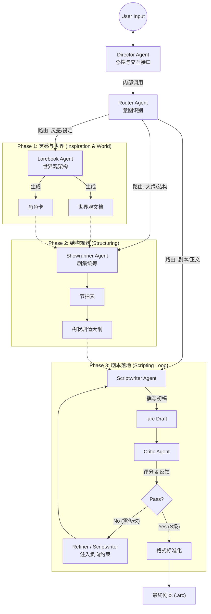
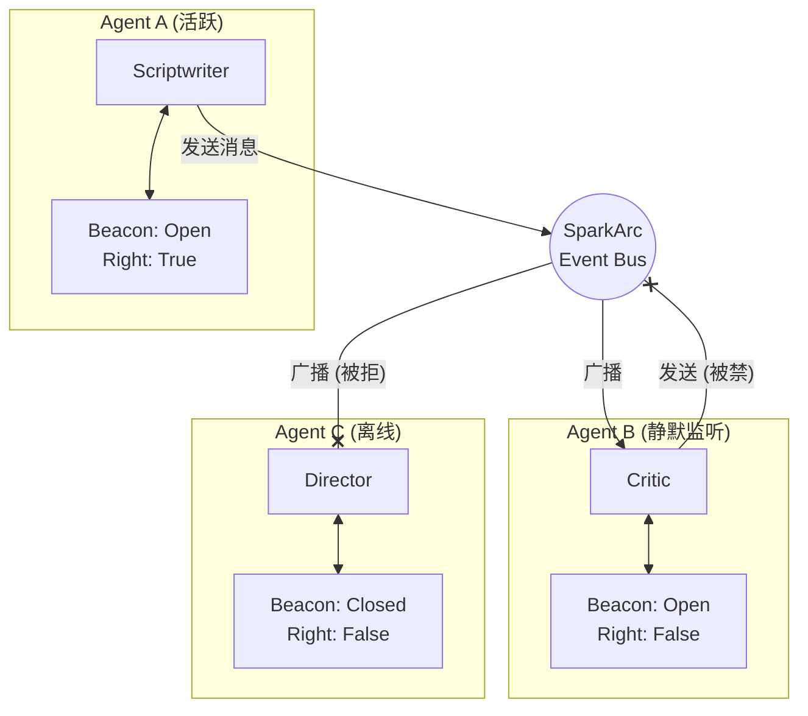
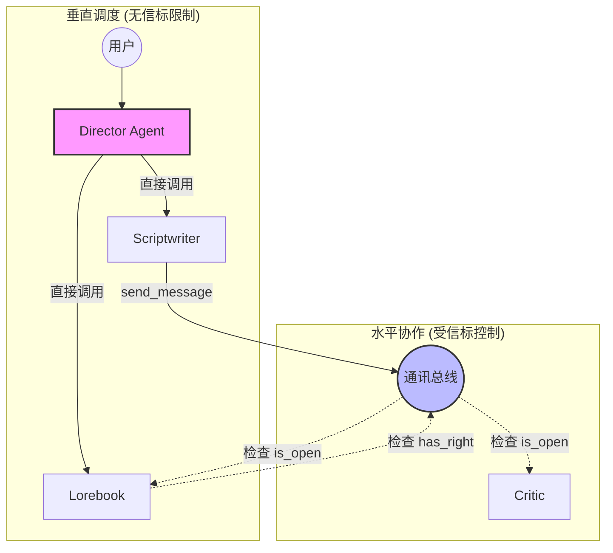

# SparkArc: 剧本创作

SparkArc 是一个Agent集群驱动的创作平台，旨在通过模拟专业创作工业流水线，将星星灵感之火扩展为完整的故事世界。
它打通了**灵感——设定——节奏——大纲——编写——验证——发布——演出**的全链路，为创作者和独立游戏开发者提供了一套强大的生产力工具。

---

## 核心功能

### 1. 以人为本，自由掌控
SparkArc 坚信，灵感与情感是人类创作不可剥夺的核心。坚持以人为本，允许你自由控制AI的介入程度。
*   **风格克隆与反AI**: 利用分析集群复刻创作者本人或著名作者创作者独特的叙事声音、用词习惯与情感色彩。**有效解决了AI创作通篇高频词**的问题，大大**降低了创作的AI味道**。
无论是灵感迸发时的快速记录，还是精雕细琢时的逐字推敲，SparkArc 提供各种程度的介入模式：
*   **全手动**: 纯粹的结构化编辑器。你完全掌控每一个字，利用 SparkArc 优秀的分层管理功能梳理复杂故事。
*   **半自动[推荐]**: 最佳的“人机共舞”体验。你提供核心灵感、关键反转或情感高光，AI 负责填充细节与润色。你随时可以打断、修改、重写，AI 会立即适应你的新方向。
*   **全自动**: 仅需一个模糊的想法，AI 为你进行头脑风暴，生成多个可选的短篇故事或大纲，激发你的创作欲望。

### 2. 无界创作，不拘于时
灵感往往诞生于电脑之外——地铁上、散步时、或是一次和朋友的——甚至和AI的闲聊中。
*   **“地铁时间” 碎片化创作**: 专为移动端适配，让你能单手操作，利用通勤的碎片时间审阅大纲、记录灵感或进行简单的剧情选择。高度的自动化让你可以在五分钟的地铁时间完成创作。
*   **灵感 MCP**: 打破应用边界。通过 MCP，你的 **RikkaHub**、**CherryStudio** 、任何其他支持MCP的 AI 助手，对话的时候灵感迸发？只需要一句话，都能一键发送至灵感信箱，成为故事的种子。

### 3. 分享与演出
不是简单的分享文本，而是你创作的完整演出。
*   **WEB演出端**：随时分享你的灵感。观众只需**点击链接**，即可进入剧本。
*   **规划中功能**：*这个饼很大，请你等一下。*
>1.支持生成角色立绘 并固定生成风格确保所有立绘风格一致
2.结合图片生成模型和图片编辑模型实现简易的背景图片功能
3.允许自定义scriptwritter功能 衍生出子agent 比如日常剧情写手、物品设定写手等等
4.用户可以自定义数据结构 由agent生成对应的解析组件在前端显示编辑 并把这个组件代码保存到数据库中 也就是LUI或者GEN-UI化

### 4. 工业生产，创作平权
不只是创作平台，更是生产力工具。生成的剧本可以轻松接入到unity、虚幻、Godot等游戏引擎。相信随着AI的发展，以后人人都有创作故事乃至创作游戏的权利。
*   **程序解耦**: 策划只需专注于文本与戏剧性，无需编写一行代码，即可控制演出、游戏行为并随时迭代文本。
*   **Unity示例**: 提供简易的 **Unity示例**。你的剧本不再是躺在文档里的死文字，而是可以直接运行的游戏资产。

### 5. 新的协作方式尝试
*   **信标旗帜**: 非传统的Agent协作模式。主动广播/被动接收的机制，降低了智能体集群的上下文心智负担，大幅降低 Token 消耗，为以后扩展更多agent提供可行框架。

---


SparkArc 的架构严格复刻了好莱坞/3A游戏的标准剧本生产流程：

| 阶段 | 传统对应 | 负责 Agent / 模块 | 功能描述 |
| :--- | :--- | :--- | :--- |
| **1. 策划/创意 (Concept)** | Logline / High Concept | **MuseAgent + MCP** | 捕捉稍纵即逝的 Flash Idea，通过多维标签（风格/基调/视点）将其固化为故事种子。 |
| **2. 世界观 (World)** | Story Bible / World Guide | **Lorebook + Showrunner** | 确立物理法则、魔法体系、地理政治以及核心人物小传，确保后续创作的逻辑自洽。 |
| **3. 结构 (Structure)** | Beat Sheet / Treatment | **Director + Blueprint** | "救猫咪"还是"英雄之旅"？在此阶段确立故事骨架，划分幕结构，生成精确的节拍表。 |
| **4. 撰写 (Drafting)** | Screenplay / Script | **ScriptwriterAgent** | 唯一的“笔”。在结构框架内填充血肉，处理场景描述、动作指导与角色对白。 |
| **5. 审阅 (Reviewing)** | Script Doctor / Coverage | **CriticAgent** | 模拟苛刻的审稿人。不直接修改，而是提供关于冲突、节奏、人物弧光的专业反馈 (Feedback JSON)。 |
| **6. 制作 (Production)** | Implementation / Assets | **Unity SDK** | 剧本资产化。解析 `.arc` 数据，驱动游戏内的对话系统、演出调度与任务触发。 |

## 目录

- [核心理念](#核心理念)
- [🚀 快速开始](#-快速开始)
- [系统架构详解](#系统架构详解)
    - [1. 智能体集群](#1-智能体集群)
    - [2. 风格克隆集群](#2-风格克隆集群)
    - [3. 信标总线通信机制](#3-信标总线通信机制)
- [数据库自动迁移](#数据库自动迁移fastapi--sqlalchemy--alembic)
- [数据协议：ARC 格式](#数据协议arc-格式)
- [基础设施与安全](#基础设施与安全)
- [跨平台生态](#-跨平台生态)

---

## 🚀 快速开始

### 方式一：Docker 一键部署（推荐）

最简单的部署方式，只需 3 步：

```bash
# 1. 克隆项目
git clone https://github.com/your-repo/sparkarc.git
cd sparkarc
# 2. 启动服务
docker compose up -d
```

服务启动后访问：**http://localhost:7788**

> 💡 **端口区分**：Docker 环境使用 `7788`，裸机环境使用 `6688`，便于同时运行（部分情况下并行调试）和环境区分（生产环境**严禁同时运行以避免可能的数据冲突**）。
> 💡 **数据持久化**：用户数据和数据库会自动保存在宿主机 `server/` 目录中，重启容器不会丢失。
> 💡 **主密钥位置**：`LLM_KEY` 默认写入 `server/llm/llm_mgr/.env`，无需单独创建 `server/.env`。

### 方式二：本地裸机开发环境

配置完成后VS Code 按F5启动，同样非常便捷。适合**不想用Docker**或者二次开发，请按以下步骤配置：

1. **初始化 Python 环境**
   ```bash
   # 1. 创建并激活 Conda 环境（先确保你部署好了miniconda或anaconda）
   conda create -n sparkarc python=3.12 -y
   conda activate sparkarc

   # 2. 安装后端依赖
   cd server
   pip install -r requirements.txt
   ```

2. **配置模型与密钥 (GUI)**
这一步可以跳过，仅用于演示后端大模型管理工具管理模型的流程。同样可以在前端配置。
   ```bash
   # 启动后端配置工具
   cd llm/llm_mgr
   python llm_mgr_cfg_gui.py
   ```
   *   **主密钥**：输入 `LLM_KEY` 用于加密存储。
   *   **API Key**：在 GUI 中选择平台（如 DeepSeek/OpenRouter），填入 Key 并保存。
   *   **验证**：点击“测试选中模型”，确保显示“测试成功”。

3. **构建前端界面**
   ```bash
   # 返回项目根目录后进入 client
   cd ../../../client
   npm install
   npm run build
   ```

4. **启动后端服务**
   ```bash
   # 返回根目录后进入 server
   cd ../server
   python app.py
   ```

5. **访问应用**
   服务启动后访问：**http://localhost:6688**


---

## 数据库自动迁移（FastAPI + SQLAlchemy + Alembic）

SparkArc 内置了**启动期自动迁移**能力，确保用户拉取新代码后无需手动升级数据库即可运行。针对原生 FastAPI + SQLAlchemy + Alembic 的痛点，我们做了以下优化：

1. **多数据库分支**：`users.db` 与 `llm_config.db` 采用独立 `version_locations`，互不干扰。
2. **进程内升级**：使用 Alembic API 直接升级，避免子进程死锁和编码问题。
3. **快速短路**：启动时先读取 `alembic_version` 与脚本 head，已是最新直接跳过。
4. **最早阶段执行**：迁移在 `lifespan` 最前面完成，避免业务初始化占用 SQLite 锁。
5. **日志保持**：迁移执行时保留 `uvicorn` 的 logger，不吞访问日志。
6. **环境感知 (`env.py`)**：通过 `-x db=name` 参数动态切换 `target_metadata`，防止在错误的数据库中生成无关的表结构。

### 开发者工作流（改表 -> 迁移 -> 发布）

1. **修改模型**（`server/core/models.py` 或 `server/llm/llm_mgr/models.py`）。
2. **生成迁移**：
    ```bash
    cd server
    python gen_migration.py
    ```
3. **处理冲突**：如有重命名/删除等危险操作，按提示手动调整迁移脚本。
4. **提交迁移**：将生成的迁移文件提交到仓库。
5. **用户拉取代码**：无需手动迁移，启动服务会自动执行升级。

### 迁移到其他项目（Reusing Migration Logic）

如果你想将这套健壮的数据库迁移逻辑（自动升级、多库支持、重命名检测）复用到其他 FastAPI 项目，请遵循以下步骤：

1.  **复制核心文件**：
    *   `server/alembic/` (目录)：包含环境配置 `env.py` 和脚本模板。
    *   `server/alembic.ini`：配置文件，需修改 `[alembic]` 下的 `script_location`。
    *   `server/gen_migration.py`：生成迁移的 CLI 工具。
    *   `server/core/auto_migrate.py`：负责运行时自动升级的逻辑。

2.  **配置多数据库 (可选)**：
    *   修改 `server/alembic/env.py` 中的 `DATABASES` 字典，配置你的数据库路径和 Metadata。
    *   修改 `server/gen_migration.py` 和 `server/core/auto_migrate.py` 中的 `VALID_DBS` 和 `DB_PATHS` 列表，使其与你的数据库对应。

3.  **接入应用生命周期**：
    在你的 `app.py` 或 `main.py` 的 lifespan 中调用 `run_auto_migrations`：

    ```python
    from contextlib import asynccontextmanager
    from fastapi import FastAPI
    from core.auto_migrate import run_auto_migrations

    @asynccontextmanager
    async def lifespan(app: FastAPI):
        # 1. 启动时自动迁移
        try:
            run_auto_migrations()
        except Exception as e:
            print(f"Migration failed: {e}")
            raise e
        
        yield
        
    app = FastAPI(lifespan=lifespan)
    ```

### 清理迁移历史（可选，高风险）

用于将**当前数据库状态**重置为新的“基线迁移”，清空历史脚本：

```bash
cd server
python clear_migration.py --yes
```

该脚本会：
1. 先升级到最新 head；
2. 备份/删除旧迁移；
3. 使用空数据库生成新的基线迁移；
4. 将真实数据库 stamp 到新 head。

> 注意：此操作会丢失回滚历史，仅用于开发期“瘦身”。

## 系统架构详解

### 1. 智能体集群 (The Agent Swarm)

SparkArc 不依赖单一的大模型，而是构建了一个分工明确的智能体集群。每个 Agent 都有独立的人设、提示词工程（Prompt Engineering）和模型配置。

#### A. 守门人 (The Gatekeepers)
*   **Director Agent (导演)**：
    *   **职责**：全局入口与上下文管理者。它负责维护用户会话的连贯性，记录关键决策，并作为“总线”的默认接收端。
    *   **模型策略**：使用高稳定性模型（Temperature 0.1），确保指令理解的准确性。
*   **Router Agent (路由)**：
    *   **职责**：轻量级意图识别。它快速分析用户输入的自然语言（如“帮我生成一个赛博朋克世界观”），将其精准分发给对应的专业 Agent。
    *   **模型策略**：使用 **Fast Slot**（如 GPT-4o-mini），极低延迟，确保交互流畅。

#### B. 创意核心 (The Creative Core)
*   **Lorebook Agent (世界观架构师)**：
    *   **职责**：从零构建世界观。它能根据简单的种子（Seed）生成详尽的地理、历史、魔法/科技体系，并批量生成与世界观契合的角色卡（Character Sheets）。
*   **Showrunner Agent (剧集统筹)**：
    *   **职责**：宏观叙事把控。它负责生成**节拍表 (Beat Sheet)** 和 **树状剧情大纲 (Tree Outline)**，确保故事结构符合“救猫咪”或“英雄之旅”等经典叙事模型。
*   **Scriptwriter Agent (执笔编剧)**：
    *   **职责**：微观场景落地。它是唯一的“写手”，负责将大纲转化为具体的 `.arc` 格式剧本。它内置了**思维链 (Chain of Thought)** 机制，在输出正文前会先生成 `<thought>` 标签，进行逻辑推演。

#### C. 质量保证 (Quality Assurance)
*   **Critic Agent (逻辑审核)**：
    *   **职责**：模拟严苛的审稿人。它不直接修改文本，而是对剧本进行多维度评分（逻辑闭环、人设一致性、情感张力），并输出结构化的 **Feedback JSON**。
    *   **模型策略**：使用 **Reason Slot**（如 o1-preview 或 Claude-3.5-Sonnet），具备极强的逻辑推理能力。

#### 协作数据流 (Collaboration Data Flow)



---

### 2. 风格克隆集群 (Style Analysis Cluster)

这是 SparkArc 最具技术深度的模块。为了捕捉人类作者微妙的文风，我们设计了一个由 **9 个 Agent** 组成的复杂子系统。

#### 工作流：串行深度分析 (Serial Deep Analysis)
```mermaid
graph TD
    Input[目标小说/文本] --> Chunker[智能切分 (30k tokens/块)]
    
    subgraph "串行分析链 (Sequential Analysis Chain)"
        Chunker --> Block1[文本块 1]
        Block1 -- "分析 + 剧情概括" --> Analyzer1[Unified Analyzer]
        Analyzer1 -- "传递上下文 (Context Handoff)" --> Analyzer2
        
        Chunker --> Block2[文本块 2]
        Block2 -- "分析 + 剧情概括" --> Analyzer2[Unified Analyzer]
        Analyzer2 -- "传递上下文" --> Analyzer3[...]
        
        Analyzer3[...] --> BlockN[文本块 N (通过最终汇总Prompt)]
        BlockN --> FinalProfile[完整风格档案]
    end
    
    subgraph "图灵回测闭环 (The Turing Test Loop)"
        FinalProfile --> Validator[Validator Agent]
        Validator -- "尝试模仿写作" --> MimicText[模仿片段]
        MimicText --> Evaluator{相似度评级?}
        
        Evaluator -- "有AI味 (Tier B-F)" --> Refine[生成负向约束<br>Negative Constraints]
        Refine --> Finalizer[最终修正]
        
        Evaluator -- "完美拟合 (Tier S/A)" --> Finalizer
    end
```

#### 风格分析流程
1.  **智能流式分析**：
    我们将长篇小说切分为 30k tokens 的大块（约 4.5 万字），采用**串行分析 (Serial Analysis)** 模式。
    *   **上下文传递**：每块分析结束时，Agent 会生成一份"剧情概括"传递给下一块，确保 AI 知道前文发生了什么（如角色关系变化、伏笔）。
    *   **全维覆盖**：每个块都进行 7 维度（对话、独白、叙事、角色、语言、结构、情感）的全量分析，避免了碎片化检索导致的上下文丢失。
2.  **自我对抗**：
    `ValidatorAgent` 是一个独立的评判者。它会基于生成的风格档案尝试写一段“伪作”，然后自我评分。如果发现生成的文字带有 AI 特有的“说教感”或“总分总结构”，它会生成一条**负向约束 (Negative Constraint)**（例如：“禁止使用‘然而’作为转折”，“禁止在对话后立即解释心理活动”），并强制注入到风格档案中。

---

### 3. 信标总线通信机制 (Beacon Bus Protocol)

为了解决多 Agent 之间复杂的交互权限与消息路由问题，SparkArc 研发了**信标总线 (Beacon Bus)**。这是一种基于发布/订阅模式的改进型通信架构，旨在模拟真实人类社交中的“倾听”与“发言”状态。

#### 核心机制：BeaconState
每个接入总线的 Agent (`SparkBaseAgent`) 都拥有一个独立的 **BeaconState (信标状态机)**，包含两个原子权限：

1.  **可见性 (Visibility / `is_open`)**：
    *   **定义**：决定该 Agent 是否“在线”并能接收广播。
    *   **应用场景**：当 `Scriptwriter` 正在撰写长篇剧本时，它会将 `is_open` 设为 `False`，物理隔绝外部干扰，进入“心流模式”。
2.  *主动权 (Authority / `has_communication_right`)**：
    *   **定义**：决定该 Agent 是否有权主动向总线“发言”。
    *   **应用场景**：在风格分析的“总结阶段”，只有 `Coordinator` 拥有主动权，其他 7 个分析 Agent 只能被动响应查询。这种 **RBAC (基于角色的访问控制)** 机制有效防止了多 Agent 系统常见的“广播风暴”和死循环。

#### 交互拓扑图


#### 架构澄清：导演调度 vs 信标协作（两套独立系统）

SparkArc 中存在**两套独立且职责不同的通信机制**，它们共同构成完整的 Agent 治理体系，而非功能冗余：

| 维度 | 导演调度机制 (Director/Router) | 信标协作机制 (Beacon/Communication) |
| :--- | :--- | :--- |
| **设计目标** | 响应用户请求，快速分发任务 | 控制 Agent 之间的自主协作边界 |
| **触发源** | 用户输入 (外部) | Agent 自身的业务逻辑 (内部) |
| **信息流向** | 垂直 (自上而下) | 水平 (对等) |
| **受信标限制** | ❌ 不受限 | ✅ 严格受限 |
| **核心代码** | `agent_director.py`, `agent_router.py` | `communication.py` |

**为何需要两套系统？**

1.  **垂直指令流 (Director -> Agent)**
    *   当用户说"帮我写一段对话"，Director 必须**立即、无障碍地**将任务分发给 `Scriptwriter`。
    *   如果此时 `Scriptwriter` 的信标是关闭的（比如正在执行另一个长任务），用户的请求不应该被拒绝。
    *   因此，**Director 拥有"上帝权限"**：它可以直接实例化 Agent 并调用 `chat()` 方法，绕过信标检查。

2.  **水平协作流 (Agent <-> Agent)**
    *   如果 `Scriptwriter` 在写作过程中想要咨询 `Lorebook` 获取设定，这属于**自主协作**。
    *   如果没有限制，可能出现 A→B→C→A 的死循环调用，或者多个 Agent 同时"广播"导致消息风暴。
    *   因此，**信标机制强制介入**：`Scriptwriter` 必须先拥有 `has_communication_right`，且 `Lorebook` 的 `is_open` 必须为 `True`，调用才能成功。

**交互模式示意图**



**对开发者的说明**

*   `agent_director.py` 中的 `_create_agent_instance()` 是直接实例化，**不走** `CommunicationContext`。
*   只有通过 `SparkBaseAgent.send_message()` 发起的调用才会触发信标检查。
*   这是有意为之的设计，而非遗漏。Director 需要保证用户请求的响应性，而信标机制专注于治理 Agent 的自治行为。

---

## 数据协议：ARC 格式

SparkArc 定义了一种兼顾**人类可读性**与**机器解析能力**的混合格式 —— **.arc**。它结合了 Markdown 的流畅阅读体验与 XML 的严谨逻辑结构。

### 格式示例
```markdown
# 场景标题：最后的告别
@guide 任务指引：陪她走完最后一段路
@intro 场景初始化描述...

[-1]
这里是旁白区域。落日将街道拉得极长，梧桐树影斑驳。
(系统自动识别为 Narration 节点)

[0]
（紧紧牵着她的手）
还记得这里吗？
(系统识别为 Player 节点，[0] 映射为当前玩家)

[1]
（歪着头，眼神茫然）
老爷爷……糖……
(系统识别为 NPC 节点，[1] 映射为 Character ID 1)

<choice>
  <opt text="指着远处的校门口">
    [0]
    你看，那是我们第一次见面的地方。
    @next 场景_回忆杀
  </opt>
  
  <opt text="保持沉默">
    [-1]
    沉默在空气中蔓延。
    <trigger>AddMood(-5)</trigger> <!-- 自定义逻辑触发器 -->
  </opt>
</choice>
```

### 解析原理
服务端 `arc_parser.py` 采用分层解析策略：
1.  **场景分割**：首先根据 `#` 标记将文本切分为独立的场景块。
2.  **元数据提取**：提取 `@guide`, `@intro` 等元数据。
3.  **思维链过滤**：自动移除 `<thought>` 标签内容，保留纯净剧本。
4.  **混合解析**：使用正则表达式处理对话行 (`[ID]`)，同时使用 XML 解析器处理 `<choice>` 分支结构，确保逻辑树的准确性。

---

## 基础设施与安全

### 数据库自动迁移 (Database Migration)

SparkArc 使用基于 Alembic 的智能化数据库管理方案，确保在版本升级过程中用户数据的安全与完整。

*   **全自动升级 (Auto-Upgrade)**：
    Docker 容器或后端服务启动时，系统会自动检测并应用最新的数据库补丁。无需了解任何 SQL 或迁移命令，即可完成版本更新。
*   **智能重命名检测 (Rename Detection)**：
    系统内置了智能启发式算法。当开发者在代码中重命名数据库字段时，迁移工具会自动识别并询问确认，避免了传统工具“先删除再新增”导致的数据丢失风险。
*   **危险操作拦截 (Safety Guard)**：
    任何涉及 `DROP COLUMN`（删除列）或 `DROP TABLE`（删除表）的修改，在生成迁移脚本阶段都会被强制拦截并要求开发者交互确认，确保每一行用户数据都受到保护。

> 💡 **开发者注意**：
> *   修改 `core/models.py` (Users DB) 后，运行 `python gen_migration.py users "说明"`
> *   修改 `llm/llm_mgr/models.py` (LLM DB) 后，运行 `python gen_migration.py llm "说明"`
> *   如果不指定数据库名，默认会对所有数据库生成迁移：`python gen_migration.py "说明"`

#### 扩展：如何添加新数据库
若需增加新的独立数据库文件（如 `log.db`）：
1.  **定义 Model**：创建继承自 `declarative_base()` 的新基类。
2.  **配置 env.py**：在 `DATABASES` 字典中添加路径与 Metadata 映射。
3.  **脚本支持**：在 `gen_migration.py` 与 `auto_migrate.py` 的循环中加入新数据库的 key。
4.  **初始化**：运行 `python gen_migration.py <key> "initial"` 生成基准版本。

### 通用大模型管理器 (LLM Manager)
底层由 `LLM_Manager` 统一接管，实现了通用的模型管理能力。

*   **多层级密钥管理**：
    *   支持系统级全局 Key (环境变量/注册表) 与用户级独立 Key。
    *   使用对称加密算法在本地存储敏感信息，拒绝明文保存。
*   **精准 Token 估算**：
    *   摒弃不稳定的 API 返回值，采用 **本地混合估算 (Local Hybrid Estimation)** 算法。
    *   基于 `tiktoken` 基准，结合 **动态 CJK 修正系数**，准确还原 Qwen/DeepSeek 等国产模型在中文环境下的高压缩率特性，确保计费统计精准可靠。
*   **多用途槽位 (Smart Slots)**：
    系统预设三种槽位，供用户预设多种情境下不同的模型，根据任务复杂度路由模型，平衡成本与效果：
    *   **Fast (快速槽)**： 轻量级廉价模型 —— 建议用于自动路由等。
    *   **Reason (推理槽)**：创作能力强的旗舰模型 —— 建议用于灵感、大纲以及剧本撰写。
    *   **Main (默认槽)**：默认模型。

### 用户管理与权限 (User Management & Permissions)

系统采用基于角色的访问控制（RBAC），并通过自动化机制简化初始配置。

*   **首位管理员**：系统会自动将**第一个注册的用户**设为管理员，拥有修改系统模型平台的权限。
*   **默认权限**：除首位用户外，所有新注册的用户默认为普通用户 (`is_admin = 0`)。
*   **权限授予**：首位管理员可通过 UI 界面中的"管理中心"授权其他用户成为管理员。

---

## 🌍 跨平台生态与架构

### 组件逻辑布局解耦 (Decoupled Architecture)

为了实现**地铁五分钟**的无缝体验，SparkArc 采用分离架构：
*   **Business Logic (Composables)**: 所有的核心业务逻辑（如 `useSynopsisLogic`, `useScriptWriterLogic`）被封装在独立的 Composable 函数中，不依赖具体 UI。
*   **Adaptive Views**: 
    *   **Desktop Views**: 针对宽屏优化的复杂工作台，提供多列布局与详细控制面板。
    *   **Mobile Views**: 针对竖屏优化的流式交互界面，强调阅读体验与快速操作。
这种解耦设计不仅让维护更加高效，也为未来扩展 **VR/AR** 甚至 **Console** 界面预留了无限可能。

### Unity 游戏引擎集成 (Unity Integration)

> [!NOTE]
> Unity SDK (`SparkArc.Unity`) 目前作为独立模块位于 `presenter/UnitySDK`，旨在为独立游戏开发者提供开箱即用的剧情解决方案。

#### 全流程数据管线 (Full Data Flow)
1.  **创作端 (SparkArc Web)**: 策划完成剧本创作，导出标准化的 `.arc` 文件或 `stories.db` SQLite 数据库。
2.  **资产层 (Assets)**: 将数据库文件放入 Unity 项目的 `StreamingAssets` 目录。
3.  **运行时 (Runtime)**: 
    *   **StoryRepository**: 游戏启动时自动加载并缓存剧本数据。
    *   **DialogueManager**: 核心驱动器。解析当前的 Story Node，处理文本显示、选项分支跳转。
    *   **Event System**: 自动将剧本中的 `<trigger>` 标签映射为 C# 事件（如 `OnPlayAnimation`, `OnAddQuest`），实现**零代码**的剧情演出编排。

通过这就这套管线，开发者可以实现 **"热更新"** 式的剧情开发——修改剧本无需重新编译代码，甚至可以在游戏运行时实时重载数据库。

---

> **SparkArc** —— 让每一个创作者都能拥有自己的 AI 编剧团队。
> *尊重灵感，掌控创作，连接世界。*
