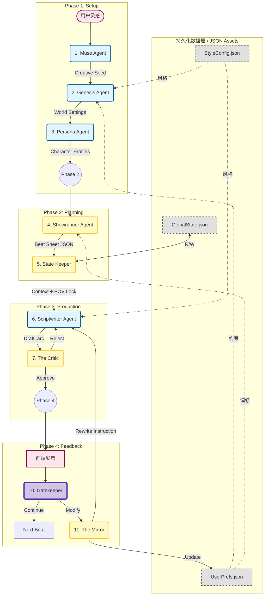

# Sparkarc Studio 技术架构与功能深度解析 (v3.0)

---

## 1. 引言：项目核心技术目标

Sparkarc Studio 的诞生源于一个清晰的技术挑战：当前的大型语言模型（LLM）虽然在文本生成方面表现出色，但在应用于**长篇、情感化、且需要严格逻辑一致性的叙事创作**时，仍面临三大核心瓶颈：

1.  **逻辑一致性崩溃 (Consistency Collapse):** 受限于上下文窗口，LLM 在处理长篇文本时会“遗忘”前文的关键设定，导致情节矛盾、人物行为失常。
2.  **情感表达肤浅 (Emotional Shallowness):** 通用型模型往往只能生成“看起来像”的文字，缺乏深度的心理刻画和情感张力，难以满足高水平互动叙事的要求。
3.  **可控性与创造性的冲突 (Control vs. Creativity Dilemma):** 过强的格式化约束（如 JSON Schema）会扼杀模型的创造力，而过松的约束又会导致输出内容难以被下游程序（如游戏引擎）稳定解析和使用。

Sparkarc Studio 的核心技术目标，就是通过设计一个**专职化、流程化、且具备自我修正能力的多 Agent 协同系统**，正面应对上述挑战，打造一个既能保证工业化生产的稳定可靠，又能最大限度激发 AI 创作潜能的高级编剧引擎。

---

## 2. 系统顶层设计：四阶段多 Agent 协同管线

项目在顶层设计上摒弃了“单一巨型 Agent”的思路，转而采用**基于专业分工的流水线模式 (Pipeline)**。这种模式将复杂的创作流程分解为清晰、可观测的多个阶段，每个 Agent 的职责单一、明确，从而极大地提升了系统的可控性、鲁棒性和可维护性。

### 2.1 协同工作流图

### 2.2 数据流与依赖关系精解

上图不仅展示了 Agent 的执行顺序，更核心的是定义了它们之间严格的数据依赖关系，确保了创作流程的确定性和可追溯性。

*   **启动阶段 (Phase 1):** `Muse Agent` 将用户的 `灵感` 转化为结构化的 `Creative Seed`。`Genesis Agent` **依赖于** `Creative Seed`、`UserPrefs.json` 和 `StyleConfig.json` 来创建 `World Settings`。`Persona Agent` **依赖于** `World Settings` 和 `Creative Seed` 来生成 `Character Profiles`。
*   **规划阶段 (Phase 2):** `Showrunner Agent` **依赖于** `Character Profiles` 和 `UserPrefs.json`，输出驱动下一阶段的 `Beat Sheet JSON`。
*   **生产阶段 (Phase 3):** `State Keeper` 根据 `Beat Sheet` **双向读写** `GlobalState.json`，并输出临时的 `Context + POV Lock`。`Scriptwriter Agent` **依赖于** `State Keeper` 的上下文、`Beat Sheet` 的目标和 `StyleConfig.json` 的风格，生成 `.arc` 草稿。`The Critic` **依赖于**此草稿进行决策。
*   **反馈阶段 (Phase 4):** `Gatekeeper` **仅依赖于**用户的当前输入。被激活的 `The Mirror` 则**依赖于**用户输入、前一轮的生成结果和 `UserPrefs.json` 的历史数据，其输出兵分两路：**更新** `UserPrefs.json` 和生成 `Rewrite Instruction` **指导** `Scriptwriter`。

---

## 3. 端到端创作流程详解：一次叙事生成的生命周期

整个流程始于用户的一段模糊灵感，经由 **Phase 1** 的 `Muse`, `Genesis`, `Persona` Agent 转化为结构化的世界观与角色档案。进入 **Phase 2**，`Showrunner` Agent 将其规划为包含节奏与情感元数据的“节拍表”。在 **Phase 3**，`State Keeper` 注入事实约束，`Scriptwriter` 在此基础上撰写 `.arc` 格式的初稿，并由 `The Critic` 进行严格的自动化质检。通过质检的内容最终在 **Phase 4** 呈现给用户，用户的反馈由 `Gatekeeper` 和 `The Mirror` 组成的轻重分离系统高效处理，形成学习与迭代的闭环。

---

## 4. 核心 Agent 模块深度解析

*   **4.1 `Muse/Genesis/Persona` (设定阶段):** 分别负责将模糊灵感结构化、在约束下构建世界观、以及利用心理学框架塑造深度角色。
*   **4.2 `Showrunner` (规划阶段):** 核心创新是输出包含**可执行元数据**的 `Beat Sheet`，用于对生产阶段进行精确的宏观调控。
*   **4.3 `State Keeper/Scriptwriter/Critic` (生产阶段):** `State Keeper` 是**无创作能力的确定性事实注入器**；`Scriptwriter` 是受控的创意执行者，采用**动态导演机制**和**强制思维链**；`The Critic` 则是自动化 QA，采用**多维度评分与阈值过滤**机制。
*   **4.4 `Gatekeeper/Mirror` (反馈阶段):** 采用**异构模型与状态分离**设计。`Gatekeeper` 以无状态、轻量级模型实现低延迟响应；`The Mirror` 以有状态、重型模型进行深度分析、意见蒸馏和用户偏好持久化。
*   **4.5 `Style Agent` (风格提取):** 其内部是一个**微型的多 Agent 分析管线**，包含 `Language`、`Narrative`、`Emotion` 等多个子 Agent，从不同维度解构文本，最终由 `Coordinator` Agent 汇总生成一份人类可读、机器可用的 `StyleConfig.json` “风格配方”。

---

## 5. 关键技术决策与设计原理

*   **5.1 数据协议：`.arc` 格式的设计哲学**
    *   在 LLM 的**创作自由度**与下游系统的**解析鲁棒性**之间取得平衡。以对 LLM 友好的 Markdown 为基底，仅在需要精确传递机器指令时使用类 XML 标签。
*   **5.2 提示词工程 (Prompt Engineering) 策略**
    *   采用**全局英语原则**保证兼容性，并广泛采用**思维链 (CoT)** 和**自检 (Self-Correction)** 模式提升输出的可靠性。
*   **5.3 异构模型选型策略**
    *   根据任务特性为不同 Agent 选择不同规模的模型，实现成本与性能的最优化。

---

## 6. 用户友好性设计与前端工具链

为将强大的后端能力转化为创作者触手可及的工具，前端提供了一系列新颖的设计：

*   **6.1 LLM 管理与 Agent 绑定:** 提供图形化界面，允许用户集中管理所有 LLM，并将**每一个 Agent**独立绑定到不同的模型，实现用户自定义的异构部署，以平衡成本与性能。
*   **6.2 故事蓝图 (Story Blueprint):** 将复杂的故事剧本可视化为节点式编辑器，创作者可以通过拖拽节点、修改属性等直观操作，对故事的宏观结构和情绪曲线进行调控。
*   **6.3 对话与场景编辑器:** 内置轻量级 `.arc` 解析器，将剧本渲染成类似最终游戏画面的样式，并提供结构化的编辑方式，实现了 AI 生成与人工微调的无缝协作。

---

## 7. 总结

Sparkarc Studio 是一个为解决 AI 在严肃叙事创作领域核心挑战而设计的精密系统。通过**专职化的多 Agent 架构**、**数据驱动的协同管线**、**创新的质量控制与反馈学习闭环**以及**人性化的前端工具链**，它在保证长篇逻辑一致性、提升情感表达深度、平衡创作自由度与工程可控性等关键问题上，给出了一套完整、高效且技术领先的解决方案。