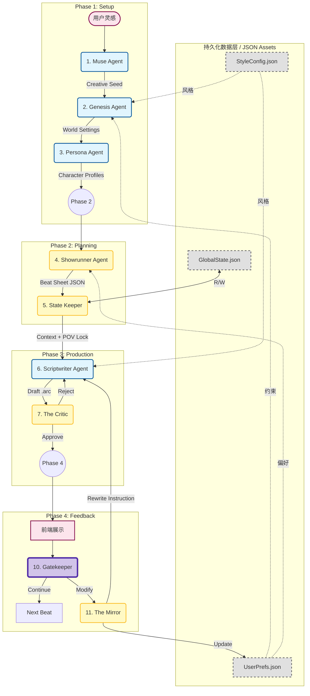

# Sparkarc Studio 技术架构与功能深度解析

---

## 1. 引言：项目核心技术目标

Sparkarc Studio 的诞生源于一个清晰的技术挑战：当前的大型语言模型（LLM）虽然在文本生成方面表现出色，但在应用于**长篇、情感化、且需要严格逻辑一致性的叙事创作**时，仍面临三大核心瓶颈：

1.  **逻辑一致性崩溃 (Consistency Collapse):** 受限于上下文窗口，LLM 在处理长篇文本时会“遗忘”前文的关键设定，导致情节矛盾、人物行为失常。
2.  **情感表达肤浅 (Emotional Shallowness):** 通用型模型往往只能生成“看起来像”的文字，缺乏深度的心理刻画和情感张力，难以满足高水平互动叙事的要求。
3.  **可控性与创造性的冲突 (Control vs. Creativity Dilemma):** 过强的格式化约束（如 JSON Schema）会扼杀模型的创造力，而过松的约束又会导致输出内容难以被下游程序（如游戏引擎）稳定解析和使用。

Sparkarc Studio 的核心技术目标，就是通过设计一个**专职化、流程化、且具备自我修正能力的多 Agent 协同系统**，正面应对上述挑战，打造一个既能保证工业化生产的稳定可靠，又能最大限度激发 AI 创作潜能的高级编剧引擎。

---

## 2. 系统顶层设计：四阶段多 Agent 协同管线

项目在顶层设计上摒弃了“单一巨型 Agent”的思路，转而采用**基于专业分工的流水线模式 (Pipeline)**。这种模式将复杂的创作流程分解为清晰、可观测的多个阶段，每个 Agent 的职责单一、明确，从而极大地提升了系统的可控性、鲁棒性和可维护性。

整个系统围绕**数据驱动**的核心思想构建，Agent 之间通过标准化的数据对象（如 `Creative Seed`, `Beat Sheet JSON`, `.arc` script）进行通信。其完整的协同工作流如下：

---

## 3. 端到端创作流程详解：一次叙事生成的生命周期

（*本章节内容详见前文，此处为简述*）
流程始于用户的一段模糊灵感，经由 **Phase 1** 的 `Muse`, `Genesis`, `Persona` Agent 转化为结构化的世界观与角色档案。进入 **Phase 2**，`Showrunner` Agent 将其规划为包含节奏与情感元数据的“节拍表”。在 **Phase 3**，`State Keeper` 注入事实约束，`Scriptwriter` 在此基础上撰写 `.arc` 格式的初稿，并由 `The Critic` 进行严格的自动化质检。通过质检的内容最终在 **Phase 4** 呈现给用户，用户的反馈由 `Gatekeeper` 和 `The Mirror` 组成的轻重分离系统高效处理，形成学习与迭代的闭环。

---

## 4. 核心 Agent 模块深度解析

*   **4.1 设定阶段 (Setup Phase):**
    *   **`Muse Agent` (灵感扩充):** 创意发散器，通过 few-shot learning 将模糊情感扩充为结构化的“创作种子”。
    *   **`Genesis Agent` (世界观构建):** 逻辑收敛器，通过**负面约束应用**机制，主动规避用户不希望看到的内容。
    *   **`Persona Agent` (角色塑造):** 深度心理建模器，整合心理学框架，赋予角色深层次、一致性的内在动机。

*   **4.2 规划阶段 (Planning Phase):**
    *   **`Showrunner Agent` (总编剧):** 宏观叙事架构师，其核心创新是输出包含**可执行元数据**的 `Beat Sheet`，用于在生产阶段对 `Scriptwriter` 的行为进行精确的宏观调控。

*   **4.3 生产核心 (Production Pipeline):**
    *   **`State Keeper` (状态管理员):** 逻辑一致性守护者，被设计为**无创作能力的确定性事实注入器**，确保逻辑约束的绝对权威性。
    *   **`Scriptwriter Agent` (核心写手):** 受控的创意执行者，通过**动态导演机制**和**强制思维链 (CoT)**，在严格的约束下完成高质量的创意输出。
    *   **`The Critic` (审读与质检):** 自动化质量保证工程师，采用**多维度评分与阈值过滤**机制，将软件测试的“断言”理念引入内容创作，保证输出质量的下限。

*   **4.4 交互与反馈回路 (Feedback Loop):**
    *   **`Gatekeeper` & `The Mirror` (反馈处理器):** 智能交互路由与持续学习系统，采用**异构模型与状态分离**设计。`Gatekeeper` 以无状态、轻量级模型实现低延迟响应；`The Mirror` 以有状态、重型模型进行深度分析、意见蒸馏和用户偏好持久化，在资源效率和用户体验间取得最佳平衡。

---

## 5. 关键技术决策与设计原理

*   **5.1 数据协议：`.arc` 格式的设计哲学**
    *   **核心权衡:** 在 LLM 的**创作自由度**与下游系统的**解析鲁棒性**之间取得平衡。
    *   **设计:** 以对 LLM 最友好的 Markdown 为基底，允许其自由发挥；仅在需要精确传递机器指令（如角色名、表情、镜头语言）时，才使用 `<Character name="Kael">` 这样对程序而言高度可靠的类 XML 标签。这一设计避免了纯 JSON 对创作力的扼杀，也避免了纯文本解析的困难与不确定性。

*   **5.2 提示词工程 (Prompt Engineering) 策略**
    *   **全局英语原则:** 为保证在不同 LLM 后端上的指令兼容性和行为一致性，所有核心 Agent 的 System Prompt 均采用英语构建。
    *   **模式化增强:** 广泛采用**思维链 (Chain-of-Thought)** 和**自检 (Self-Correction)** 模式（如 POV Check），引导模型在输出前进行逻辑推理和自我校验，显著提升了生成内容的准确性和可靠性。

*   **5.3 异构模型选型策略**
    *   **成本与性能优化:** 系统并非依赖单一模型，而是根据任务特性选择最合适的模型。例如，`Gatekeeper` 的意图分类任务简单，采用轻快模型（如 Gemini Flash）即可，实现了低成本和低延迟；而 `The Mirror` 的反馈分析任务复杂，则调用顶级模型（如 Gemini 2.5 Pro），以保证分析的深度和准确性。这种“因材施教”的策略实现了整个系统运行成本和性能的最优化。

---

## 6. 总结

Sparkarc Studio 是一个为解决 AI 在严肃叙事创作领域核心挑战而设计的精密系统。通过**专职化的多 Agent 架构**、**数据驱动的协同管线**、以及**创新的质量控制与反馈学习闭环**，它在保证长篇逻辑一致性、提升情感表达深度、平衡创作自由度与工程可控性等关键问题上，给出了一套完整、高效且技术领先的解决方案。

本项目的实践证明，通过精巧的系统设计，我们能够将 LLM 从一个“泛用的文本生成器”驯化并武装成一个“专业的叙事创作引擎”，为游戏开发、互动娱乐乃至更广阔的内容创作领域带来了全新的可能性。