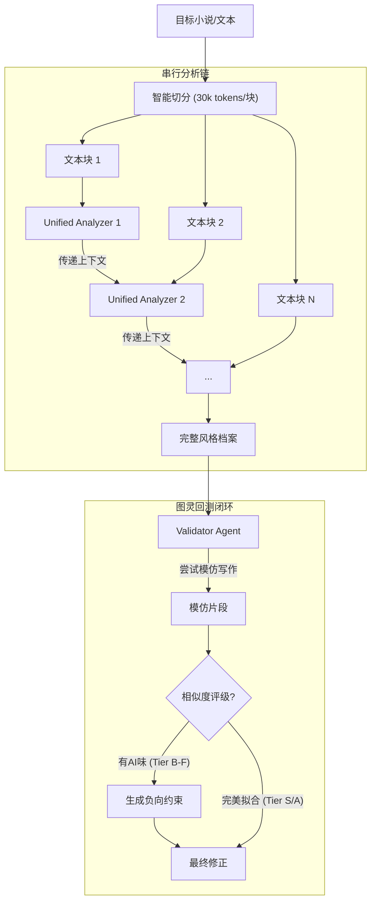
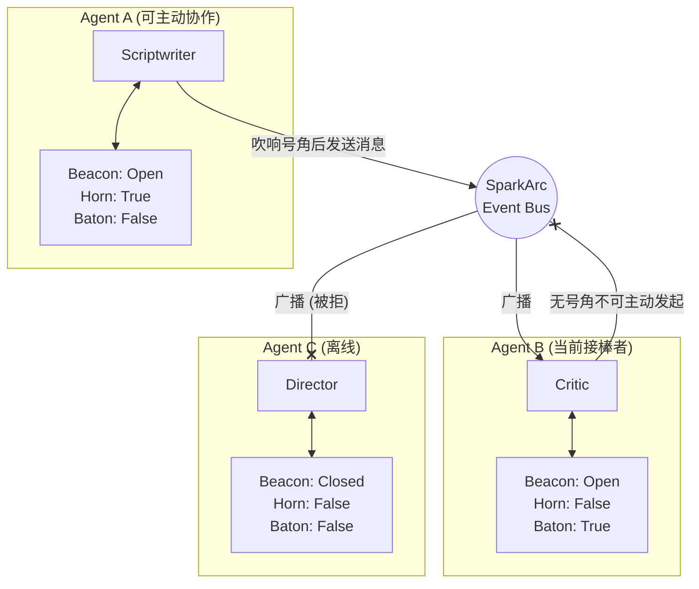

# SparkArc 架构深度文档

本文档包含 SparkArc 架构的深度技术细节。README 中仅保留概述，完整内容在此展开。

---

## 1. 导演调度 vs 信标协作——双系统对比

SparkArc 中存在**两套独立且职责不同的通信机制**，它们共同构成完整的 Agent 治理体系，而非功能冗余。

### 1.1 导演调度机制（Director Orchestration）

Director Agent 基于 **LangGraph SupervisorGraph** 实现多轮工具调用自主调度，取代了早期的规则式意图识别方案。

#### 调度工具集

| 工具名 | 功能 | 说明 |
| :--- | :--- | :--- |
| `list_chapters` | 查看项目章节结构 | 理解全局结构后决定分派 |
| `read_chapter_scene` | 读取具体场景内容 | 精确了解当前进度 |
| `read_chapter_outline_raw` | 读取原始大纲文本 | 获取原始规划信息 |
| `delegate_task` | 委派任务给专家 Agent | 核心调度动作，返回 Sentinel 交由 LangGraph 拦截 |
| `trigger_auto_write` | 触发无人值守自动撰写 | 启动 Auto-Write 管道 |
| `check_scriptwriter_status` | 查询自动撰写进度 | 检查 Auto-Write 状态 |
| `work_tracker` | 工作进度追踪 | 记录任务完成情况 |

#### LangGraph 调度流程

Director 的 `delegate_task` 不再同步调用目标 Agent 的 `chat()`，而是返回 Sentinel 字符串，由外层 `DirectorGraph` 拦截并路由到 `sub_agent_node` 执行 `chat_stream()`，以暴露完整的内层状态流。

核心代码：
- `server/agents/director_graph.py` — SupervisorGraph 定义
- `server/agents/agent_director.py` — DirectorAgent 类

### 1.2 信标协作机制（Beacon Bus）

信标总线是带权限控制的消息路由架构，使用"信标 / 号角 / 旗帜"三件套模拟真实协作中的可见性、主动通信权和任务归属。

> ⚠️ **当前状态**：信标总线的完整基础设施（类定义、REST API、前端交互面板）均已实现，但 Agent 间的水平自主通信为**预留能力**——当前所有 Agent 协作均通过 Director 直接调度完成。

| 维度 | 导演调度机制 | 信标协作机制 |
| :--- | :--- | :--- |
| **设计目标** | 响应用户请求，快速分发任务 | 控制 Agent 之间的自主协作边界 |
| **触发源** | 用户输入（外部） | Agent 自身的业务逻辑（内部） |
| **信息流向** | 垂直（自上而下） | 水平（对等） |
| **受信标限制** | ❌ 不受限 | ✅ 受信标/号角/旗帜共同约束 |
| **核心代码** | `agent_director.py` + `director_graph.py` | `communication.py` |

### 1.3 为何需要两套系统

1. **垂直指令流 (Director → Agent)**
    - 当用户说"帮我写一段对话"，Director 必须**立即、无障碍地**将任务分发给 Scriptwriter。
    - 如果 Scriptwriter 的信标是关闭的（比如正在执行另一个长任务），用户的请求不应该被拒绝。
    - 因此，Director 拥有"上帝权限"：可以直接实例化 Agent 并调用 `chat()` 方法，绕过信标检查。

2. **水平协作流 (Agent ↔ Agent)**
    - 如果 Scriptwriter 在写作过程中想要咨询 Lorebook 获取设定，这属于**自主协作**。
    - 如果没有限制，可能出现 A→B→C→A 的死循环调用，或者多个 Agent 同时广播导致消息风暴。
    - 因此，信标机制强制介入：发起方必须先拥有"号角"，接收方必须开启"信标"，"旗帜"则用于表达当前这条任务链归谁推进。

---

## 2. Agent 三模态调用协议（完整版）

SparkArc 规定：**每个专家 Agent 的提示词必须严格区分三种调用模态**，并通过同一个 `yaml` 的三个顶层字段承载。

| 模态 | 触发路径 | YAML 字段 | 典型场景 | 输出特征 |
| :--- | :--- | :--- | :--- | :--- |
| **专有工作模式** | 业务面板按钮 / `agent.execute()` / 具名方法 | `system` + `user` | 点击"生成灵感"按钮、点击"生成大纲"按钮 | 严格结构化、可被后端解析器直接落盘 |
| **用户交互模式** | 聊天气泡直接 @ 对应 Agent | `chat_system` | 在聊天里问 Muse「能给我几个反转套路吗」 | 自然对话、可发散、不强制格式 |
| **导演委派模式** | 导演自主调度 / 全自动流水线 | `pipeline_system` | 用户一句"从灵感到剧本帮我做完"，导演把每一步派给对应专家 | 严格结构化（等同专有工作）+ 工具落盘 + 向导演简报 |

### 2.1 运行态逻辑

- 模式选择收口在 `communication.py` 的 `chat_stream()` / `chat()` 里：`skip_tool_confirmation=True` 时优先取 `pipeline_system`；为 `False` 时优先取 `chat_system`；两者都缺才回落到 `system`。
- 导演委派时 `normalize_handoff_payload` 会强制把 `user_confirmation_state` 提升为 `not_required`，保证子 Agent 一定走 `pipeline_system`。

### 2.2 `pipeline_system` 写法硬约束

1. **受众声明**：第一句必须明确"你的受众是导演，不是用户"。
2. **三件套主干**：正文只写「调工具 + 一步到位 + 向导演简报」三件套。
3. **格式规范走 tool reference，不要复述**：结构化产出规范应通过 `_get_tool_prompt_references` 绑定到对应落盘工具，而不是在 `pipeline_system` 里复制粘贴。
4. **严禁无效引用**：禁止使用"与正常生成相同"、"格式同 system"这类表述——两段 system 在代码里是互斥选择而非叠加。
5. **禁止头脑风暴式软约束**：不要出现"发散思维 / 打破常规"这类与结构化产出冲突的语气修饰。

### 2.3 格式规范的唯一真相源：`_get_tool_prompt_references`

SparkArc 用「工具 reference 自动注入」机制避免在 `system` 与 `pipeline_system` 之间重复书写产出规范。

- `communication.py` 的 `_build_tool_prompt_reference_block()` 会在 LLM 被绑定工具时，把 Agent 注册的「工具 → yaml 字段」映射展开并拼接到 system prompt 末尾。
- 注册点：每个 Agent 子类重写 `_get_tool_prompt_references()` 返回 `{tool_name: [{"prompt_key": ..., "field": "system"}]}`。
- 可用 `_get_tool_prompt_reference_values()` 为占位符提供默认填充。

**现状参考实现**：

| Agent | 落盘工具 | tool reference 映射 |
| :--- | :--- | :--- |
| MuseAgent | `rewrite_inspiration` | → yaml 顶层 `system` |
| WorldviewAgent | `rewrite_worldview` / `rewrite_all_characters` | → `rewrite_worldview.system` / `generate_characters.system` |
| ShowrunnerAgent | `rewrite_synopsis` / `rewrite_beat_sheet` / `rewrite_outline` | → 各子 prompt 的 `system` |
| ScriptwriterAgent | `create_or_rewrite_script` | → 顶层 `system`（arc 模式）或 `generate_novel.system`（novel 模式） |
| CriticAgent | **无落盘工具** | `pipeline_system` 内嵌产出规范摘要 |

### 2.4 新增 Agent 自检清单

1. `prompts/<agent>.yaml` 同时定义 `system`、`chat_system`、`pipeline_system` 三个顶层字段。
2. 若有落盘工具：必须重写 `_get_tool_prompt_references()`，把 yaml `system` 绑定到落盘工具；`pipeline_system` 保持极简三件套。
3. 若无落盘工具：必须在 `pipeline_system` 里直接内嵌产出规范关键摘要。
4. `SparkAgentExecutor` 的 `build_context` / `execute` / `write_result` 协议完整实现。
5. 该 Agent 的落盘工具已在 `server/agents/tools/*` 中按域实现，并统一在 `server/agents/tools/registry.py` 注册；`server/agents/agent_tools.py` 继续作为唯一公共导出与 `get_tools_for_agent` 门面。

贡献者请参阅 [AGENTS.md](../AGENTS.md) 查看完整协议。

---

## 3. Agent 工具注册表

### 3.0 统一门面与内部拆分

SparkArc 的工具层采用“统一门面 + 内部按域拆分”的结构：

- `server/agents/agent_tools.py`：唯一公共入口。外部调用、测试兼容导出、`get_tools_for_agent` / `TOOLS_BY_NAME` 访问都继续经这里完成。
- `server/agents/tools/*`：按业务域承载具体 schema 与实现，例如 `muse.py`、`lorebook.py`、`showrunner.py`、`scriptwriter.py`、`shared_read.py`、`delegation.py`、`automation.py`、`search.py`、`research.py`。
- `server/agents/tools/registry.py`：内部唯一注册真相源，负责工具分组、`ALL_TOOLS`、`TOOLS_BY_NAME` 与 `get_tools_for_agent` 聚合。

强约束：

- 不允许在 `tools/registry.py` 之外再造第二套工具注册表或 Agent→工具映射。
- 工具实现不得直接反向依赖 `server/agents/routes/*` 私有实现；通用能力应先下沉到公共层。

### 3.0.1 公共工厂与服务层

为避免工具层和调度层反向依赖路由私有函数，本轮重构补入三类公共层：

- `server/agents/agent_factory.py`：统一 Agent 实例化入口，供聊天路由、导演图和委派工具复用。
- `server/agents/project_content.py`：承载项目内容读取服务（如 `load_worldview`）。
- `server/agents/auto_write_service.py`：承载 Auto-Write 后台启动与状态读取服务。

### 3.1 各 Agent 工具分配

| Agent | 工具列表 |
| :--- | :--- |
| **Director** | `list_chapters`, `read_chapter_scene`, `read_chapter_outline_raw`, `delegate_task`, `work_tracker`, `trigger_auto_write`, `check_scriptwriter_status` |
| **Muse** | `rewrite_inspiration` |
| **Lorebook** | `rewrite_worldview`, `rewrite_all_characters`, `update_character`, `patch_worldview` |
| **Showrunner** | `rewrite_synopsis`, `rewrite_beat_sheet`, `rewrite_outline`, `patch_synopsis`, `patch_beat_sheet`, `patch_outline`, `read_chapter_outline_raw` |
| **Scriptwriter** | `create_chapter`, `create_or_rewrite_script`, `patch_script`, `read_worldview`, `read_character`, `read_synopsis`, `read_beat_sheet`, `work_tracker` + `list_chapters`, `read_chapter_scene`, `read_chapter_outline_raw` |
| **Critic** | `list_chapters`, `read_chapter_scene`, `read_chapter_outline_raw`（仅共享读取工具） |
| **Style** | 无绑定工具（通过子集群内部流程执行） |

### 3.2 可选灰度工具

| 工具 | 状态 | 说明 |
| :--- | :--- | :--- |
| `graph_rag_tool` | 已生产化，默认不挂载 | 支持 `build` / `query` / `status` / `reset` 四种操作，查询模式支持 `local` / `global` / `drift`。若要启用，只需加入目标 Agent 的工具列表 |
| `capture_inspiration` | MCP 专用 | 仅通过 MCP Server 暴露，不挂载到任何聊天 Agent |

### 3.3 Scriptwriter 三模式工具授权

| 模式 | 授权工具 |
| :--- | :--- |
| **手动 Compose** | 无工具，纯生成调用 |
| **Auto-Write Pre-flight** | 仅 `SHARED_READ_TOOLS`（世界观/角色/梗概/节拍已在循环前全量注入 Prompt） |
| **Chat / 导演委派** | `SCRIPTWRITER_TOOLS` + `SHARED_READ_TOOLS` 全部开放 |

---

## 4. 流式基础设施层

### 4.1 两条主链路

SparkArc 前端有两条独立的流式消费链路，不可混淆：

#### 聊天主链路（Chat NDJSON）

- 前端通过 `chatStore` / `chatService` 发起聊天流
- 后端路由在 `routes/chat.py`
- Agent 侧通过 `SparkBaseAgent.chat_stream` 推送事件
- 输出 NDJSON 事件（`assistant_delta`、`reasoning_delta`、`tool_*` 等）
- `chatStore._consumeStream` 统一消费并维护消息、segments、tool_traces
- 聊天链路落盘时写 `metadata.segments` 和 `metadata.tool_traces`，保证刷新后时序可恢复

#### 业务任务主链路（SSE / 语义流）

- 前端创建 `createStreamingTask(scope, target)`
- 使用 `consumeSSEReader` / `consumeTextReader` / `consumeNdjsonReader` 消费流
- 后端路由通过 `iterate_sync_iterable_in_thread` 桥接同步生成器到异步响应
- 业务事件统一附加 `onStart` / `onProgress` / `onDelta` / `onStats` / `onDone` / `onError` / `onCancelled`
- 全局遮罩统一走 `global-loading` / `cancel-loading` 事件

### 4.2 前端流式收口点

| 收口点 | 文件 | 职责 |
| :--- | :--- | :--- |
| 流式任务入口 | `client/src/utils/streamingRuntime.ts` | `createStreamingTask` 统一托管 |
| 全局遮罩统计 | `client/src/utils/loadingStats.ts` | 加载/进度统计 |
| 事件总线 | `client/src/eventBus.ts` | 跨组件事件广播 |
| 全局加载 UI | `client/src/components/share/GlobalLoading.vue` | 遮罩渲染 |
| 聊天流消费 | `client/src/components/stores/chatStore.ts` | NDJSON 消费 + segments + tool_traces |
| Auto-Write 状态 | `client/src/utils/autoWriteState.ts` | 无人撰写进度状态 |
| Auto-Write 遮罩 | `client/src/components/share/DirectorAutoWriteOverlay.vue` | 嵌套进度环渲染 |

### 4.3 后端流式收口点

| 收口点 | 文件 | 职责 |
| :--- | :--- | :--- |
| 通讯层底座 | `server/agents/communication.py` | SparkBaseAgent + 消息总线 |
| 执行协议层 | `server/agents/agent_utils.py` | SparkAgentExecutor 三步协议 |
| 工具门面层 | `server/agents/agent_tools.py` + `server/agents/tools/*` + `server/agents/tools/registry.py` | 统一门面导出 + 域内实现拆分 + 唯一注册表 |
| 公共工厂 / 服务层 | `server/agents/agent_factory.py` + `project_content.py` + `auto_write_service.py` | 统一实例化与跨链路复用服务 |
| 多 Agent 调度 | `server/agents/director_graph.py` | LangGraph SupervisorGraph |
| 流式桥接 | `server/agents/routes/streaming_utils.py` | 同步→异步桥接 |
| 业务语义层 | `server/agents/routes/stream_semantics.py` + `execution_core.py` | SSE 语义帧协议 |
| 路由聚合 | `server/agents/routes/__init__.py` | 子路由聚合 |

---

## 5. Agent Registry 国际化

Agent 注册表（`server/agents/registry.py`）采用多语言字典结构，每个 Agent 的 `name` / `display` / `description` 均包含 `zh-CN` / `en-US` / `ja-JP` 三种语言。

- 前端通过 i18n 的 `components.agentNames` / `agentDescriptions` 做本地映射
- 后端通过 `resolve_agent_i18n_field()` 按请求 locale 提取对应字段
- 新增语言时，只需在每个 Agent 条目中加一组翻译即可

---

## 6. Critic 审核机制（完整版）

Critic 的核心目标不是回答"这段是不是 AI 写的"，而是回答：**这段文字哪里会让读者觉得像模型在完成任务。**

### 6.1 四条核心机制

1. **阅读体验导向，而不是来源检测**：
   它关注解释腔、段尾升华、对白过度完整、抽象词堆积、动作/感官承载不足等"可被读者感知"的问题。
2. **少量等级分类，而不是伪精确分数**：
   使用 `S/A/B/C/D` 五档等级，更符合大模型的分类特性，也更符合人类编辑直觉。
3. **证据化批评，而不是空泛评价**：
   每条命中尽量引用原文短片段，并说明"哪里假、为什么假、该如何改"。
4. **输出修改单，而不是直接洗稿**：
   Critic 负责生成结构化 `fix_ticket`，描述修改目标、必须保留项与建议操作，默认不直接改写正文。

### 6.2 为什么优先利用大模型，而不是专有 ML 模型

- **大模型更擅长复杂语义判别**：AI 味通常不是一个单点特征，而是结构、语气、对白效率、叙事承载的综合失真；这类问题很难用单一分类器稳定覆盖。
- **大模型能给出"证据 + 原因 + 修改建议"**：专有 ML 模型通常只能输出一个概率或标签，而 Critic 需要像编辑一样指出具体句子并解释问题。
- **不依赖额外标注与训练流水线**：在创作领域，风格与问题口径会不断变化。使用大模型可以通过 Prompt 和协议快速迭代，而不必先积累大规模标注集再训练专用模型。
- **天然适合长文本与项目上下文**：Critic 可以直接结合世界观、角色、大纲和当前场景一起审稿，这比只看局部特征的专有模型更贴近真实编辑工作流。

---

## 7. 风格克隆集群（完整版）

这是 SparkArc 最具技术深度的模块。为了捕捉人类作者微妙的文风，我们设计了一个精简高效的分析子系统，核心由 **UnifiedStyleAnalyzer（统一分析器）** 和 **ValidatorAgent（验证器）** 组成。

### 7.1 工作流：串行深度分析

### 7.2 风格分析流程

1. **智能流式分析**：
    我们将长篇小说切分为 30k tokens 的大块（约 4.5 万字），由 `UnifiedStyleAnalyzer` 进行**串行分析**。
    * **上下文传递**：每块分析结束时，分析器会生成一份"剧情概括"传递给下一块，确保 AI 知道前文发生了什么（如角色关系变化、伏笔）。
    * **全维覆盖**：每个块都由同一个分析器进行 7 维度（对话、独白、叙事、角色、语言、结构、情感）的全量分析，避免了碎片化检索导致的上下文丢失。
2. **自我对抗**：
    `ValidatorAgent` 是一个独立的评判者。它会基于生成的风格档案尝试写一段"伪作"，然后自我评分。如果发现生成的文字带有 AI 特有的"说教感"或"总分总结构"，它会生成一条**负向约束**（例如："禁止使用'然而'作为转折"，"禁止在对话后立即解释心理活动"），并强制注入到风格档案中。

---

## 8. 信标总线核心机制（完整版）

每个接入总线的 Agent（`SparkBaseAgent`）都拥有一套独立的运行态三件套：

1. **信标 (`is_beacon_open`)**：
    * **定义**：决定该 Agent 是否对其他 Agent 可见、可被触达、可接收外部消息。
    * **应用场景**：当 `Scriptwriter` 正在撰写长篇剧本时，它可以关闭信标，物理隔绝外部干扰，进入"心流模式"。
2. **号角 (`has_horn`)**：
    * **定义**：决定该 Agent 是否有资格主动向总线发话、向其他 Agent 发起协作。
    * **应用场景**：通过控制哪些 Agent 拥有号角，可以限定谁能主动跨 Agent 发起下一跳，避免广播风暴与无边界互相打断。
3. **旗帜 (`has_baton`)**：
    * **定义**：表示当前这条任务链的接力棒在谁手里，也就是当前任务由谁继续推进。
    * **应用场景**：导演把任务交给 `Lorebook` 后，旗帜会转移给 `Lorebook`；当结果需要回导演复核时，旗帜再交回导演。

### 8.1 交互拓扑图

---

## 9. ARC 格式解析策略

服务端 `arc_parser.py` 采用分层解析策略：

1. **场景分割**：首先根据 `#` 标记将文本切分为独立的场景块。
2. **元数据提取**：提取 `@guide`, `@intro` 等元数据。
3. **思维链过滤**：自动移除 `<conception>` 标签内容，保留纯净剧本。
4. **混合解析**：使用正则表达式处理对话行 (`[ID]`)，同时使用自定义标签解析器（基于深度追踪的标签匹配）处理 `<choice>` 分支结构，并识别 `@act` 行为指令与 `@next` 跳转逻辑，确保逻辑树的准确性。
