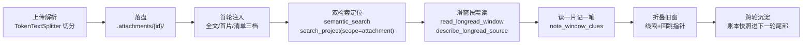

# 长上下文处理（long-context）

> SparkArc 如何处理超过单次模型窗口的长文本：附件、超长世界观，以及
> 未来一切“全文放不下”的长文档。阈值总览见
> [longread-thresholds](longread-thresholds.zh-CN.md)。

## 一句话

长文档 = **切分落盘 + 全局地图 + 双检索定位 + 滑窗按需读 + 线索账本**。
模型永远只看到“地图 + 账本 + 当前一个窗口”，全文躺在磁盘上按需取。

## 为什么不是“切小块全塞进去”或“纯 RAG”

- 全塞：窗口撑爆，且 90% 的 token 是模型本轮用不到的正文。
- 纯 RAG：embedding 只能回答“语义相近”，铺垫、伏笔、首尾呼应这类
  “语义不相近但叙事相关”的线索会被漏掉；且 RAG 构建时有截断
  （GraphRAG 默认只取 24 万字符），尾部从源头就没进去。
- 所以 SparkArc 用双检索（语义 + 正则）只做**定位**（返回窗口号），
  真正的阅读走滑窗（Agent 亲自读原文），读完把线索记进账本。
  定位管“去哪读”，滑窗管“读什么”，账本管“记住什么”。

## 链路

1. **切分落盘**：`TokenTextSplitter`（`core/file_ingest/chunking.py`）按
   token 切分，`attachment_id = sha256(正文)[:16]` 天然去重，落盘到
   `{project}/.attachments/{id}/`（`full.txt` + `chunks/` + `meta.json`）。
   全程同一口径（pack 累加），不混用整体一次性估算。
2. **三档注入**：`routes/chat_attachment.py` 按体量降级——小附件灌全文，
   单个大附件灌首片 + 分片说明，超窗/多附件只给清单（含 source_id 对照）。
   DB 与请求体只存引用，不存全文。
3. **双检索定位**：`semantic_search(scope=["attachment"])` 语义定位到窗口号；
   `search_project(scope=["attachment"])` 正则精确定位到窗口号（每附件只保留
   首个命中，避免全文灌回）。两者都返回 `chunk_index` 回跳指针，不灌正文。
   语义检索四种状态（正常 / 内容已更新 / 构建中 / 未启用）全部通过工具
   返回值区分，定义不变。
4. **滑窗按需读**：`describe_longread_source` 先看地图，
   `read_longread_window` / `read_attachment_chunk` / `read_worldview_window`
   按窗口号读。世界观超 64K 自动转同一底座（地图 + 首片）。
5. **线索账本**：`note_window_clues` 读一片记一笔（人物/伏笔/矛盾/时间 +
   出处引用 + 窗口号），只追加不改写，上限 64 条，任务终态落盘
   `.longread_ledger/`，下一轮自动恢复并注入尾部快照。
6. **带线索折叠**：旧窗口折叠为“线索 + 回跳指针”占位符，本轮新读原文
   完整保留；同一任务内只追加不改写中间历史，保护前缀缓存。

## 前缀缓存布局

`system（稳定）+ manifest（稳定）+ ledger（只追加）+ 当前窗口（一片，尾部）+ 本轮用户请求（最尾）`。
地图与账本一经注入只追加不改写；无附件房间零干扰（0 附件时原样返回）。
详见 AGENTS.md §5.2.1 第 4 条。

## 收口（维护者必读）

- 底座：`server/agents/longread/`（地图 + 账本 + 折叠 + 落盘）
- 工具面：`server/agents/tools/longread.py`，注册只在 `tools/registry.py`，
  导出只经 `agent_tools.py`
- 世界观视图：`server/agents/worldview_source.py`（不复制不双写，只做逻辑切片）
- 任务流转：`server/agents/longread_store.py`（ContextVar，热路径零 IO）
- 路由接线：`server/agents/routes/chat.py`（任务首尾 init/save + 每轮账本快照）、
  `server/agents/routes/chat_attachment.py`（三档注入）
- 切分/存储复用：`core/file_ingest/chunking.py`、`agents/attachment/storage.py`
- 检索：`agents/tools/search.py`（`search_project.scope` 与
  `semantic_search.scope` 共用 `attachment` 值）、`agents/vector_index/`

新长文本（大纲聚合、角色聚合等）接入时：切分复用 `TokenTextSplitter`，
读取复用本底座三件套，严禁自建第二套滑窗/占位符/账本。
