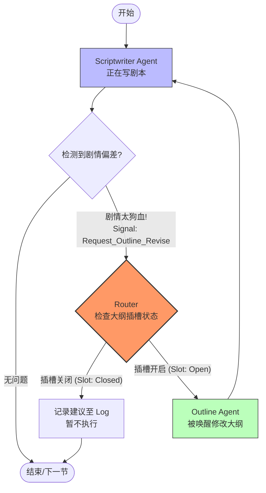

# Agent 插槽机制分析与架构建议

## 1. 两种模式的深度对比

您提出的两种模式触及了多 Agent 协作的核心难题：**控制权管理**。

### 方案 A：被动允许（插槽模式 / Opt-in）
**机制**：Agent B（如大纲）只有在特定状态下开启“插槽”，Agent A（如剧本）才能对其发起交互。
*   **隐喻**：像是“办公时间”。大纲 Agent 挂出“欢迎来访”的牌子时，编剧 Agent 才能进去敲门。
*   **优点**：
    *   **稳定性极高**：防止了 Agent 之间的恶性循环（例如：编剧改大纲 -> 大纲改编剧 -> 编剧又改大纲）。
    *   **符合 LangGraph 逻辑**：LangGraph 本质是状态机，"插槽开启"可以完美映射为 State 中的一个布尔值标记（Flag）。
    *   **调试清晰**：你可以明确知道为什么这次交互发生了（因为开关开了）。
*   **缺点**：
    *   **响应滞后**：如果编剧急需修改，但大纲没开插槽，流程可能会卡住或被迫跳过修正。

### 方案 B：主动放权（特权模式 / Capability-based）
**机制**：Agent A（如剧本）拥有“特权”，可以随时强制打断或调用 Agent B，无论 Agent B 在干什么。
*   **隐喻**：像是“钦差大臣”。编剧 Agent 拿着尚方宝剑，可以直接命令大纲 Agent 干活。
*   **优点**：
    *   **效率极高**：发现问题立即解决，不用等待。
    *   **适合处理异常**：例如用户（反馈 Agent）觉得不对劲，应该拥有最高优先级的主动权。
*   **缺点**：
    *   **系统风险大**：如果 prompt 没写好，容易导致流程混乱，甚至不仅改了这一段，还把后面全改乱了。

---

## 2. 架构建议：混合式“插槽+信号”机制

考虑到 LangGraph 的特性和剧本创作的严肃性，我强烈建议以 **方案 A（被动插槽）** 为基础，辅以 **信号机制**。

**核心逻辑：**
1.  **插槽（Slots）即状态**：在全局 State 中维护一张“插槽表”。
2.  **意图（Signals）即触发器**：发起方 Agent 不直接调用对方，而是发出一个“请求信号”。
3.  **路由层（Router）做决定**：LangGraph 的条件边（Conditional Edge）检查：`如果有信号 AND 目标插槽已开启 -> 跳转到目标 Agent`。

### Mermaid 逻辑演示

## 3. 为什么选择“被动插槽”？

对于 **Scriptwriter -> Outline** 这种“下级向上级”的反馈，必须是**受限**的。
*   如果编剧可以随意改大纲，很可能导致写到第 5 章时，把第 1 章埋的伏笔给改没了，导致逻辑崩坏。
*   只有当大纲 Agent 处于“Review Mode（评审模式）”或明确开启了“允许微调”的插槽时，才接受这种反向修改，最为安全。

相反，对于 **User/Feedback -> Any Agent**，可以使用 **主动放权** 模式，因为用户意志高于一切。

## 4. 待确认问题

为了落地这个方案，我需要确认以下细节：

1.  **同步 vs 异步**：当 Scriptwriter 想要修改大纲时，您希望：
    *   A) **立即跳转**：当前写作暂停，跳到大纲 Agent 改完大纲，再跳回来重写？（流程复杂，但一致性高）
    *   B) **留言模式**：Scriptwriter 继续写，只是把建议记下来，等下一章生成前，大纲 Agent 统一处理？（流程顺畅，但可能这一章还是错的）
    
2.  **插槽的控制权**：谁来决定开启插槽？
    *   是 Agent 自己（例如大纲生成完觉得自己不够好，主动开启插槽求助）？
    *   还是由您（用户）在前端手动开关？
    *   还是由一个总控 Agent (Showrunner) 来根据阶段调度？
