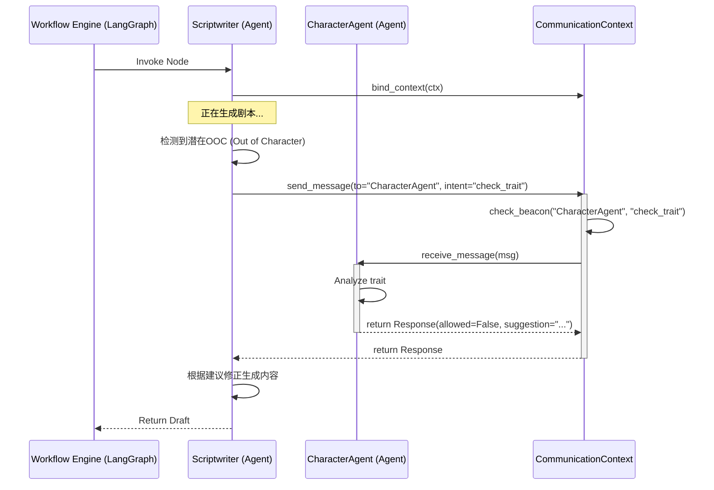

# Beacon & Communication 架构设计规范

本设计旨在为现有 Agent 体系引入**同步通讯 (Synchronous Communication)** 与 **状态信标 (Beacon)** 机制，实现 Agent 间的动态交互与协作。

## 1. 核心概念与数据结构

### 1.1 设计目标
构建一套机制，允许 Agent 在 LangGraph 的执行过程中：
1.  **亮灯 (Beacon)**：声明自己当前具备的能力或可接受的干预（即 "插槽" Slot）。
2.  **通讯 (Communication)**：发送和接收结构化消息，实现动态纠偏。
3.  **约束**：必须是同步执行，确保在一个 LangGraph 节点（Node）执行期间完成交互。

### 1.2 数据结构定义

#### `AgentMessage` (通讯载体)
用于在 Agent 之间传递意图和数据。

```python
from dataclasses import dataclass, field
from typing import Any, Optional, Dict
from enum import Enum
import time

class MessageType(Enum):
    REQUEST = "request"   # 请求（期望回应）
    RESPONSE = "response" # 响应
    SIGNAL = "signal"     # 单向通知（如进度更新）

@dataclass
class AgentMessage:
    sender: str           # 发送方 Agent ID (e.g., "scriptwriter")
    receiver: str         # 接收方 Agent ID (e.g., "outline_agent")
    msg_type: MessageType # 消息类型
    intent: str           # 意图 (e.g., "query_character_trait", "update_outline")
    content: Any          # 消息负载 (Payload)
    
    # Metadata
    msg_id: str = field(default_factory=lambda: f"msg_{int(time.time()*1000)}")
    reply_to: Optional[str] = None  # 如果是 RESPONSE，关联的请求 ID
    timestamp: float = field(default_factory=time.time)
    metadata: Dict[str, Any] = field(default_factory=dict)
```

#### `BeaconState` (信标状态)
描述一个 Agent 当前“开启”了哪些插槽（Slots）。

```python
@dataclass
class BeaconSlot:
    name: str             # 插槽名称 (e.g., "modify_character")
    description: str      # 插槽描述
    schema: Dict          # (可选) 输入数据格式要求
    is_active: bool = True

@dataclass
class BeaconState:
    agent_id: str
    status: str = "idle"  # idle, busy, waiting
    active_slots: Dict[str, BeaconSlot] = field(default_factory=dict)
    
    def register_slot(self, name: str, description: str):
        self.active_slots[name] = BeaconSlot(name, description)
        
    def close_slot(self, name: str):
        if name in self.active_slots:
            self.active_slots[name].is_active = False
```

## 2. 架构设计

### 2.1 运行时上下文 (CommunicationContext)
由于现有 Agent (`ScriptwriterAgent` 等) 主要是无状态的 LLM 包装器，我们需要一个**请求作用域 (Request-Scoped)** 的对象来持有通讯状态。这个对象将作为参数传递给 Agent，或者包含在 LangGraph 的 `State` 中。

```python
class CommunicationContext:
    def __init__(self):
        # 存储所有活跃 Agent 的 Beacon 状态
        # Key: agent_id, Value: BeaconState
        self.beacons: Dict[str, BeaconState] = {}
        
        # 消息总线/历史记录
        self.message_log: list[AgentMessage] = []
        
        # 注册的 Agent 实例引用 (用于同步调用)
        self._agents: Dict[str, Any] = {}

    def register_agent(self, agent_id: str, agent_instance: Any):
        """注册 Agent 实例，以便可以被调用"""
        self._agents[agent_id] = agent_instance
        if agent_id not in self.beacons:
            self.beacons[agent_id] = BeaconState(agent_id)

    def get_beacon(self, agent_id: str) -> Optional[BeaconState]:
        return self.beacons.get(agent_id)

    def dispatch(self, message: AgentMessage) -> Optional[AgentMessage]:
        """同步分发消息"""
        self.message_log.append(message)
        
        target_agent = self._agents.get(message.receiver)
        if not target_agent:
            raise ValueError(f"Agent {message.receiver} not found or not active.")
            
        # 检查 Beacon 是否允许该操作 (Slot Check)
        beacon = self.beacons.get(message.receiver)
        if not beacon or message.intent not in beacon.active_slots:
             # 在强一致性模式下可能抛错，或者返回拒绝消息
             pass 

        # 同步调用目标 Agent 的处理方法
        # 假设所有 Agent 都实现了 receive_message 方法
        response = target_agent.receive_message(message)
        
        if response:
            self.message_log.append(response)
            
        return response
```

### 2.2 通讯混入类 (AgentCommunicationMixin)
为所有 Agent 提供标准通讯能力的基类。

```python
class AgentCommunicationMixin:
    """
    Mixin class to provide signal/slot capabilities.
    Expects self.agent_id to be set.
    """
    
    def bind_context(self, context: CommunicationContext):
        self._comm_context = context
        context.register_agent(self.agent_id, self)
    
    def open_slot(self, slot_name: str, description: str):
        """开启一个插槽 (Beacon)"""
        if self._comm_context:
            beacon = self._comm_context.get_beacon(self.agent_id)
            beacon.register_slot(slot_name, description)
            
    def send_message(self, receiver: str, intent: str, content: Any, msg_type=MessageType.REQUEST) -> Optional[AgentMessage]:
        """发送消息并等待（同步）响应"""
        msg = AgentMessage(
            sender=self.agent_id,
            receiver=receiver,
            msg_type=msg_type,
            intent=intent,
            content=content
        )
        return self._comm_context.dispatch(msg)
        
    def receive_message(self, message: AgentMessage) -> Optional[AgentMessage]:
        """
        处理接收到的消息。子类应重写 `_handle_specific_intent`。
        """
        # 基础路由逻辑
        if hasattr(self, f"on_{message.intent}"):
            handler = getattr(self, f"on_{message.intent}")
            result = handler(message.content)
            
            # 构造响应
            return AgentMessage(
                sender=self.agent_id,
                receiver=message.sender,
                msg_type=MessageType.RESPONSE,
                intent=f"reply_{message.intent}",
                content=result,
                reply_to=message.msg_id
            )
        return None
```

## 3. 工作流集成方案

### 3.1 集成到 `agent_workflow.py`
我们需要在 `StoryGenerationState` 中携带 `CommunicationContext`，并在 Workflow 启动时初始化它。

1.  **State 更新**:
    ```python
    class StoryGenerationState(TypedDict):
        # ... existing fields ...
        comm_context: CommunicationContext # 新增：通讯上下文
    ```

2.  **节点逻辑更新**:
    -   在每个 Node (如 `scriptwriter_node`) 开始时，实例化 Agent 后，立即调用 `bind_context`。
    -   或者，更佳方案：在 Workflow `START` 节点或一个专门的 `setup` 节点中，预先实例化那些需要**长期存在**的 Agent（如果它们需要跨节点保持状态），并注入 Context。
    -   *鉴于当前 Agent 是轻量级的，我们可以在每个 Node 内部实例化，但必须将同一个 `comm_context` 传递进去。*

### 3.2 消息流示例 (Mermaid)

场景：`Scriptwriter` 在写作过程中，发现角色行为不一致，请求 `CharacterAgent` 确认。



## 4. 实施计划

1.  **创建基础模块** (`server/core/agent_comms.py`):
    -   实现 `AgentMessage`, `BeaconState`, `CommunicationContext`, `AgentCommunicationMixin`.
2.  **重构基类**:
    -   确保 `ScriptwriterAgent` 等继承自 `AgentCommunicationMixin`（或者在初始化时混入）。
3.  **更新 LangGraph**:
    -   在 `agent_workflow.py` 中引入 `CommunicationContext`。
    -   在 Node 内部连接 Context。
4.  **测试用例**:
    -   创建一个模拟的 "Ping-Pong" 场景，验证同步通讯是否通畅。
