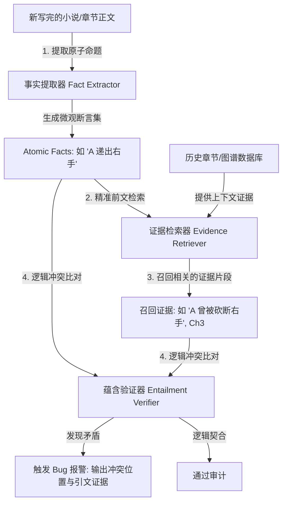

# Lost in Stories: Consistency Bugs in Long Story Generation by LLMs

*   **论文链接：** [https://arxiv.org/abs/2603.09871](https://arxiv.org/abs/2603.09871)
*   **发布时间：** 2026年3月
*   **核心领域：** 长篇小说一致性漏洞分类、ConStory-Bench 评测集、ConStory-Checker 自动审计算法

---

## 一、 核心贡献与思想

随着大模型上下文窗口（Context Window）的不断扩大，长文本生成的表面流利度得到了质的飞跃，但**全局逻辑一致性依然是长篇写作的重灾区**。目前，学术界缺乏针对长故事生成一致性进行自动审计与细粒度诊断的理论体系。

本研究（Lost in Stories）做出了以下三项核心突破：
1.  **一致性漏洞分类学 (Consistency Bug Taxonomy)**：首次将大长篇创作中出现的逻辑吃书、漂移现象细致归纳为 **5 大类、19 个细粒度子类**。
2.  **ConStory-Bench**：推出了一个包含 2,000 个场景Prompt，特化于一致性测试的长故事评估基准。
3.  **ConStory-Checker**：设计了一套基于证据匹配（Evidence Retrieval）与中立蕴含推理的自动化一致性漏洞审计引擎，能够精准定位逻辑吃书并给出原句高亮与引用，克服了传统的 “LLM-as-a-judge” 漏判严重、证据模糊的问题。

---

## 二、 系统架构 (ConStory-Checker Pipeline)

ConStory-Checker 不让大模型去无脑通读并凭主观回答是否有冲突，而是构建了一个**“微观断言提取 -> 证据靶向召回 -> 双向蕴含校验”**的严密判定闭环：



---

## 三、 19 类细粒度故事一致性漏洞规范

ConStory-Bench 将故事生成的一致性漏洞划分为以下五大维度：

### 1. 角色塑造与特征漂移 (Characterization)
*   **1.1 记忆矛盾 (Memory Contradictions)**：角色忘却或记错自己此前章节亲历的重大事件。
*   **1.2 认知冲突 (Knowledge Conflicts)**：角色越界知晓了不应被知晓的秘密，或忘记了自己已明确获知的信息。
*   **1.3 技能/战力波动 (Skill/Power Fluctuations)**：角色战斗力、智商或社会资源在没有合理交代的情况下发生阶跃或断崖式下滑。
*   **1.4 遗忘技能 (Forgotten Abilities)**：角色面临危险时，完全忽略了自己拥有的招牌法术或技能，导致脱困逻辑滑稽。

### 2. 事实细节一致性 (Factual Detail)
*   **2.1 外貌不符 (Appearance Mismatches)**：角色的发色、眼睛颜色、伤疤位置、所受创伤在后文中无故变更或自愈。
*   **2.2 命名混乱 (Nomenclature Confusions)**：对同一个地点、道具、尤其是不常登场的配角名字在跨章节时拼写写错或混淆。
*   **2.3 数量与物理逻辑错误 (Quantitative Errors)**：计算混乱。例如写着“共 3 个信封，烧了 2 个，还剩 2 个”。

### 3. 叙事文采风格 (Narrative Style)
*   **3.1 叙事视角漂移 (Perspective Shifts)**：打破第一人称限制等 POV 人称锁定，无故滑入上帝视角。
*   **3.2 情感语气不一致 (Tone Inconsistencies)**：高冷仙尊突然使用现代网络流行语，角色口吻偏离其基调。
*   **3.3 写作风格断裂 (Style Breaks)**：仙侠或奇幻古风小说中，突兀插入现代商用或学术分析用词。

### 4. 情节线与时间轴 (Timeline & Plot)
*   **4.1 时间物理矛盾 (Time Contradictions)**：时间的瞬移或颠倒（如没有剧情跨越时，两句对话天就黑了）。
*   **4.2 持续时间异常 (Duration Errors)**：伤口恢复时间、赶路所耗时间与常理或小说自身的物理规则不符。
*   **4.3 因果关系违背 (Causality Violations)**：颠倒因果或死人重新出场。
*   **4.4 废弃情节线 (Abandoned Plots)**：模型挖坑不填（如第 5 章提到发现一具神秘女尸，但直到 20 章也再无任何下文）。

### 5. 世界观底层设定 (World-building & Setting)
*   **5.1 设定规则违背 (Rule Violations)**：违背故事的超自然法则（如主角一天之内无代价连发多次“一天只能用一次”的绝招）。
*   **5.2 社会常理冲突 (Social Norm Conflicts)**：发生无逻辑的违反正常人类行为规范的事。
*   **5.3 地理位置混乱 (Geographical Contradictions)**：虚拟地图方向颠倒，城门地理方位错乱。

---

## 四、 工程实现与检测算法细节

### 1. 事实断言提取器（Fact Extractor）
ConStory-Checker 使用极轻量提示词让高速 LLM 提取当前生成的文本片段中的原子事实（Atomic Facts）：
```
[User Prompt]
请提取下列小说正文中所有关于“人物外表、持有的物品、拥有的技能、发生过的重大事件、所处的时间和地理位置”的原子声明。
请以 JSON 格式输出，例如：{"statement": "John 目前右手完好"}。
```

### 2. 双向蕴含推理器（Entailment Verifier）
将从 `History Database` 中召回的关于“John 右手”的历史段落（如：`刀光闪过，John 失去了他的右手`）与当前事实声明比对：
```
[Verifier System Prompt]
你的任务是判断“当前事实声明”与“历史上下文证据”之间是否发生逻辑冲突（Contradiction）。
- 事实声明：John 的右手抓住了玉佩。
- 历史证据：第3章写道：John 的右手已在刑场被斩断。

如果逻辑上存在冲突，请回复 [CONTRADICTION] 并说明原因。
```

### 实验结论：
ConStory-Checker 在对各类 LLM 长篇生成进行检测时：
*   对一致性 Bug 的 **检测召回率 (Recall)** 达到了 **92.4%**，大幅超越了人类读者的细致度。
*   发现了一致性错误在 **长篇小说中段（Middle of text）** 最容易爆发，且常发生在 **Token 熵值异常飙升的剧情点**。
