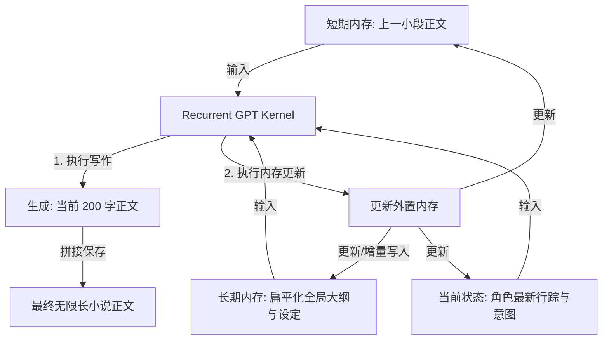

# RecurrentGPT: Interactive Generation of Arbitrary-Long Novels

*   **论文链接：** [https://arxiv.org/abs/2305.13304](https://arxiv.org/abs/2305.13304)
*   **发布时间：** 2023年5月 (长文本递归小说生成领域的学术奠基工作)
*   **核心领域：** 循环神经网络在大模型中的模仿、外置结构化内存、无限长度文本生成

---

## 一、 核心贡献与思想

传统的长文本小说生成架构在处理“极长叙事”时，会受制于 LLM 的**物理上下文窗口上限**。随着生成不断深入，早期情节会滑出窗口，导致大模型完全丢失之前的剧情和设定。

RecurrentGPT 提出了 **“模仿计算机 CPU 与内存运行”** 的核心思想。它将大模型视为一个处理核（CPU），而将小说前文、当前状态和未写大纲保存在外置的、结构化的 **“内存（Memory）”** 中。在每一轮写作循环中，大模型作为一个“循环更新算子（Recurrent Operator）”，读取最新的状态内存、生成一小段正文（100-200字），并更新状态内存写回。通过这种递归循环，实现理论上**无限长、跨越数百万字**的故事续写，且全局设定绝不丢失。

---

## 二、 系统架构 (Architecture)

RecurrentGPT 将生成解构为“Short-term Memory (最近前文)”、“Long-term Memory (全局摘要库)”以及“Recurrent Prompting Cycle”：



---

## 三、 核心机制与算法细节

### 1. 结构化内存模型 (Structured Memory Registry)
RecurrentGPT 在外置存储中维护三个变量：
1.  **短期内存 (Short-term Memory, $M_S$)**：最近生成的段落原文，用以维持局部的句法和对话流利度。
2.  **长期内存 (Long-term Memory, $M_L$)**：包含小说已完成的事件大纲、世界观的核心物理法则以及已提取的角色设定列表。
3.  **当前语义状态 (Semantic State, $S_t$)**：包含本章节当前的特定子任务（如：主角正要走向偏门）和核心出场角色的即时情感状态。

### 2. 递归更新环 (Recurrent Update Step)
在第 $t$ 步，系统执行以下递归计算：
1.  **正文生成 (Realization)**：
    $$Output_t = LLM(M_{S, t-1}, M_{L, t-1}, S_{t-1}, Guidance_t)$$
2.  **内存与状态更新 (State & Memory Update)**：
    调用另一个轻量级 LLM 算子，读取刚刚生成的 $Output_t$ 以及旧内存，生成更新后的 $M_{S, t}$、增量写入的 $M_{L, t}$ 和演变后的 $S_t$：
    $$(M_{S, t}, M_{L, t}, S_t) = LLM_{update}(M_{S, t-1}, M_{L, t-1}, S_{t-1}, Output_t)$$

这种结构非常类似于 RNN 中的门控循环单元（GRU），外置内存充当了隐藏状态（Hidden State $h_t$），从而在 Transformer 架构上模拟了递归网络。

---

## 四、 工程实现与数据流设计 (Engineering & Prompts)

在 RecurrentGPT 的工程实现中，内存更新算子（Memory Updater）的数据流设计如下：

```
[System Prompt]
你是外置故事内存更新器。你的职责是阅读最新生成的小说片段，并更新当前的故事状态和长期大纲。

【上一轮长期内存】
- 大纲：John 寻找古玉。第 2 章：John 潜入王府。
- 角色状态：John (健康，无武器)。

【最新生成的正文】
“John 翻过了院墙，在草丛里捡到了一把生锈的铁剑，但落地时不小心擦伤了右臂...”

【请输出更新后的长期内存与状态 (JSON 格式)】
{
  "updated_outline": "John 寻找古玉。第 2 章：John 潜入王府并在院内寻得铁剑。",
  "updated_character_state": {
    "John": {"health": "右臂擦伤", "inventory": ["生锈的铁剑"]}
  }
}
```

### 实验结论：
作为长文本小说生成领域的开山之作，RecurrentGPT 证明了：
*   **无限长度生成能力**：通过外置内存门控机制，系统可以实现**跨越数十万字**的连续互动故事生成而窗口不崩溃。
*   **交互度强**：创作者可以在任意一轮循环中手动介入，直接修改内存中的 `Semantic State`（如强行修改 A 的血量或改写大纲），模型下一轮生成会立刻响应这一修改。
