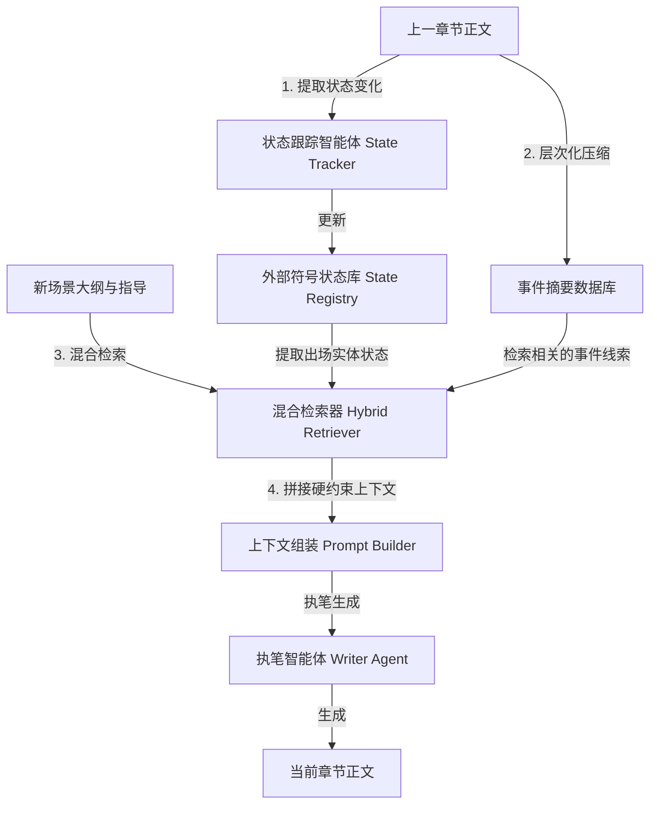

# SCORE: Story Coherence and Retrieval Enhancement

*   **论文链接：** [https://arxiv.org/abs/2503.23512](https://arxiv.org/abs/2503.23512)
*   **发布时间：** 2025年3月
*   **核心领域：** 长距离连贯性、动态实体状态跟踪、混合式检索增强 (Hybrid RAG)

---

## 一、 核心贡献与思想

SCORE (Story Coherence and Retrieval Enhancement) 旨在解决大模型长篇创作中频繁出现的**“实体幻觉（Entity Hallucinations）”**与**“情感失配（Emotional Drift）”**。例如：前文已经被写死、被丢弃或被毁坏的物品，在后续章节中又毫无合理交代地突兀出现；或者角色对配角的情感和信任度突变。

SCORE 的核心思想是：**“将叙事中的状态管理符号化（Symbolic State Tracking），并将其与多层级、上下文敏感的检索（Hybrid Retrieval）相结合”。** 架构中内置一个独立的状态机来实时捕获前文产生的实体（角色、物品、关键地点）的状态变化，生成高强度的逻辑“硬约束”注入 LLM 的上下文。

---

## 二、 系统架构 (System Architecture)

SCORE 包含动态状态机、层次化事件摘要器以及混合 RAG 检索流水线：



---

## 三、 核心机制与算法细节

### 1. 外部符号状态跟踪 (Dynamic State Tracking)
SCORE 为故事中的每一个实体（人、重要物品、物理线索）维护一个离散的**生命周期状态机**。状态定义如下：
*   **Active (活跃状态)**：实体当前存在，且可以与当前场景的剧情产生交互。
*   **Lost (丢失/失踪状态)**：实体目前无法被直接触及（例如：配角离开了队伍、主角的古玉被偷走但还没找回）。
*   **Destroyed (销毁/死亡状态)**：实体已在历史事件中被彻底抹除（例如：某配角已死、玉佩已被摔碎）。

每次生成一个 Episode，**State Tracker Agent** 在后台增量读取当前正文，通过特定的结构化输出抽取状态转移三元组：`(Entity, Action_Trigger, Target_State)`。
例如，若正文写道：`“John 的长剑在激战中被熔岩彻底熔化”`。
Tracker 会提取：`("John的长剑", "melted", "Destroyed")`。
外部符号库接收此信号，将 `John的长剑` 的状态从 `Active` 变更为 `Destroyed`。

### 2. 混合式检索增强 (Hybrid Retrieval)
传统的向量 RAG 对地名、人名等“精确专有名词”的召回效果较差，容易被近义词混淆。SCORE 采用两路混合检索：
1.  **关键词匹配路 (TF-IDF / Lexical Search)**：确保地名（如“万花谷”）和人名（如“冷无极”）的精确命中，将包含该词的历史事实精准召回。
2.  **语义向量匹配路 (Dense Vector Search)**：基于余弦相似度（Cosine Similarity），检索前文发生的类似情感基调、心理冲突或因果线索。
最后，两路结果通过倒排倒角融合（RRF）算法进行排序，提取 Top-K 证据。

---

## 四、 工程实现与数据流设计 (Engineering & Prompts)

在 SCORE 的工程流水线中，数据流运行如下：

### 1. State Tracker 抽取 Prompt
```
[System Prompt]
你是一个故事状态转换检测器。你的任务是分析最新的一段小说正文，提取其中角色、重要道具或地点的状态变化。
状态包括：
- Active: 登场、完好、在场
- Lost: 失踪、离开、下落不明
- Destroyed: 死亡、被毁坏、被熔化

请仅以 JSON 数组格式输出变化，如 [{"entity": "玉佩", "action": "丢失", "state": "Lost"}]。
```

### 2. Context Builder 注入的 Fact Constraints
当写下一个章节，且大纲提及 `John` 时，组装器自动检索 `State Registry` 中与 `John` 相关的装备和人物关系状态：

```
[System Prompt]
你必须严密遵循以下外部符号状态看板进行写作，严禁在文中无合理原因地推翻这些事实。

【实时状态看板 (Symbolic State Board)】
- 角色：John (状态: Active, 身体特征: 左臂骨折)
- 道具：John的长剑 (状态: Destroyed, 证据来源: Ch5.arc 熔岩损毁)
- 道具：神秘古玉 (状态: Lost, 证据来源: Ch3.arc 被偷，目前未找回)

【注意】John的长剑已毁，John在此场景中绝不能使用此剑；神秘古玉目前下落不明，John不可将其拿出使用。
```

### 3. 实验数据与评估
在 NCI-2.0 一致性评测集以及 EASM 情感基调评估中的表现：
*   **叙事连贯性分数 (Narrative Coherence)**：提升了 **23.6%**。
*   **故事幻觉率 (Hallucinations)**：相比普通长上下文大模型，**降低了 40.1%**。
*   **情感和人物关系的一致性表现** 达到 **89.7%**。
*   有效确保了物品状态和人物生死状态在跨越数十万字前后文后的绝对精确。
