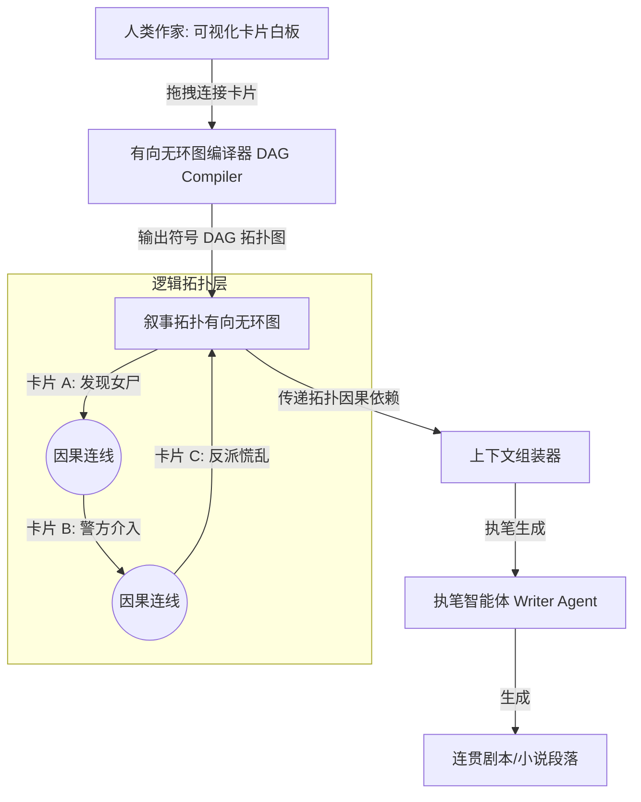

# EPOS-AI: Symbolic Semantic Graph Card Outline System

*   **项目官网链接：** [https://epos-ai.ch/](https://epos-ai.ch/)
*   **流行时间：** 2024–2026年 (专为专业剧本与长篇小说设计的瑞士创意写作协作平台)
*   **核心领域：** 符号卡片大纲、叙事拓扑图、剧情因果网络、人机协同规划

---

## 一、 核心目标与痛点

传统的长篇小说或电影剧本在创作时，创作者习惯使用**物理卡片（Index Cards）**在白板上排列剧情。然而，目前的 AI 写作工具通常只提供线性的文本编辑器，这使得 AI 无法理解“如果卡片 A 的位置被移动，会导致卡片 B、C 的情节因果发生断裂”这一复杂的网络化戏剧逻辑。

EPOS-AI 提出了 **“符号语义图谱卡片大纲 (Symbolic Semantic Graph Card Outline)”** 的核心理念。它将物理卡片白板升级为一幅**“叙事拓扑图（Narrative Topology Graph）”**。图上的节点是“情节卡片（Plot Cards）”，连边是显式的“因果驱动（Causal Driving）”或“情感转折（Emotional Turning Point）”连线。通过在大模型写作前建立这套网络，AI 能够深刻理解整体剧情的力学结构（Narrative Mechanics）。

---

## 二、 系统架构设计 (Architecture)

EPOS-AI 的核心架构将用户界面上的卡片拖拽编译为后端的拓扑有向无环图（DAG），并动态传递给生成器：



---

## 三、 核心机制与算法细节

### 1. 情节卡片 (Plot Card) 节点模型
在 EPOS-AI 中，一张情节卡片是一个包含符号语义的节点：
*   **Card ID**：`card_402_the_encounter`
*   **主干动作 (Core Action)**：`A 与 B 在火车站擦肩而过`
*   **出场实体 (Entities)**：`[A, B]`
*   **前置必达卡片 (Predecessor Nodes)**：`[card_201_A_escapes]` (表示 A 必须先逃跑成功，火车站擦肩事件在逻辑上才允许成立)。
*   **后置影响 (Successor Nodes)**：`[card_403_B_finds_clue]`

### 2. 拓扑一致性校验与动态重规划 (Topology Check)
当人类作家在界面上移动或者删除某张卡片时：
1.  **检测断链**：拓扑编译器会检查是否发生了“前置依赖断裂”（例如，删除了“A 逃跑成功”的卡片，但保留了“火车站擦肩”）。
2.  **AI 自动重规划**：系统会调用规划智能体，给出提示：`“您删除了 A 逃跑成功的卡片，导致火车站擦肩事件失去了前因。是否允许 AI 自动生成一张‘A 混入出殡队伍出城’的新情节卡片进行桥接？”`
3.  这完美解决了传统长篇写作中由于人类随意修改某一部分而导致的“全书情节雪崩式吃书”问题。

---

## 四、 工程实现与数据流设计 (Engineering & Prompts)

在 EPOS-AI 中，大模型接收到的是一个经过拓扑排序（Topological Sort）后的卡片描述包：

```
[System Prompt]
你是一个剧本执笔智能体。你需要根据给定的“叙事拓扑图（卡片 DAG）”及其连线关系，撰写这一部分的剧本。

【场景卡片拓扑依赖】
- 当前要写卡片：Card_402 (火车站遭遇)
- 前置已完成卡片：Card_201 (A 成功越狱逃走)
- 连线类型：因果驱动（Causal Link） -> 因为 A 刚刚越狱逃走，所以在火车站遭遇 B 时，A 必须表现出极度伪装与紧张，且身上带有囚服换下的破烂衣物。
- 出场角色：A (伪装成旅客), B (正在月台巡视)

请撰写此处的场景剧本，合理体现前置卡片（A 刚刚越狱）导致的因果限制。
```

### 开源与工业价值：
EPOS-AI 的符号化卡片图谱提供了一个宝贵的工业设计经验：**不要将小说大纲视为一条直线的文本，而是将其视为一张有向无环图（DAG）**。这样不仅大模型能获得高强度的因果约束，而且系统可以在人类修改大纲时，进行精准的因果断链诊断与自动插卡修复，极大提升了人机协同创作的稳定度。
