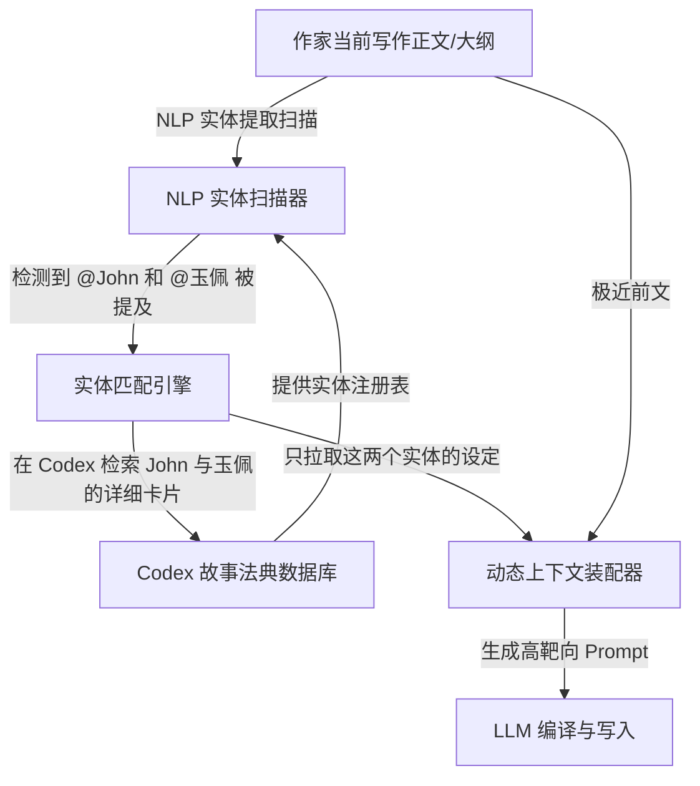

# Novelcrafter: Codex-based Explicit Entity Anchoring

*   **项目官网链接：** [https://www.novelcrafter.com/](https://www.novelcrafter.com/)
*   **流行时间：** 2024–2026年 (目前西方最主流的 BYO-API AI 协同写作编辑器)
*   **核心领域：** 故事法典 (Codex)、显式上下文管理、别名表匹配、实体状态维护

---

## 一、 核心目标与痛点

长篇小说中往往包含大量的**背景要素**（角色身世、地理环境、魔法体系规则）。直接把这些背景全量塞入 System Prompt，会导致 LLM 的上下文窗口臃肿，使模型在写作时产生严重的“注意力消散”。

Novelcrafter 提出了 **“故事法典 (Codex)”** 架构。它将小说中的背景要素解构为独立的“实体卡片”（角色、道具、地标、种族等），并在正文写作中采用**“显式实体检测与按需注入”**的机制，只将当前场景提及的实体卡片送入上下文，实现了极度节省 Token 与极高的一致性。

---

## 二、 系统架构设计 (Architecture)

Novelcrafter 将数据和渲染流程严格解耦为“Codex 卡片库”、“自然语言处理器（NLP 实体扫描）”和“动态 Context 装配器”：



---

## 三、 核心机制与算法细节

### 1. Codex 别名表与 NLP 词片匹配
*   **别名关联**：Codex 中每个实体都可以关联一个“别名列表”。例如角色 `John` 可以包含别名：`“老约翰”`、`“约翰·史密斯”`。
*   **扫描机制**：当作家在编辑器中敲入文字，或者在场景大纲中写明出场人物时，NLP 扫描器（基于词典匹配和 Trie 树结构）会高速检索文本中的实体提及。
*   **按需动态加载 (On-demand Context Loading)**：
    *   如果文本提到：`“John 掏出了那块发光的玉佩”`。
    *   系统检测到 `John` (ID: 01) 和 `玉佩` (ID: 08)。
    *   在本次 API 触发中，只将 `John 卡片`（红发、负伤）和 `玉佩卡片`（温热、刻有龙纹）拼入 Context。而剩余的 50 个角色和 30 个地点卡片全部留在 Codex 数据库中，**完全不参与本次生成**。

### 2. 实体状态演化标签 (Entity Tags)
Codex 允许为实体卡片打上时间轴标签（如 `[Start: Chapter 1]` / `[Deprecated: Chapter 5]`）。这确保了当 John 在第 5 章折断了长剑后，第 6 章起调用“长剑卡片”时，卡片属性会自动变为“已折断”，防止模型发生一致性冲突。

---

## 四、 工程实现与数据流设计 (Engineering & Prompts)

在 Novelcrafter 写入管线中，动态上下文的拼装逻辑如下：

```
[System Prompt]
你是一个协作写作助手。请根据当前的“正文前文”、“大纲指导”以及从故事法典（Codex）中召回的“关联实体定义”进行正文生成。

【故事法典当前关联实体（仅包含当前涉及实体，其余已过滤）】
- 实体卡: John
  - 别名: 约翰、老约翰
  - 外貌: 独眼，左脸有指长刀疤
  - 性格: 冷酷，多疑

- 实体卡: 墨玉佩
  - 外貌: 通体漆黑，正面刻有双龙戏珠纹路，触手温润

【正文前文】
John 走进了昏暗的茶馆，Mary 已经在桌旁等候。John 的指尖在桌沿上敲了敲...

【大纲指导】
John 向 Mary 展示那块墨玉佩，Mary 脸色大变。

【输出要求】
请在写作中严密遵循 John 的外貌特征（独眼、左脸刀疤）和墨玉佩的特征（漆黑、双龙纹路）。
```

### 开源与工业价值：
Novelcrafter 证明了，在 128k 大窗口时代，**“显式实体提取匹配 + Ad-hoc 卡片注入”** 依旧是比“将全量设定死塞入窗口”更稳定、更廉价、且人设最不容易发生漂移（OOC）的工业级标杆方案。
