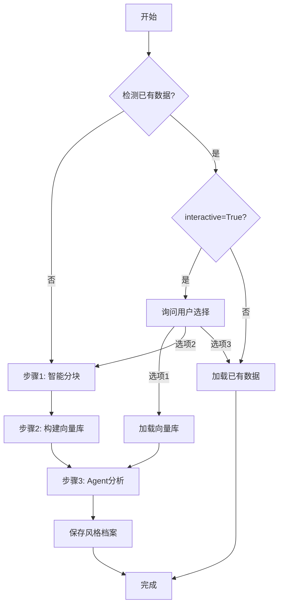

# Agent Style V2 风格提取系统使用说明

## 主要改进 (最新更新)

### 1. 完整小说文本支持
- ✅ 测试函数现在从 `1.epub` 读取**完整小说文本**
- ✅ 自动合并短章节（每块至少3000字符）
- ✅ 显示章节预览和统计信息

### 2. 智能检测与用户交互
当检测到已存在的风格数据时，系统会提供3个选项：

```
📋 检测到已有数据
✓ 风格文件: author_styles/test_author.json
✓ 向量库: author_style_db/test_author

请选择操作:
  1. 使用现有向量库进行风格提取 (快速)
  2. 完全重新生成 (重新分块+重建向量库+风格提取)
  3. 加载已有风格档案 (最快)
```

**选项说明:**
- **选项1**: 跳过分块和向量化，直接用已有向量库进行Agent分析（适合调整Agent参数后重新分析）
- **选项2**: 完全重新处理，从头开始分块、向量化、分析（适合换了新文本或大幅修改）
- **选项3**: 直接加载已保存的风格档案（最快，适合查看结果）

### 3. 函数参数更新

```python
def save_style_profile(
    author_id: str, 
    chapter_texts: List[str], 
    force_regenerate: bool = False,  # 强制重新生成
    interactive: bool = True          # 是否交互式询问（新增）
) -> Dict:
```

**使用示例:**

```python
# 交互模式（默认）- 会询问用户选择
result = save_style_profile("author_id", chapters)

# 非交互模式 - 自动使用已有数据
result = save_style_profile("author_id", chapters, interactive=False)

# 强制重新生成 - 跳过询问直接重建
result = save_style_profile("author_id", chapters, force_regenerate=True)
```

## 运行测试

```bash
cd server/agent_test
python agent_style_v2.py
```

测试流程：
1. 读取 `1.epub` 完整小说
2. 显示章节统计和预览
3. 如果检测到已有数据，询问用户选择
4. 执行风格提取
5. 显示结果摘要和文件位置

## 生成的文件

```
author_styles/
  └── test_author.json          # 风格档案（JSON格式）

author_style_db/
  └── test_author/
      ├── index.faiss            # 向量索引
      └── index.pkl              # 元数据
```

## 代码架构改进

### 新增内部函数
```python
def _run_agent_analysis(author_id, vector_store, style_filepath) -> Dict:
    """执行Agent分析并保存结果（复用逻辑）"""
```

这个函数封装了步骤3（多Agent分析），使得：
- 选项1可以直接跳转到分析步骤
- 避免代码重复
- 更清晰的流程控制

## 工作流程



## 注意事项

1. **EPUB文件**: 确保 `1.epub` 存在于 `agent_test` 目录
2. **环境变量**: 需要配置 `ALIYUN_API_KEY` 用于embedding
3. **向量库复用**: 如果只是想调整Agent提示词重新分析，使用选项1可以节省大量时间
4. **批量处理**: 设置 `interactive=False` 可用于批量处理多个作者

## 性能优化

- **选项3**: ~1秒（直接读取JSON）
- **选项1**: ~30秒（跳过分块和向量化）
- **选项2**: ~2-5分钟（完整流程）

具体时间取决于小说长度和API响应速度。
