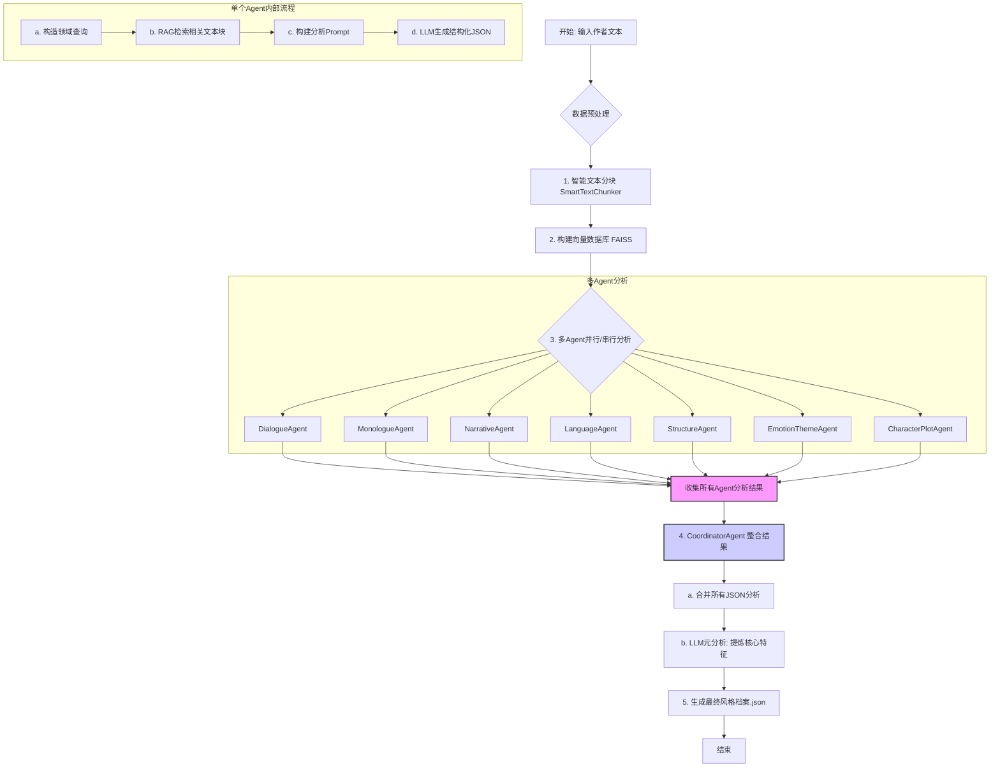
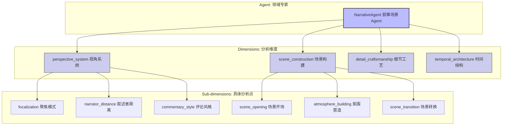

# 作者风格分析 Agent 模块全流程与思路解析

本文档旨在深入解析 `agent_style_v2.py` 脚本中实现的多 Agent 作者风格分析系统的架构、工作流程和核心设计思想。该系统的核心亮点在于其通过专业化的 Agent 协作，对文本进行多维度、深层次的风格解构，并最终形成一份结构清晰、内容详实的风格档案。

## 一、 核心设计思想

系统采用了 **“分而治之”** 的策略，将复杂的“写作风格”概念拆解为多个可以独立分析的领域（如对话、叙事、语言等）。每个领域都由一个经过专门指令优化的 **专业 Agent** 负责。这种设计避免了使用单个、庞大的 Prompt 来分析所有内容，从而提高了分析的 **深度、准确性** 和 **稳定性**。

其核心是 **RAG (Retrieval-Augmented Generation) + 多 Agent 协作** 的模式：

1.  **RAG 检索增强**：首先，将作者的全部文本作品进行语义化分块并构建成一个向量数据库。当某个专业 Agent (如“对话 Agent”) 需要分析时，它会使用与自身领域高度相关的关键词（如“说道”、“叹气”、“反问”）作为查询，从向量库中精准地检索出最相关的文本片段。这为 LLM 提供了高质量、高浓度的“原始论据”。
2.  **多 Agent 协作**：系统部署了多个独立的分析 Agent，每个 Agent 都是其负责领域（如对话系统、内心独白、叙事结构等）的“专家”。它们并行或串行地工作，各自完成分析任务。
3.  **结构化输出**：每个 Agent 的分析任务都由一个精心设计的 Prompt 指导，该 Prompt 强制要求 LLM 以 JSON 格式输出，且 JSON 结构遵循 `维度 -> 子维度` 的层级，确保了分析结果的结构化和可用性。
4.  **中心化整合**：最后，一个 **协调 Agent (CoordinatorAgent)** 负责收集所有专业 Agent 的分析结果，将它们整合成一个统一的、全面的风格档案，并在此基础上进行更高层次的“元分析”，提炼出作者最核心的标志性特征。

## 二、 系统工作全流程

整个流程可以分为四个主要阶段：**数据准备、多 Agent 分析、结果整合** 和 **缓存管理**。

### 流程详解：

1.  **输入与预处理** (`save_style_profile`):
    *   接收作者的所有文本（如从 EPUB 文件提取）。
    *   将文本合并，并送入 `SmartTextChunker`。该分块器会根据句子边界进行切分，确保每个文本块（Chunk）的语义完整性，大小适中（约400字符），并有少量重叠以保证上下文连续性。

2.  **构建向量数据库**：
    *   使用 `DashScopeEmbeddings` 将每个文本块向量化。
    *   利用 `FAISS` 库构建一个高效的本地向量数据库，并将其与作者 ID 关联保存。这个数据库是后续所有 RAG 操作的基础。

3.  **多 Agent 分析** (`_run_agent_analysis`):
    *   系统实例化所有专业 Agent (如 `DialogueAgent`, `NarrativeAgent` 等)。
    *   这些 Agent 可以并行（使用 `ThreadPoolExecutor`）或串行执行分析。
    *   **每个 Agent 的工作流程如下**：
        *   **检索 (Retrieve)**: Agent 根据自身职责，定义一组高度特化的查询关键词列表。例如 `MonologueAgent` 的查询是 `["内心想法：想心思", "心理活动：回忆思考"]` 等。然后调用 `retrieve_relevant_chunks` 方法在向量库中进行相似度搜索，获取大量相关文本片段。
        *   **增强 (Augment)**: 将检索到的几十个文本片段作为“上下文”或“证据”整合进一个大型 Prompt 中。
        *   **生成 (Generate)**: 该 Prompt 指示 LLM 扮演特定领域的专家，并根据提供的文本样本，按照预设的 `维度 -> 子维度` JSON 格式进行深入分析。
        *   Agent 解析 LLM 返回的 JSON 字符串，并将其封装成 `AgentAnalysisResult` 对象。

4.  **整合与元分析** (`CoordinatorAgent`):
    *   `CoordinatorAgent` 收集所有成功的分析结果。
    *   **结果合并**: 将每个 Agent 返回的 JSON 数据合并成一个大的 `writing_style_analysis_framework` 对象。
    *   **元分析 (Meta-Analysis)**: 这是点睛之笔。协调器将合并后的分析结果摘要和部分有代表性的原文片段再次提交给 LLM，要求它进行更高维度的归纳，生成 `distinctive_features` 部分，如 `"signature_style"` (标志性特征), `"potential_risks"` (潜在风险) 等。
    *   最后，将元数据（如框架版本、使用 Agent 列表等）和分析结果整合，形成最终的 JSON 风格档案。

5.  **输出与缓存**：
    *   最终的 JSON 文件被保存在 `author_styles/{author_id}.json`。
    *   系统具备缓存机制，如果检测到已存在的向量库或风格档案，会提示用户选择是直接加载、使用旧向量库重新分析，还是完全重新生成，提高了效率。

## 三、 核心结构：`Agent -> 维度 -> 子维度`

这是该系统最核心的结构化设计，它保证了分析结果的系统性和深度。

*   **Agent (代理)**: 最高层级，代表一个独立的分析单元，专注于一个广泛的写作领域。例如，`NarrativeAgent` 的唯一职责就是分析所有与“叙事”相关的元素。

*   **Dimension (维度)**: 每个 Agent 将其负责的领域进一步细分为几个关键的 **分析维度**。这些维度是构成该领域的核心组成部分。在 `NarrativeAgent` 的例子中，它将“叙事”拆解为 `perspective_system` (视角)、`scene_construction` (场景)、`detail_craftsmanship` (细节) 和 `temporal_architecture` (时间) 四个维度。这些维度构成了该 Agent 输出 JSON 的第一层 Key。

*   **Sub-dimension (子维度)**: 每个维度再被分解为更具体、更可操作的 **子维度**。这是 LLM 需要直接回答的具体分析点。例如，在 `perspective_system` 维度下，子维度包括 `focalization` (聚焦模式)、`narrator_distance` (叙述者距离) 等。这些子维度构成了 JSON 的第二层 Key。

**这种三层结构的好处**：

1.  **任务聚焦**: 让 LLM 在每一步都只思考一个非常具体的问题，避免了泛泛而谈。
2.  **结果规整**: 产出的 JSON 结果结构清晰，层次分明，极易于程序解析和后续利用。
3.  **可扩展性强**: 如果需要增加新的分析领域（比如“世界观构建”），只需开发一个新的 Agent，定义好其负责的维度和子维度即可，对现有系统无影响。
4.  **分析深度**: 迫使分析从宏观（Agent 领域）深入到中观（维度）再到微观（子维度），确保了分析的全面性和深度。

## 四、 总结

`agent_style_v2.py` 实现了一个强大且可扩展的写作风格分析框架。它通过 **RAG 精准检索**、**专业 Agent 分工**、**结构化 Prompt 设计** 和 **中心化整合元分析** 的组合拳，能够自动化、系统化地生成高质量的作者风格画像。其核心的 `Agent -> 维度 -> 子维度` 查询分析模式，是确保分析结果深度、精度和结构化的关键所在，为后续的风格模仿、内容生成等下游任务奠定了坚实的基础。