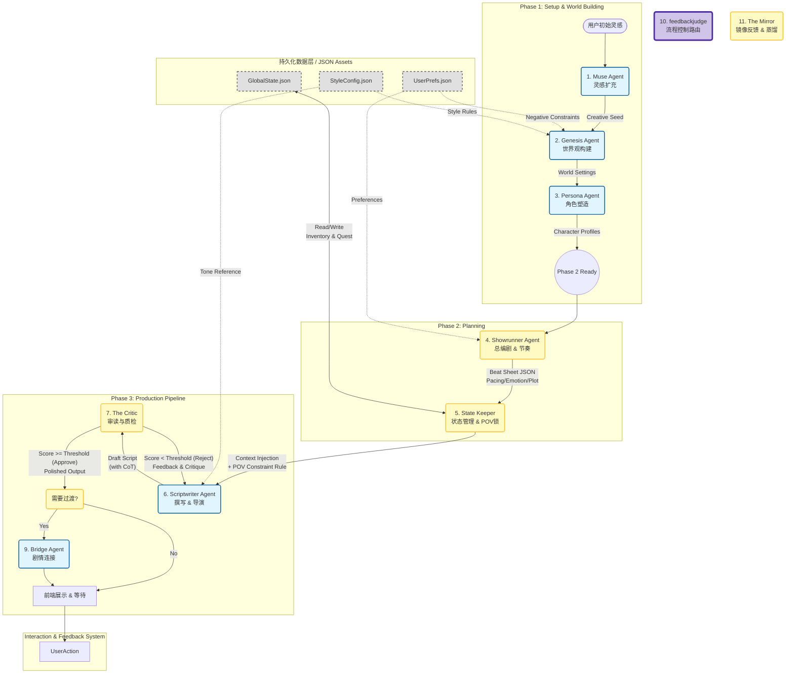

# Sparkarc Studio —— 基于多 Agent 协同的情感驱动型写作系统 (架构 v2.1)

**项目定位：**
一个专供 Unity 等引擎或 Web 前端使用的 AI 高级编剧系统。
**核心目标：**
让创作者专注于“情感”和“剧情核心”，由 AI 完成繁琐的重复劳动。系统强调“以人为本”的情感表达，通过多 Agent 协同解决长篇逻辑崩坏与文本平淡的问题。
**文本风格目标：**
Galgame/交互式视觉小说风格。在对话之外，重点强化心理独白、环境侧写、潜台词与镜头感的文字化表达。

---

## 1. 多 Agent 架构方案 (Finalized)

### 第一阶段：灵感与设定 (Setup Phase)

1.  **创意助手 (Muse Agent)**
    *   **职能：** 创作起点。接受用户模糊的灵感（如歌词、生活瞬间的感受、突如其来的灵感），在尊重情感基调的前提下扩充为核心创作种子。
2.  **设定专家 (Lorebook Agent)**
    *   **职能：** 根据种子自动生成/辅助生成世界观设定与角色档案。
3.  **角色塑造 (Persona)**
    *   **职能：** 生成角色的详细设定（性格、语气、深层心理防御机制等），建立角色档案库。（由设定专家 Agent 协作完成）

### 第二阶段：结构与规划 (Planning Phase)

4.  **总编剧 (Showrunner Agent)** *[已融合节奏控制职能]*
    *   **职能：** 核心决策层。它不再只输出平铺直叙的文字大纲，而是输出带有元数据的 **"Beat Sheet" (节拍表)**。
    *   **输出包含：** 剧情梗概 + 节奏标签（如 `[Pacing: Fast]`, `[Tension: High]`）+ 关键情感点。它指导后续的撰写 Agent 何时该“慢下来写特写”，何时该“加快叙事”。

### 第三阶段：核心生产 (Production Phase)

5.  **剧情校验 (State Keeper)** *[新增核心]*
    *   **职能：** “记账员”。它不参与创作，只负责维护全局的一致性。
    *   **工作流：** 维护一个动态 JSON 数据库（包含物品 Inventory、人际关系 Relationship、任务状态 QuestLog）。在生成正文前，它负责检索并注入当前场景所需的“事实约束”，防止由于上下文窗口限制导致的逻辑崩坏。
    *   **[新增机制] 人称视角锁 (POV Lock)：**
        *   针对 LLM 容易混淆“Player/User”与“Character”的问题，State Keeper 必须在 Prompt 头部强制注入视角定义。
        *   **约束规则：** 明确“User”是导演，“AI”是编剧，而文本中的“我”必须严格绑定为主角（PlayerName）。禁止出现第二人称“你”来描述主角行为。

6.  **执笔编剧 (Scriptwriter Agent)** *[已融合导演职能]*
    *   **职能：** 单体核心写手。负责将大纲转化为具体的 Galgame 脚本。
    *   **实现策略：**
        *   **不拆分：** 统一负责对话与旁白，以确保气口连贯。
        *   **动态导演机制：** “导演”不再是独立 Agent，而是作为 **System Prompt 的动态参数**。根据 Showrunner 的节奏标签，自动注入对应的镜头语言提示词（如“侧重听觉描写”或“强调光影变化”）。
        *   **思维链 (CoT)：** 强制要求在输出正文前，先进行`<thought>`思考，分析角色的潜台词和动作动机。
        *   **[更新] 人称自检：** 在 `<thought>` 阶段必须包含一步“POV Check”，确认当前描述对象是主角时使用“我”，描述外部对象时使用对应称呼，防止人称漂移。

7.  **逻辑审核** *[逻辑重构]*
    *   **职能：** **评价与过滤 (Evaluation & Filtering)**。它不再只是简单的修饰，而是作为质量阀门。
    *   **工作流：**
        1.  **评价（Evaluate）：** 接收 Scriptwriter 的初稿，针对“人称一致性”、“逻辑闭环”、“情感密度”进行打分。
        2.  **过滤（Filter）：** 如果分数低于阈值（例如人称错乱），直接驳回（Reject）并附带修改意见，强制 Scriptwriter 重写。
        3.  **放行（Approve）：** 只有通过过滤的文本才会进行最终的润色（潜台词注入、感官增强）并输出给前端。

### 第四阶段：工具与连接 (Utility Phase)

8.  **文风专家 (Style Agent)**
    *   **状态：** *[已实现]*
    *   **职能：** 将用户过往作品转化为风格描述文件（JSON），作为静态资产约束所有生成内容。
9.  **场景衔接 (Bridge Agent)**
    *   **职能：** 专门负责修复剧情断层，生成平滑的过渡文本。

10. **意图识别** *[新增/轻量级路由]*
    *   **模型策略：** 采用极速/轻量级模型 (如qwen或gemini的Flash版)。
    *   **职能：** **无状态决策与路由 (Stateless Decision & Routing)**。
    *   **输入限制：** **仅接收用户的当前输入指令**，不加载上文剧情或复杂设定（零上下文），以保证极低延迟。
    *   **工作机制：**
        *   **意图识别：** 快速判断用户的输入是“满意/继续”还是“不满意/有意见”。
        *   **分支路由：**
            *   **Case A (满意):** 直接放行，向系统发送 `NEXT_PHASE` 信号，进入下一阶段创作。
            *   **Case B (不满意/修改):** 拦截流程，唤醒并调用重型的 **Mirror Agent**，将用户指令转交给它处理。

11. **反馈记录** *[核心/重型分析]*
    *   **模型策略：** 采用高推理能力模型。
    *   **触发条件：** 仅在 feedbackjudge 判定用户有修改意见时被激活。
    *   **职能：** **反馈分析、持久化与重写指导**。
    *   **工作机制：**
        *   **上下文加载：** 此时才加载“上一阶段的生成内容” + “全局必要信息（如人设卡）” + “用户的修改意见”。
        *   **意见蒸馏与持久化：** 深度分析用户意见，提取结构化的 **Negative Constraint (负面约束)** 或 **Preference Tag (偏好标签)**，并写入 `user_preference.json`。
        *   **生成修改指令：** 将用户的自然语言吐槽转化为给对应 Agent（如 Scriptwriter）的精确技术指令（Prompt Instruction），例如：“*User Feedback: Remove internal monologue here. Action: Rewrite current block keeping dialogue only.*”
        *   **回滚触发：** 指挥上一级 Agent 执行重写 (Re-roll)。

---

## 2. 数据格式标准 (Data Protocol)

采用 **Markdown + XML 混合格式**。核心目的是为了降低结构化输出对大模型的创作能力影响。

**AI 输出示例 :**
严格参考 **剧情格式.ais**文件

## 3.注意事项

1.使用英语来构筑所有agent的提示词以确保指令准确

---

**Agent架构**

## 以下未来考虑 暂不实现
## 演出端
**目标**: 打通游戏引擎与 Web 分享，实现"所见即所得"的最终演出。

### 1. Unity 集成 (Presenter - C#)
- [ ] **Runtime SDK**
    - 在 Unity 中实现一个轻量级解析器，读取后端生成的 JSON 剧本。
- [ ] **实时预览 (Live Preview)**
    - 通过 WebSocket 连接编辑器与 Unity，编辑器修改节点文本，Unity 画面实时刷新台词。
- [ ] **演出指令绑定**
    - 在节点编辑器中提供简单的 GUI (下拉框/开关)，插入 Unity 能够识别的指令 (如 `PlayAnim("Cry")`, `CameraShake(2.0)`)。

### 2. Web 分享与社区
- [ ] **Web Player**
    - 一个纯前端的播放器组件，用于在网页上直接跑通剧本。
- [ ] **一键分享**
    - 将项目打包为静态链接，方便用户分享给朋友试玩。

---

## ✨ 待探索特性 (Future Research)
- [ ] **多模态辅助**: 根据当前场景描述，调用 SD/Midjourney 生成背景图。
- [ ] **TTS 配音**: 集成 VITS/GPT-SoVITS，为角色生成语音。